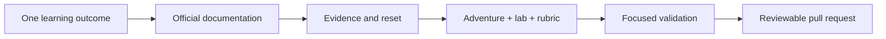

# Contributing

Thank you for improving Awesome Copilot Adventures.

> [!IMPORTANT]
> Begin with a learning outcome and observable evidence, not a feature list or fantasy story.

## Contribution loop

## Before writing

1. Choose one primary agentic learning objective.
2. Verify terminology and behavior in current official GitHub or Microsoft documentation.
3. Decide which primitive is required: instructions, prompt, skill, custom agent, MCP, or hook.
4. Define deterministic evidence, intentional failure, and reset steps.
5. Identify stable, preview, experimental, or availability-dependent behavior.

## Adventure checklist

- [ ] Create `adventures/<level>/<slug>/README.md`.
- [ ] Create `adventures/<level>/<slug>/rubric.md`.
- [ ] Add a starter under `labs/<slug>/` when files or configuration change.
- [ ] Add or update the deterministic verifier.
- [ ] Reference a hero asset in `assets/images/adventures/`.
- [ ] Add official sources and a real `last_verified` date.
- [ ] Include Ask → Plan → Agent → Review → Evidence.
- [ ] Include an intentional failure and independent challenge.
- [ ] Run `npm test`.
- [ ] Run the targeted language build or test when applicable.

Do not create a separate Ask-only copy. Ask is an investigation role within the same progressive adventure.

## Documentation design

- Use meaningful headings and concise paragraphs.
- Use GitHub Alerts for important notes, warnings, and cautions.
- Use Mermaid when a process, dependency graph, or sequence is clearer visually.
- Keep diagrams readable without color alone.
- Include alt text for every meaningful image.
- Prefer relative links inside the repository.
- Do not place essential instructions only inside an image or video.

## Media

Use [Media Prompts](./docs/media-prompts.md). Generated hero images should be 1456×832, contain no embedded text, and include meaningful alt text. Videos need a poster image and reduced-motion fallback.

## Pull requests

Use a focused title such as `New Copilot Adventure: The Skill Grimoire of Algora`. Describe:

- the learning objective;
- official sources and feature status;
- files and behavioral changes;
- validation commands and results;
- limitations and follow-up media.
