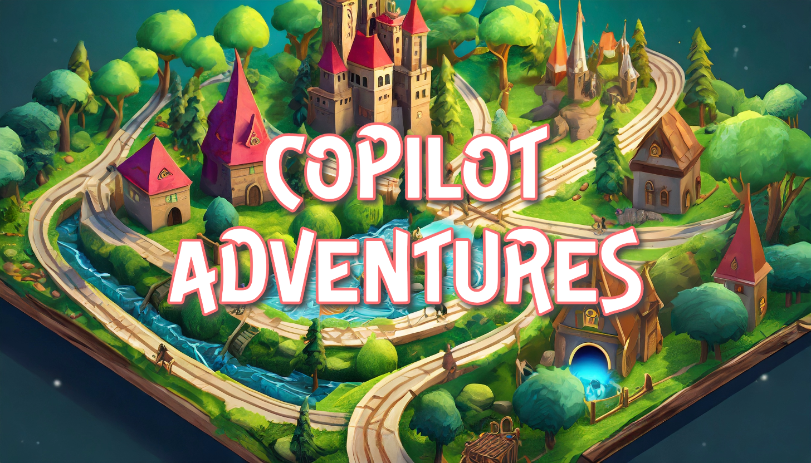
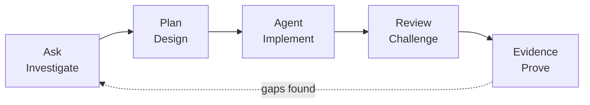

<p align="center">
  
</p>

<h1 align="center">Awesome Copilot Adventures</h1>

<p align="center">
  An evidence-first, fantasy-themed curriculum for agentic software engineering with GitHub Copilot.
</p>

<p align="center">
  <a href="https://github.com/paulasilvatech/awesome-copilot-adventures/actions/workflows/quality.yml"></a>
  <a href="https://github.com/paulasilvatech/awesome-copilot-adventures/actions/workflows/pages.yml"></a>
  <a href="./LICENSE"></a>
  <a href="./docs/feature-status.md"></a>
</p>

<p align="center">
  <a href="https://paulasilvatech.github.io/awesome-copilot-adventures/"><strong>Explore the learning site</strong></a>
  ·
  <a href="https://codespaces.new/paulasilvatech/awesome-copilot-adventures?quickstart=1"><strong>Open in Codespaces</strong></a>
  ·
  <a href="./docs/curriculum-map.md"><strong>View the curriculum</strong></a>
</p>

> [!IMPORTANT]
> This curriculum teaches **agents and agentic engineering**, not deprecated custom chat modes. Ask, Plan, Agent, custom agents, harnesses, environments, and customization primitives are taught as separate concepts.

## The learning loop

Every adventure follows the same evidence-producing workflow:



- **Ask** inspects facts, constraints, context, and unknowns.
- **Plan** defines scope, risks, trust boundaries, and validation.
- **Agent** edits, invokes tools, observes results, and iterates.
- **Review** challenges the result from a clean or specialized context.
- **Evidence** records commands, exit codes, diffs, limitations, and decisions.

> [!NOTE]
> A role is not a harness. Local and Copilot are VS Code agent harnesses; Cloud is a remote session target; Copilot CLI is a terminal surface; and the Copilot SDK embeds an agent runtime in an application. Availability depends on account, policy, client, and environment.

## Curriculum

| Level | Focus | Adventures |
| --- | --- | --- |
| **00 · Foundations** | Roles, harnesses, context, and evidence | [Portals of Nexus](./adventures/00-foundations/portals-of-nexus/) · [Context Mirrors](./adventures/00-foundations/context-mirrors/) |
| **01 · Basics** | Bounded loops and repository instructions | [Tempora Loop](./adventures/01-basics/tempora-loop/) · [Laws of Eldoria](./adventures/01-basics/eldoria-laws/) |
| **02 · Intermediate** | Skills, custom agents, and guardrails | [Skills of Algora](./adventures/02-intermediate/algora-skills/) · [Agents of Stellaris](./adventures/02-intermediate/stellaris-agents/) · [Guardrails of Stonevale](./adventures/02-intermediate/stonevale-guardrails/) |
| **03 · Advanced** | MCP, orchestration graphs, and parallel sessions | [MCP Cartographer](./adventures/03-advanced/cartographer-mcp/) · [Lumoria Graph](./adventures/03-advanced/lumoria-graph/) · [Parallel Mythos](./adventures/03-advanced/mythos-parallel/) |
| **04 · Surfaces** | Cloud agent, Copilot CLI, and Copilot SDK | [Cloud Citadel](./adventures/04-surfaces/cloud-citadel/) · [Terminal Gate](./adventures/04-surfaces/terminal-gate/) · [Automaton Foundry](./adventures/04-surfaces/automaton-foundry/) |
| **99 · Capstone** | End-to-end governed agentic delivery | [Convergence of Three Realms](./adventures/99-capstone/convergence-of-three-realms/) |

See the visual [Curriculum Map](./docs/curriculum-map.md) and current [Feature Status Matrix](./docs/feature-status.md).

## Customization primitives

Use the smallest primitive that supplies the missing behavior:

| Need | Primitive |
| --- | --- |
| Context applied automatically | Repository or path-specific instructions |
| A manually invoked repeatable task | Prompt file |
| Reusable expertise loaded when relevant | Agent Skill |
| A role with selected tools and optional handoffs | Custom agent |
| Access to an external capability | Model Context Protocol server |
| Deterministic lifecycle enforcement | Hook |

The [Customization Primitives guide](./docs/customization-primitives.md) includes a decision diagram and portability notes.

## Quick start

```bash
gh repo clone paulasilvatech/awesome-copilot-adventures
cd awesome-copilot-adventures
npm install
npm test
```

For the complete environment, reopen the repository in its Dev Container.

## Repository map

```text
adventures/           Current progressive curriculum and rubrics
labs/                 Starter exercises and deterministic verifiers
solutions/            Reference implementations for legacy challenges
.github/agents/       Reusable custom agents
.github/skills/       Progressively loaded Agent Skills
.github/prompts/      Manually invoked prompt files
.github/instructions/ Path-scoped instructions
.github/hooks/        Preview hook examples and guidance
docs/                 GitHub Pages content
assets/               Current, legacy, and generated media
legacy/               Preserved version-one curriculum
shared/               Deterministic shared data
```

## Validation

```bash
npm test
dotnet build solutions/csharp/CopilotAdventures.sln
python solutions/python/test_gridlock_arena.py
```

The checks validate current Markdown links, curriculum structure, customization files, lab syntax, the Context Mirrors baseline, and reference solutions.

## Media

Production hero files are intentionally pending so unrelated artwork is never published under inaccurate alt text. The complete prompts for Banana Pro are in [Media Prompts](./docs/media-prompts.md), including:

- 14 adventure hero images;
- three site illustrations;
- five optional motion assets;
- filenames, dimensions, alt text, poster requirements, and reduced-motion guidance.

## Contributing

Read [CONTRIBUTING.md](./CONTRIBUTING.md) before proposing an adventure. Contributions must use current official GitHub or Microsoft sources, include deterministic evidence, mark preview behavior, and avoid unsupported availability or performance claims.

## Project policies

- [Code of Conduct](./CODE_OF_CONDUCT.md)
- [Security Policy](./SECURITY.md)
- [Support](./SUPPORT.md)
- [Attribution](./NOTICE.md)
- [MIT License](./LICENSE)

Historical Ask/Agent pairs remain under [legacy/adventures-v1](./legacy/adventures-v1/) for comparison, not as current product guidance.
