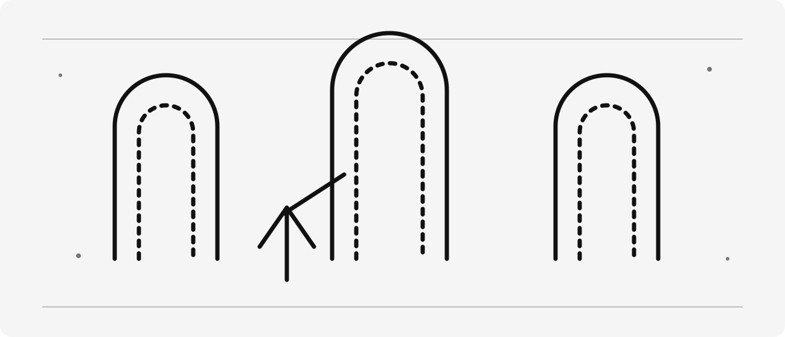
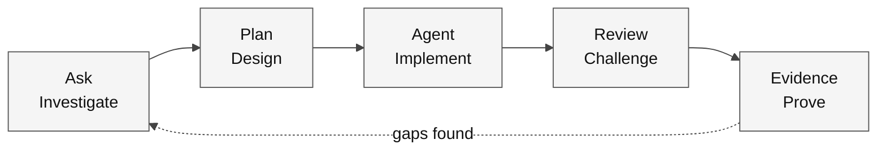

<p align="center">
  
</p>

<h1 align="center">Awesome Copilot Adventures</h1>

<p align="center">
  Learn to investigate, plan, implement and verify with GitHub Copilot — one reproducible lab at a time.
</p>

<p align="center">
  <a href="https://workshop-gbb.github.io/awesome-copilot-adventures/"></a>
  <a href="./LICENSE"></a>
  <a href="./docs/downloads.md"></a>
</p>

<p align="center">
  <a href="./docs/prerequisites.md"><strong>Tools, accounts and prerequisites</strong></a>
  ·
  <a href="./docs/start-here.md"><strong>Start here — your first working check</strong></a>
  ·
  <a href="./docs/learning-path.md"><strong>Choose your learning path</strong></a>
  ·
  <a href="./docs/curriculum-map.md"><strong>View the curriculum</strong></a>
  ·
  <a href="./docs/downloads.md"><strong>Download a learner kit</strong></a>
</p>

> [!TIP]
> **New here? Start with one small success.** Download
> [01-interface.zip](./assets/lab-kits/hands-on/01-interface.zip), extract it into a
> new work folder and follow [Start here](./docs/start-here.md). You do not need
> Python, .NET, Docker, a cloud subscription or a GitHub repository for that first lab.

## What you will learn

This is a learning kit for developers and technical learners who want to use an
agent without confusing a confident answer with working software. Start by opening
files and running one local test. Progress to features, refactoring, customization,
MCP and governed multi-environment work.

| Path | Style | Contents | Start |
| --- | --- | --- | --- |
| **Hands-on** | Professional exercises, no fantasy | 26 guides; 21 runnable exercise variants | [First lab](./mslearn-github-copilot/Instructions/Labs/LAB_AK_01_examine_settings_interface.md) |
| **Adventures** | Short stories supporting technical concepts | 14 adventures, labs and rubrics | [Portals of Nexus](./adventures/00-foundations/portals-of-nexus/README.md) |

The paths complement each other; completing both is not mandatory. The
[learning order](./docs/learning-path.md) explains prerequisites, stopping points
and which advanced subjects to take next.

## Required, optional or advanced?

| Category | What it means | Examples |
| --- | --- | --- |
| **Required for your chosen lab** | Needed for that lab's declared evidence | Its runtime, starter, baseline, reviewed change and verification |
| **Required for live Copilot practice** | Separate from running local code | Authorized Copilot access in a supported client; review of permissions |
| **Optional** | An alternative or extension, not a first-run blocker | A second language, local Git history, a private GitHub repo, Codespaces |
| **Advanced** | Take after the listed prerequisites | MCP, parallel work, Spec Kit, SDK, cloud-agent delegation and capstone |
| **Maintainer-only** | Changes how this curriculum is published | Building the whole site, regenerating ZIPs and editing translations |

Availability depends on account, organization policy, client and environment.
No learner is required to make a private repository public or enable a paid
service to finish a local exercise.

## Your first result

1. Install/select **Node 24** and open the extracted `01-interface` folder in VS Code.
2. Read `KIT-START.md`, `greeting.mjs` and `greeting.test.mjs`.
3. From that folder's terminal, run:

   ```bash
   node KIT-VERIFY.cjs
   node --test --test-concurrency=1 greeting.test.mjs
   ```

4. Expect the unchanged starter to pass **2 tests**. A different test count or
   error needs investigation, not a copied success transcript.
5. Follow the [guided first session](./docs/start-here.md) to investigate, plan and
   implement one whitespace-handling change; then prove the result with tests.

**No package installation is needed for this first kit.** The download guide
covers [Windows, macOS, Linux and optional GitHub publication](./docs/downloads.md).

---

## The learning loop

Every adventure follows the same evidence-producing workflow:



**Legend.** Rectangles are workflow stages. Solid arrows show the normal progression; the dashed arrow returns unresolved evidence gaps to investigation.

**Explanation.** A fluent response is not completion. The loop ends only when the reviewed result meets the acceptance criteria and the recorded checks support it.

- **Ask** inspects facts, constraints, context, and unknowns.
- **Plan** defines scope, risks, trust boundaries, and validation.
- **Agent** edits, invokes tools, observes results, and iterates.
- **Review** challenges the result from a clean or specialized context.
- **Evidence** records commands, exit codes, diffs, limitations, and decisions.

> [!NOTE]
> A role is not a harness. Local and Copilot are VS Code agent harnesses; Cloud is a remote session target; Copilot CLI is a terminal surface; and the Copilot SDK embeds an agent runtime in an application. Availability depends on account, policy, client, and environment.

## Adventure progression

| Level | Focus | Adventures |
| --- | --- | --- |
| **00 · Foundations** | Roles, harnesses, context, and evidence | [Portals of Nexus](./adventures/00-foundations/portals-of-nexus/) · [Context Mirrors](./adventures/00-foundations/context-mirrors/) |
| **01 · Basics** | Bounded loops and repository instructions | [Tempora Loop](./adventures/01-basics/tempora-loop/) · [Laws of Eldoria](./adventures/01-basics/eldoria-laws/) |
| **02 · Intermediate** | Skills, custom agents, and guardrails | [Skills of Algora](./adventures/02-intermediate/algora-skills/) · [Agents of Stellaris](./adventures/02-intermediate/stellaris-agents/) · [Guardrails of Stonevale](./adventures/02-intermediate/stonevale-guardrails/) |
| **03 · Advanced** | MCP, orchestration graphs, and parallel sessions | [MCP Cartographer](./adventures/03-advanced/cartographer-mcp/) · [Lumoria Graph](./adventures/03-advanced/lumoria-graph/) · [Parallel Mythos](./adventures/03-advanced/mythos-parallel/) |
| **04 · Surfaces** | Cloud agent, Copilot CLI, and Copilot SDK | [Cloud Citadel](./adventures/04-surfaces/cloud-citadel/) · [Terminal Gate](./adventures/04-surfaces/terminal-gate/) · [Automaton Foundry](./adventures/04-surfaces/automaton-foundry/) |
| **99 · Capstone** | End-to-end governed agentic delivery | [Convergence of Three Realms](./adventures/99-capstone/convergence-of-three-realms/) |

See the visual [Curriculum Map](./docs/curriculum-map.md) and current [Feature Status Matrix](./docs/feature-status.md).

## Hands-on progression

The [Hands-on Labs](./mslearn-github-copilot/index.md) are numbered professional
exercises, **not new adventures**. They retain the imported exercise/task format
with revised explanations, local fixtures, negative cases, and safe reset.

1. **01:** context, roles, permissions and a small verified change.
2. **02–05:** choose C# or Python; investigate → add a feature → test → refactor.
3. **06–12:** choose an applicable engineering or collaboration exercise.
4. **15:** understand instructions, prompts, skills and custom agents.
5. **13, 14, 17:** distinguish greenfield, brownfield feature work and modernization.
6. **16:** build a bounded SDK application; keep offline tests separate from live inference.

Read the [lab-by-lab audit](./mslearn-github-copilot/Instructions/Reference/AUDIT.md)
and [monochrome diagram standard](./docs/diagram-style.md). All Mermaid diagrams use
white, ice, grays and black, with accessible labels, legends and explanations.

## Customization primitives

Use the smallest primitive that supplies the missing behavior:

| Need | Primitive |
| --- | --- |
| Context applied automatically | Repository or path-specific instructions |
| A manually invoked repeatable task | Prompt file |
| Reusable expertise loaded when relevant | Agent Skill |
| A role with selected tools and optional handoffs | Custom agent |
| Access to an external capability | Model Context Protocol server |
| Deterministic lifecycle enforcement | Hook |

The [Customization Primitives guide](./docs/customization-primitives.md) includes a decision diagram and portability notes.

## Materials and completion

For an individual exercise, use the [35 learner kits](./docs/downloads.md):
21 hands-on variants and 14 adventure labs. Each ZIP contains the starter, lesson,
local visual assets, licenses, an integrity manifest and a first-run guide.
The guide distinguishes a passing baseline from an intentional starter failure.

- [ ] I can explain the scenario and the concept in my own words.
- [ ] I recorded the initial state, chosen runtime and command.
- [ ] I reviewed the plan and the changes instead of accepting an answer blindly.
- [ ] My checks cover the requested behavior and reject a deliberate wrong result.
- [ ] I labeled unavailable/live features and kept evidence of what actually ran.
- [ ] I reset or preserved my work without affecting another project.

A starter failure is intentional when the lesson says so. A local structural
verifier is not proof of an authenticated cloud or model run. The
[coverage and evidence boundaries](./docs/learning-path.md) make that distinction explicit.

## Multilingual learning site

The Astro pipeline builds reading views in
[English](https://workshop-gbb.github.io/awesome-copilot-adventures/en/),
[Spanish](https://workshop-gbb.github.io/awesome-copilot-adventures/es/) and
[Brazilian Portuguese](https://workshop-gbb.github.io/awesome-copilot-adventures/pt-br/).
Language switches preserve the document and its section. If the public deployment
is unavailable, the repository guides and checked-in learner kits remain usable;
publishing status is separate from local test results.

The repository explorer includes original starters, tests, solutions, data,
customizations, media, licenses and clearly identified historical material.
Code and executable examples keep their original text. Downloads are checked
against their SHA-256 inventory before use.

The build is static, uses one page-rendering worker, and does not require Ruby,
Jekyll, a model API or a database. See the [publishing guide](docs/site-publishing.md)
and [design system](docs/DESIGN.md).

## Repository map

```text
adventures/           Current progressive curriculum and rubrics
labs/                 Starter exercises and deterministic verifiers
mslearn-github-copilot/ Numbered professional exercises and their fixtures
assets/lab-kits/       Learner ZIPs, manifests and checksums
solutions/            Reference implementations for legacy challenges
.github/agents/       Reusable custom agents
.github/skills/       Progressively loaded Agent Skills
.github/prompts/      Manually invoked prompt files
.github/instructions/ Path-scoped instructions
.github/hooks/        Preview hook examples and guidance
docs/                 Canonical guide content
site/                 Astro layouts, components and routes
site-locales/          Reviewed Spanish and Brazilian Portuguese prose
site-generated/       Ignored, reproducible publication input
assets/               Current, legacy, and generated media
legacy/               Preserved version-one curriculum
shared/               Deterministic shared data
```

## For contributors and facilitators

The full-checkout route is separate from the learner quick start:

```bash
gh repo clone workshop-gbb/awesome-copilot-adventures
cd awesome-copilot-adventures
npm ci --ignore-scripts
npm test
```

Run only the targeted language build/test for the solution you change. Follow the
[publishing guide](./docs/site-publishing.md) for ZIP regeneration, translations,
site builds and rendered-link validation. Facilitators should rehearse the chosen
path on a fresh kit and record access blockers before the session.

## Media

The guides include original SVG illustrations and topic-specific diagrams with
accessible descriptions. The [media briefs](./docs/media-prompts.md) describe
optional cinematic images and videos, not assets claimed to have been produced.
Historical UI captures are labeled references, not current availability evidence.

## Contributing

Read [CONTRIBUTING.md](./CONTRIBUTING.md) before proposing an adventure. Contributions must use current official GitHub or Microsoft sources, include deterministic evidence, mark preview behavior, and avoid unsupported availability or performance claims.

## Project policies

- [Code of Conduct](./CODE_OF_CONDUCT.md)
- [Security Policy](./SECURITY.md)
- [Support](./SUPPORT.md)
- [Attribution](./NOTICE.md)
- [MIT License](./LICENSE)

Historical Ask/Agent pairs remain under [legacy/adventures-v1](./legacy/adventures-v1/) for comparison, not as current product guidance.
