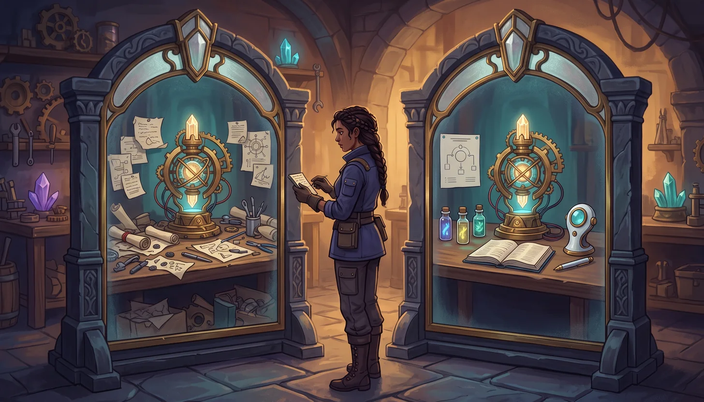
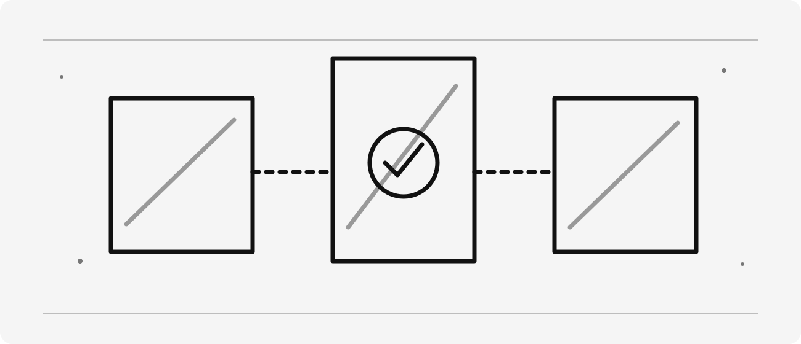
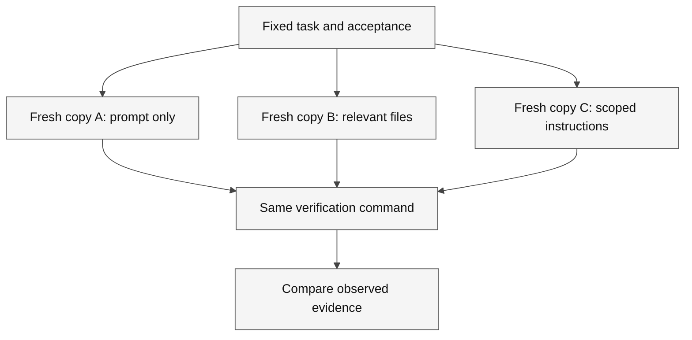

# The Context Mirrors


> [!NOTE]
> **Status:** Content ready · **Media:** Generated cover and original SVG illustration · **Last verified:** 2026-09-05  
> **Primary capability:** Building and validating minimal agent context



<details>
<summary>Original concept illustration (SVG)</summary>



</details>

> [!TIP]
> [Download this learner kit](../../../assets/lab-kits/adventures/context-mirrors.zip) and use
> [the extraction and setup guide](../../../docs/downloads.md). Keep the original starter untouched.



**Legend.** Branches are controlled experiment variants; the shared verification node keeps the output contract fixed.

**Explanation.** Changing the task, source and model together makes cause unclear. Fresh copies prevent one variant from inheriting another variant’s edits.

## Official references

These official sources are the authority for product behavior and availability. Recheck them when using a different surface or after a product update.

- [Context engineering guide](https://code.visualstudio.com/docs/agents/guides/context-engineering-guide)
- [Custom instructions](https://code.visualstudio.com/docs/agent-customization/custom-instructions)
- [Prompt files](https://code.visualstudio.com/docs/agent-customization/prompt-files)

## Story

Lumina’s mirrors reflect files, selections, instructions, tool results, and history. Each unnecessary reflection can hide the clue that matters.

The fantasy is a memory aid; the engineering lesson requires observable, reproducible evidence.

## Learning objectives

- Build a minimal packet of task intent, relevant paths, exclusions and a verification command.
- Compare context variants while keeping the task, model and acceptance criteria fixed.
- Record unsupported claims and out-of-scope edits without treating one trial as a productivity benchmark.

## Prerequisites

For tools and personal accounts, complete [the prerequisites guide](../../../docs/prerequisites.md).
For terminal-only study, follow [the extracted-kit CLI route](../../../docs/downloads.md#use-copilot-cli-from-the-extracted-kit);
VS Code-specific evidence remains separate.

| Requirement | Why it matters |
| --- | --- |
| Complete the preceding adventure, or demonstrate its exit evidence | Keep this mission focused on its named capability |
| Node 24 and the extracted kit | The local verifier uses the supplied runtime and files |
| A disposable folder outside another project | Customizations and intentional failures must not leak into other work |
| Authorized host access, only for live steps | Availability, tools and policies differ |

**Evidence boundary:** Local tests establish sequence behavior; the comparison is not a general ranking of models or workflows.

Estimated session: 45–75 minutes after prerequisites; actual duration varies. Never use production secrets or customer data.

## Concept explanation

Context includes the prompt, selected text, open files, repository instructions, retrieved sources, tool output, and conversation history. More context is not automatically better. Prefer current source and executable evidence over remembered explanations. Persistent memory, where available, is a separate capability whose availability and behavior must be verified; never treat memory as authoritative without revalidation.

### Concrete use case

Two explanations of the same sequence predictor can sound equally confident. The useful one cites the tested branch and identifies the missing new pattern instead of describing an imagined API.

### Vocabulary checkpoint

- **Role:** Ask, Plan, Agent, or a custom agent.
- **Harness/surface:** the runtime or product surface in which a role operates.
- **Target:** the selected session destination, such as Local, Copilot, or Cloud where exposed.
- **Environment:** the folder, worktree, local machine, Codespace, or remote environment.
- **Instructions:** automatically applied durable context.
- **Prompt:** a manually invoked task template.
- **Skill:** reusable expertise loaded when relevant.
- **Custom agent:** a role with instructions, tools, and optional handoffs.
- **MCP:** Model Context Protocol.
- **Evidence:** a path, diff, command result, trace, or review decision.

## Ask → Plan → Agent workflow

### Ask — investigate

1. Identify the real user outcome and current source of truth.
2. Inspect relevant files, instructions, tools, permissions, and existing checks.
3. Cite concrete paths or platform evidence for every important finding.
4. Record uncertainty and do not infer unavailable capabilities.

**Gate:** No implementation until the current state and evidence are understood.

### Plan — design

1. State scope, non-goals, assumptions, risks, and trust boundaries.
2. Select the minimum role, tools, authority, and environment.
3. Define acceptance criteria, verification commands, review, and reset.
4. Mark any Preview or experimental dependency and provide a fallback.

**Gate:** Another learner should be able to predict completion from the plan.

### Agent — execute

1. Make the smallest reversible change or produce the planned artifact.
2. Use short inspect → change → verify loops.
3. Preserve command output, exit status, diffs, traces, or platform records.
4. Stop when acceptance criteria are met; do not perform unrelated cleanup.

### Review — challenge

1. Inspect the complete diff or artifact.
2. Compare each result with the plan and acceptance criteria.
3. Run the narrowest relevant existing check, broadening only when justified.
4. Record limitations and unresolved risks.
5. Score the work with [rubric.md](rubric.md).

## Guided mission

### 1. Prepare one isolated copy

1. Download and extract the [context-mirrors kit](../../../assets/lab-kits/adventures/context-mirrors.zip) into a new work-drive directory.
2. Read `KIT-START.md` at its root. Open `starter/` as the VS Code workspace when testing discovery, but run the verifier from the kit root.
3. Inspect `starter/`, `verify.js` before editing.
4. From the extracted kit root, run `node verify.js`.
5. Record the passing sequence baseline. A missing runtime or unrelated crash is not the expected exercise result.

### 2. Investigate and plan

Copyable baseline command, from the extracted kit root:

```bash
node verify.js
```

In Ask, request a trace of the inspected files and what the verifier actually observes. Challenge any claim about live execution that is not supported by output.

Use this planning prompt:

```text
Choose one new sequence pattern. Keep model and acceptance fixed, define fresh-copy context variants, and state how you will record files changed, checks actually run and unsupported claims.
Do not implement yet. Identify affected files, the negative case and a safe reset.
```

### 3. Implement the reviewed slice

1. Approve only the named starter artifact and necessary focused tests.
2. Ask Agent to implement one slice; inspect proposed commands before execution.
3. Run `node verify.js` again from the kit root, or `node ../verify.js` from `starter/`.
4. Compare the exact result with the checkpoint below and review the complete diff.
5. Record host discovery or live activity separately when available. Do not enable extra services to manufacture a passing result.

> [!IMPORTANT]
> **Checkpoint:** A fresh starter passes its existing checks; every variant begins from that same untouched source.
> Local tests establish sequence behavior; the comparison is not a general ranking of models or workflows.

### 4. Prove a check can reject a mistake

Add an irrelevant design claim to one context packet, not to production code. Challenge whether the answer cites executable sources and record the unsupported assertion if it does not.

| Observation | Decision | Action | Evidence | Limitation |
| --- | --- | --- | --- | --- |
| Initial state and exact diagnostic | Why this change is needed | Named file and bounded change | Command, exit code and observed result | What the local check does not prove |

Finish with the adventure-specific capability evidence in [the rubric](rubric.md), not just the presence of a file.

## Intentional failure: The Hall of Infinite Reflections

Perform this only in a disposable environment:

Supply unrelated files, an old design note, and the vague request “improve this.” The exercise fails because stale and unbounded context obscures authority and completion criteria.

### Recovery

Return to Ask, identify the violated boundary, narrow the plan, remove unnecessary authority or context, and repeat the smallest relevant verification. Document the causal lesson rather than merely stating that the attempt failed.

## Independent challenge

Design a context packet for a cross-file refactor where one document is stale, including a method for resolving the conflict.

Constraints:

- Do not copy the guided mission verbatim.
- Do not add tools, permissions, or cloud resources without a stated need.
- Do not claim quality, performance, compatibility, or availability without executed evidence.
- Keep fantasy language subordinate to technical clarity.

## Evidence checklist

- [ ] Source-grounded Ask findings.
- [ ] Approved plan with scope, non-goals, risks, checks, and reset.
- [ ] Agent diff or artifact limited to the declared scope.
- [ ] Verification output with command, status, or platform record.
- [ ] Intentional-failure root cause and recovery.
- [ ] Independent challenge result.
- [ ] Explicit limitations and feature-status notes.
- [ ] Completed [rubric.md](rubric.md).

## Reset instructions

1. Save your diff, command output and limitations from the disposable kit.
2. Stop only the process or learning session you started. Do not stop other projects.
3. If you initialized Git in the kit, inspect `git status --short` there and restore only your named exercise files from its local baseline.
4. Otherwise, extract the original ZIP into a new unused directory for another attempt; do not overwrite your current work.
5. Remove only exercise-owned configurations, worktrees or remote resources after reviewing anything worth preserving.

The curriculum source and other projects must remain unchanged. A reset of the copied kit is not a repository-wide hard reset.

## Next adventure

[The Tempora Loop](../../01-basics/tempora-loop/README.md)
