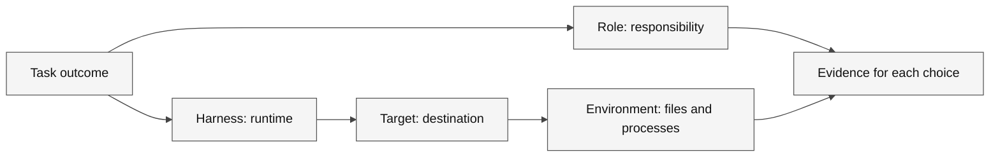

# The Portals of Nexus


> [!NOTE]
> **Status:** Content ready · **Media:** Original SVG illustration · **Last verified:** 2026-09-05  
> **Primary capability:** Selecting roles, harnesses, targets, and environments


> [!TIP]
> [Download this learner kit](../../../assets/lab-kits/adventures/portals-of-nexus.zip) and use
> [the extraction and setup guide](../../../docs/downloads.md). Keep the original starter untouched.



**Legend.** Boxes name different dimensions; arrows show which decisions must be connected before execution.

**Explanation.** A responsibility does not determine the runtime or location. Keep the dimensions distinct even when one UI presents them together.

## Official references

These official sources are the authority for product behavior and availability. Recheck them when using a different surface or after a product update.

- [Agent harness concepts](https://code.visualstudio.com/docs/agents/concepts/agent-harnesses)
- [Run agents in different harnesses](https://code.visualstudio.com/docs/agents/run/agent-harnesses)
- [About GitHub Copilot cloud agent](https://docs.github.com/en/copilot/concepts/agents/cloud-agent/about-cloud-agent)

## Story

At Nexus, four portals appear identical until their runes reveal who acts, where work runs, and which authority crosses the threshold.

The fantasy is a memory aid; the engineering lesson requires observable, reproducible evidence.

## Learning objectives

- Classify a task by agent role, harness, target and execution environment.
- Explain why a worktree isolates source changes but does not supply a new identity.
- Complete the portal map and distinguish its controlled choices from universal product rules.

## Prerequisites

| Requirement | Why it matters |
| --- | --- |
| Complete [Start here](../../../docs/start-here.md), or be able to open a folder and run a Node command | Keep this mission focused on its named capability |
| Node 24 and the extracted kit | The local verifier uses the supplied runtime and files |
| A disposable folder outside another project | Customizations and intentional failures must not leak into other work |
| Authorized host access, only for live steps | Availability, tools and policies differ |

**Evidence boundary:** The verifier checks the map, not that any selected host or account is available.

Estimated session: 45–75 minutes after prerequisites; actual duration varies. Never use production secrets or customer data.

## Concept explanation

An agentic workflow has separate dimensions. A role is Ask, Plan, Agent, or a custom agent. A harness is the runtime, such as Local, Copilot, or another supported harness; Cloud is a remote session target. The environment is the folder, worktree, local machine, or remote workspace. Instructions, prompts, skills, custom agents, and MCP servers are distinct customization primitives. Naming each dimension prevents accidental authority and irreproducible results.

### Concrete use case

A maintainer asks for an explanation, then a change. Ask can inspect without editing; a later Agent session may use a worktree. Record those decisions separately rather than describing both as one agent mode.

### Vocabulary checkpoint

- **Role:** Ask, Plan, Agent, or a custom agent.
- **Harness/surface:** the runtime or product surface in which a role operates.
- **Target:** the selected session destination, such as Local, Copilot, or Cloud where exposed.
- **Environment:** the folder, worktree, local machine, Codespace, or remote environment.
- **Instructions:** automatically applied durable context.
- **Prompt:** a manually invoked task template.
- **Skill:** reusable expertise loaded when relevant.
- **Custom agent:** a role with instructions, tools, and optional handoffs.
- **MCP:** Model Context Protocol.
- **Evidence:** a path, diff, command result, trace, or review decision.

## Ask → Plan → Agent workflow

### Ask — investigate

1. Identify the real user outcome and current source of truth.
2. Inspect relevant files, instructions, tools, permissions, and existing checks.
3. Cite concrete paths or platform evidence for every important finding.
4. Record uncertainty and do not infer unavailable capabilities.

**Gate:** No implementation until the current state and evidence are understood.

### Plan — design

1. State scope, non-goals, assumptions, risks, and trust boundaries.
2. Select the minimum role, tools, authority, and environment.
3. Define acceptance criteria, verification commands, review, and reset.
4. Mark any Preview or experimental dependency and provide a fallback.

**Gate:** Another learner should be able to predict completion from the plan.

### Agent — execute

1. Make the smallest reversible change or produce the planned artifact.
2. Use short inspect → change → verify loops.
3. Preserve command output, exit status, diffs, traces, or platform records.
4. Stop when acceptance criteria are met; do not perform unrelated cleanup.

### Review — challenge

1. Inspect the complete diff or artifact.
2. Compare each result with the plan and acceptance criteria.
3. Run the narrowest relevant existing check, broadening only when justified.
4. Record limitations and unresolved risks.
5. Score the work with [rubric.md](rubric.md).

## Guided mission

### 1. Prepare one isolated copy

1. Download and extract the [portals-of-nexus kit](../../../assets/lab-kits/adventures/portals-of-nexus.zip) into a new work-drive directory.
2. Read `KIT-START.md` at its root. Open `starter/` as the VS Code workspace when testing discovery, but run the verifier from the kit root.
3. Inspect `starter/portal-map.json`, `verify.js` before editing.
4. From the extracted kit root, run `node verify.js`.
5. Record the documented starter rejection. A missing runtime or unrelated crash is not the expected exercise result.

### 2. Investigate and plan

In Ask, request a trace of the inspected files and what the verifier actually observes. Challenge any claim about live execution that is not supported by output.

Use this planning prompt:

```text
Map the three task rows to role, harness, target and environment. Justify each choice, identify which dimensions the verifier checks, and keep the task read-only until the map is reviewed.
Do not implement yet. Identify affected files, the negative case and a safe reset.
```

### 3. Implement the reviewed slice

1. Approve only the named starter artifact and necessary focused tests.
2. Ask Agent to implement one slice; inspect proposed commands before execution.
3. Run `node verify.js` again from the kit root, or `node ../verify.js` from `starter/`.
4. Compare the exact result with the checkpoint below and review the complete diff.
5. Record host discovery or live activity separately when available. Do not enable extra services to manufacture a passing result.

> [!IMPORTANT]
> **Checkpoint:** Each task row has four independent dimensions; a GitHub pull request is not mislabeled as an environment.
> The verifier checks the map, not that any selected host or account is available.

### 4. Prove a check can reject a mistake

In the disposable map, temporarily swap one role with a harness value. The verifier must reject the mixed dimensions. Restore the correct row.

| Observation | Decision | Action | Evidence | Limitation |
| --- | --- | --- | --- | --- |
| Initial state and exact diagnostic | Why this change is needed | Named file and bounded change | Command, exit code and observed result | What the local check does not prove |

Finish with the adventure-specific capability evidence in [the rubric](rubric.md), not just the presence of a file.

## Intentional failure: The Universal Portal Assumption

Perform this only in a disposable environment:

Describe the work only as “use Agent mode to fix it,” omitting the harness, environment, permissions, and verification. The request fails because Agent names a responsibility, not an execution boundary.

### Recovery

Return to Ask, identify the violated boundary, narrow the plan, remove unnecessary authority or context, and repeat the smallest relevant verification. Document the causal lesson rather than merely stating that the attempt failed.

## Independent challenge

Given a bug needing investigation, design, implementation, and CI evidence, justify every role and environment transition.

Constraints:

- Do not copy the guided mission verbatim.
- Do not add tools, permissions, or cloud resources without a stated need.
- Do not claim quality, performance, compatibility, or availability without executed evidence.
- Keep fantasy language subordinate to technical clarity.

## Evidence checklist

- [ ] Source-grounded Ask findings.
- [ ] Approved plan with scope, non-goals, risks, checks, and reset.
- [ ] Agent diff or artifact limited to the declared scope.
- [ ] Verification output with command, status, or platform record.
- [ ] Intentional-failure root cause and recovery.
- [ ] Independent challenge result.
- [ ] Explicit limitations and feature-status notes.
- [ ] Completed [rubric.md](rubric.md).

## Reset instructions

1. Save your diff, command output and limitations from the disposable kit.
2. Stop only the process or learning session you started. Do not stop other projects.
3. If you initialized Git in the kit, inspect `git status --short` there and restore only your named exercise files from its local baseline.
4. Otherwise, extract the original ZIP into a new unused directory for another attempt; do not overwrite your current work.
5. Remove only exercise-owned configurations, worktrees or remote resources after reviewing anything worth preserving.

The curriculum source and other projects must remain unchanged. A reset of the copied kit is not a repository-wide hard reset.

## Next adventure

[The Context Mirrors](../../00-foundations/context-mirrors/README.md)
