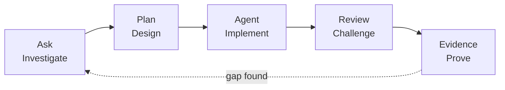

# The Portals of Nexus

> [!NOTE]
> **Status:** Content ready · **Media:** Pending · **Last verified:** 2026-09-05  
> **Primary capability:** Selecting roles, harnesses, targets, and environments

> [!TIP]
> Production hero media is intentionally pending. Use the specification in [Media Prompts](../../../docs/media-prompts.md) before adding a production hero asset.

## Official references

These official sources are the authority for product behavior and availability. Recheck them when using a different surface or after a product update.

- [Agent harness concepts](https://code.visualstudio.com/docs/agents/concepts/agent-harnesses)
- [Run agents in different harnesses](https://code.visualstudio.com/docs/agents/run/agent-harnesses)
- [About GitHub Copilot cloud agent](https://docs.github.com/en/copilot/concepts/agents/cloud-agent/about-cloud-agent)

## Story

At Nexus, four portals appear identical until their runes reveal who acts, where work runs, and which authority crosses the threshold.

The fantasy is a memory aid; the engineering lesson requires observable, reproducible evidence.

## Learning objectives

By the end, you can:

- Explain the primary capability in precise product language.
- Separate role, harness, target, environment, and customization primitive.
- Complete a bounded Ask → Plan → Agent workflow.
- Review tool use, changes, and verification evidence independently.
- State unavailable, Preview, experimental, or unverified behavior without guessing.

## Prerequisites

- Completion of the preceding adventure, or equivalent familiarity.
- A disposable repository or authorized sandbox.
- Access appropriate to the selected Copilot surface; availability is not assumed.
- An existing test, build, lint, validation, or review mechanism where applicable.

Never use production secrets, customer data, or irreversible resources. Use the paper fallback when a named service is unavailable.

## Concept explanation

An agentic workflow has separate dimensions. A role is Ask, Plan, Agent, or a custom agent. A harness is the runtime, such as Local, Copilot, or another supported harness; Cloud is a remote session target. The environment is the folder, worktree, local machine, or remote workspace. Instructions, prompts, skills, custom agents, and MCP servers are distinct customization primitives. Naming each dimension prevents accidental authority and irreproducible results.

### Vocabulary checkpoint

- **Role:** Ask, Plan, Agent, or a custom agent.
- **Harness/surface:** the runtime or product surface in which a role operates.
- **Target:** the selected session destination, such as Local, Copilot, or Cloud where exposed.
- **Environment:** the folder, worktree, local machine, Codespace, or remote environment.
- **Instructions:** automatically applied durable context.
- **Prompt:** a manually invoked task template.
- **Skill:** reusable expertise loaded when relevant.
- **Custom agent:** a role with instructions, tools, and optional handoffs.
- **MCP:** Model Context Protocol.
- **Evidence:** a path, diff, command result, trace, or review decision.

## Ask → Plan → Agent workflow

### Ask — investigate

1. Identify the real user outcome and current source of truth.
2. Inspect relevant files, instructions, tools, permissions, and existing checks.
3. Cite concrete paths or platform evidence for every important finding.
4. Record uncertainty and do not infer unavailable capabilities.

**Gate:** No implementation until the current state and evidence are understood.

### Plan — design

1. State scope, non-goals, assumptions, risks, and trust boundaries.
2. Select the minimum role, tools, authority, and environment.
3. Define acceptance criteria, verification commands, review, and reset.
4. Mark any Preview or experimental dependency and provide a fallback.

**Gate:** Another learner should be able to predict completion from the plan.

### Agent — execute

1. Make the smallest reversible change or produce the planned artifact.
2. Use short inspect → change → verify loops.
3. Preserve command output, exit status, diffs, traces, or platform records.
4. Stop when acceptance criteria are met; do not perform unrelated cleanup.

### Review — challenge

1. Inspect the complete diff or artifact.
2. Compare each result with the plan and acceptance criteria.
3. Run the narrowest relevant existing check, broadening only when justified.
4. Record limitations and unresolved risks.
5. Score the work with [rubric.md](rubric.md).

## Guided mission

Open the [Portals of Nexus lab](https://github.com/paulasilvatech/awesome-copilot-adventures/blob/main/labs/portals-of-nexus/README.md) and keep its verifier output as evidence.

Create a five-column map for one task: role, harness, target, environment, and evidence. Investigate the repository with Ask, design a reversible change with Plan, let Agent make it in a disposable repository, then review the diff and existing checks.

Record each material step in this table:

| Observation | Decision | Action | Evidence | Limitation |
|---|---|---|---|---|
| What was inspected? | Why this next step? | What changed or ran? | What proves it? | What remains unknown? |

### Guided acceptance criteria

- The initial state is supported by current evidence.
- The plan is bounded and contains a reset path.
- Agent work stays inside the declared scope.
- Verification observes the requested behavior.
- Review is independent from the implementation claim.

## Intentional failure: The Universal Portal Assumption

Perform this only in a disposable environment:

Describe the work only as “use Agent mode to fix it,” omitting the harness, environment, permissions, and verification. The request fails because Agent names a responsibility, not an execution boundary.

### Recovery

Return to Ask, identify the violated boundary, narrow the plan, remove unnecessary authority or context, and repeat the smallest relevant verification. Document the causal lesson rather than merely stating that the attempt failed.

## Independent challenge

Given a bug needing investigation, design, implementation, and CI evidence, justify every role and environment transition.

Constraints:

- Do not copy the guided mission verbatim.
- Do not add tools, permissions, or cloud resources without a stated need.
- Do not claim quality, performance, compatibility, or availability without executed evidence.
- Keep fantasy language subordinate to technical clarity.

## Evidence checklist

- [ ] Source-grounded Ask findings.
- [ ] Approved plan with scope, non-goals, risks, checks, and reset.
- [ ] Agent diff or artifact limited to the declared scope.
- [ ] Verification output with command, status, or platform record.
- [ ] Intentional-failure root cause and recovery.
- [ ] Independent challenge result.
- [ ] Explicit limitations and feature-status notes.
- [ ] Completed [rubric.md](rubric.md).

## Reset instructions

1. Restore the exercise map with `git restore labs/portals-of-nexus/starter/portal-map.json`.
2. Run `git status --short -- labs/portals-of-nexus`; it should print nothing.
3. Close the exercise session so its role-selection context is not reused accidentally.

Cleanup is part of completion. Do not leave billable resources, credentials, processes, branches, or worktrees behind.

## Next adventure

[The Context Mirrors](../../00-foundations/context-mirrors/README.md)
