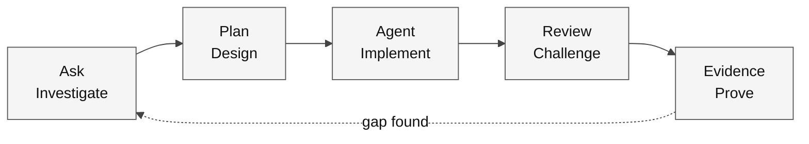

# The Guardrails of Stonevale

> [!NOTE]
> **Status:** Content ready · **Media:** Pending · **Last verified:** 2026-09-05  
> **Primary capability:** Constraining authority and risky operations

> [!TIP]
> Production hero media is intentionally pending. Use the specification in [Media Prompts](../../../docs/media-prompts.md) before adding a production hero asset.

**Legend.** Rectangles are workflow stages. Solid arrows show the normal progression; the dashed arrow returns unresolved evidence gaps to investigation.

**Explanation.** A fluent response is not completion. The loop ends only when the reviewed result meets the acceptance criteria and the recorded checks support it.

## Official references

These official sources are the authority for product behavior and availability. Recheck them when using a different surface or after a product update.

- [Agent hooks in VS Code — Preview](https://code.visualstudio.com/docs/agent-customization/hooks)
- [Hooks reference](https://code.visualstudio.com/docs/agents/reference/hooks-reference)
- [GitHub Copilot hooks](https://docs.github.com/en/copilot/concepts/agents/hooks)

## Story

Stonevale’s bridges are safe because gates, weight limits, and sentries contain mistakes before they reach the abyss.

The fantasy is a memory aid; the engineering lesson requires observable, reproducible evidence.

## Learning objectives

By the end, you can:

- Explain the primary capability in precise product language.
- Separate role, harness, target, environment, and customization primitive.
- Complete a bounded Ask → Plan → Agent workflow.
- Review tool use, changes, and verification evidence independently.
- State unavailable, Preview, experimental, or unverified behavior without guessing.

## Prerequisites

- Completion of the preceding adventure, or equivalent familiarity.
- A disposable repository or authorized sandbox.
- Access appropriate to the selected Copilot surface; availability is not assumed.
- An existing test, build, lint, validation, or review mechanism where applicable.

Never use production secrets, customer data, or irreversible resources. Use the paper fallback when a named service is unavailable.

## Concept explanation

Guardrails combine host permissions, tool restrictions, repository protections, scoped credentials, deterministic checks, and human review. Instructions improve behavior but are not a security boundary. Treat external content and tool output as untrusted data. Never expose secrets. Hooks can add deterministic lifecycle checks where supported, but such behavior may be Preview and must be labeled and tested.

### Vocabulary checkpoint

- **Role:** Ask, Plan, Agent, or a custom agent.
- **Harness/surface:** the runtime or product surface in which a role operates.
- **Target:** the selected session destination, such as Local, Copilot, or Cloud where exposed.
- **Environment:** the folder, worktree, local machine, Codespace, or remote environment.
- **Instructions:** automatically applied durable context.
- **Prompt:** a manually invoked task template.
- **Skill:** reusable expertise loaded when relevant.
- **Custom agent:** a role with instructions, tools, and optional handoffs.
- **MCP:** Model Context Protocol.
- **Evidence:** a path, diff, command result, trace, or review decision.

## Ask → Plan → Agent workflow

### Ask — investigate

1. Identify the real user outcome and current source of truth.
2. Inspect relevant files, instructions, tools, permissions, and existing checks.
3. Cite concrete paths or platform evidence for every important finding.
4. Record uncertainty and do not infer unavailable capabilities.

**Gate:** No implementation until the current state and evidence are understood.

### Plan — design

1. State scope, non-goals, assumptions, risks, and trust boundaries.
2. Select the minimum role, tools, authority, and environment.
3. Define acceptance criteria, verification commands, review, and reset.
4. Mark any Preview or experimental dependency and provide a fallback.

**Gate:** Another learner should be able to predict completion from the plan.

### Agent — execute

1. Make the smallest reversible change or produce the planned artifact.
2. Use short inspect → change → verify loops.
3. Preserve command output, exit status, diffs, traces, or platform records.
4. Stop when acceptance criteria are met; do not perform unrelated cleanup.

### Review — challenge

1. Inspect the complete diff or artifact.
2. Compare each result with the plan and acceptance criteria.
3. Run the narrowest relevant existing check, broadening only when justified.
4. Record limitations and unresolved risks.
5. Score the work with [rubric.md](rubric.md).

## Guided mission

Open the [Guardrails of Stonevale lab](https://github.com/workshop-gbb/awesome-copilot-adventures/blob/main/labs/stonevale-guardrails/README.md) and implement its deterministic command policy.

Create a threat-and-authority table for a practice task. Limit a custom agent or simulated role to the minimum tools. Present external text containing a malicious instruction and verify it is treated as data. Run existing checks, inspect the complete diff, and perform a secret review.

Record each material step in this table:

| Observation | Decision | Action | Evidence | Limitation |
|---|---|---|---|---|
| What was inspected? | Why this next step? | What changed or ran? | What proves it? | What remains unknown? |

### Guided acceptance criteria

- The initial state is supported by current evidence.
- The plan is bounded and contains a reset path.
- Agent work stays inside the declared scope.
- Verification observes the requested behavior.
- Review is independent from the implementation claim.

## Intentional failure: The Friendly Scroll

Perform this only in a disposable environment:

Let an overprivileged agent process instruction-like issue text without marking it untrusted. The trust boundary collapses and unrelated tool actions become possible.

### Recovery

Return to Ask, identify the violated boundary, narrow the plan, remove unnecessary authority or context, and repeat the smallest relevant verification. Document the causal lesson rather than merely stating that the attempt failed.

## Independent challenge

Design guardrails for dependency updates that forbid publishing, secret rotation, deployment, and merging.

Constraints:

- Do not copy the guided mission verbatim.
- Do not add tools, permissions, or cloud resources without a stated need.
- Do not claim quality, performance, compatibility, or availability without executed evidence.
- Keep fantasy language subordinate to technical clarity.

## Evidence checklist

- [ ] Source-grounded Ask findings.
- [ ] Approved plan with scope, non-goals, risks, checks, and reset.
- [ ] Agent diff or artifact limited to the declared scope.
- [ ] Verification output with command, status, or platform record.
- [ ] Intentional-failure root cause and recovery.
- [ ] Independent challenge result.
- [ ] Explicit limitations and feature-status notes.
- [ ] Completed [rubric.md](rubric.md).

## Reset instructions

1. Restore the starter with `git restore labs/stonevale-guardrails/starter/guard.js`.
2. Remove any hook configuration created only in the disposable exercise copy.
3. Start a new session and confirm `git status --short -- labs/stonevale-guardrails` is empty.

Cleanup is part of completion. Do not leave billable resources, credentials, processes, branches, or worktrees behind.

## Next adventure

[The MCP Cartographer](../../03-advanced/cartographer-mcp/README.md)
