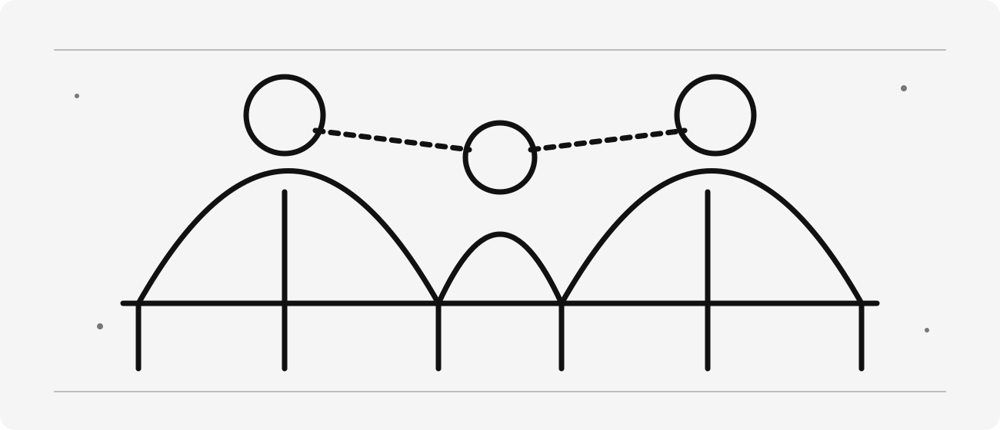

# The Convergence of Three Realms


> [!NOTE]
> **Status:** Content ready · **Media:** Original SVG illustration · **Last verified:** 2026-09-05  
> **Primary capability:** Integrating local, cloud, and runtime agents



> [!TIP]
> [Download this learner kit](../../../assets/lab-kits/adventures/convergence-of-three-realms.zip) and use
> [the extraction and setup guide](../../../docs/downloads.md). Keep the original starter untouched.

```mermaid
---
config:
  theme: base
  look: classic
  themeVariables:
    darkMode: false
    background: "#ffffff"
    primaryColor: "#f5f5f5"
    primaryTextColor: "#111111"
    primaryBorderColor: "#555555"
    secondaryColor: "#e0e0e0"
    secondaryTextColor: "#111111"
    secondaryBorderColor: "#666666"
    tertiaryColor: "#bdbdbd"
    tertiaryTextColor: "#111111"
    tertiaryBorderColor: "#444444"
    lineColor: "#444444"
    textColor: "#111111"
    mainBkg: "#f5f5f5"
    nodeBorder: "#555555"
    clusterBkg: "#ffffff"
    clusterBorder: "#999999"
    edgeLabelBackground: "#ffffff"
    actorBkg: "#e0e0e0"
    actorBorder: "#555555"
    actorTextColor: "#111111"
    actorLineColor: "#777777"
    signalColor: "#333333"
    signalTextColor: "#111111"
    labelBoxBkgColor: "#f5f5f5"
    labelBoxBorderColor: "#777777"
    labelTextColor: "#111111"
    loopTextColor: "#111111"
    activationBkgColor: "#bdbdbd"
    activationBorderColor: "#555555"
    noteBkgColor: "#f5f5f5"
    noteTextColor: "#111111"
    noteBorderColor: "#777777"
    attributeBackgroundColorOdd: "#f5f5f5"
    attributeBackgroundColorEven: "#e0e0e0"
---
flowchart LR
    accTitle: The Convergence of Three Realms capability map
    accDescr: Traceability requires both implementation and runtime evidence. Label unavailable stages so the reviewer can see exactly what was and was not executed.
    A["Ask: findings"] --> P["Plan: design"]
    P --> L["Local implementation: verification"]
    L --> C["Cloud work: pull request"]
    C --> S["SDK: evaluation report"]
    C --> R["Human review"]
    S --> R
    R --> D["Decision with evidence"]
```



**Legend.** Boxes are accountable stages; arrows carry named artifacts, not shared identity or automatic approval.

**Explanation.** Traceability requires both implementation and runtime evidence. Label unavailable stages so the reviewer can see exactly what was and was not executed.

## Official references

These official sources are the authority for product behavior and availability. Recheck them when using a different surface or after a product update.

- [Agent harness concepts](https://code.visualstudio.com/docs/agents/concepts/agent-harnesses)
- [About GitHub Copilot cloud agent](https://docs.github.com/en/copilot/concepts/agents/cloud-agent/about-cloud-agent)
- [GitHub Copilot SDK](https://docs.github.com/en/copilot/how-tos/copilot-sdk)
- [MCP servers in VS Code](https://code.visualstudio.com/docs/agent-customization/mcp-servers)

## Story

The local workshop, GitHub cloud citadel, and application foundry converge. Authority, artifacts, and evidence must cross each border deliberately.

The fantasy is a memory aid; the engineering lesson requires observable, reproducible evidence.

## Learning objectives

- Map six ordered stages to actors, roles, harnesses, environments and consumed artifacts.
- Keep human review distinct from agent execution and preserve evidence across handoffs.
- Deliver a traceable local workflow with explicitly labeled optional cloud and SDK observations.

## Prerequisites

| Requirement | Why it matters |
| --- | --- |
| Complete the preceding adventure, or demonstrate its exit evidence | Keep this mission focused on its named capability |
| Node 24 and the extracted kit | The local verifier uses the supplied runtime and files |
| A disposable folder outside another project | Customizations and intentional failures must not leak into other work |
| Authorized host access, only for live steps | Availability, tools and policies differ |

**Evidence boundary:** Completing the workflow contract is not a production delivery. Record unexecuted cloud and SDK stages as paper alternatives, never fabricated observations.

Estimated session: 45–75 minutes after prerequisites; actual duration varies. Never use production secrets or customer data.

## Concept explanation

The capstone treats agentic engineering as a governed system. Realm one is a local harness such as VS Code or Copilot CLI. Realm two is GitHub Copilot cloud agent. Realm three is a runtime application built with the GitHub Copilot SDK. Each has different identities, tools, environments, and evidence. Boundaries must be explicit, authority minimal, Preview capabilities labeled, and claims grounded.

### Concrete use case

A local developer, a cloud worker and an embedded runtime agent have different identities and outputs. The final maintainer needs both the implementation evidence and the runtime evaluation before deciding.

### Vocabulary checkpoint

- **Role:** Ask, Plan, Agent, or a custom agent.
- **Harness/surface:** the runtime or product surface in which a role operates.
- **Target:** the selected session destination, such as Local, Copilot, or Cloud where exposed.
- **Environment:** the folder, worktree, local machine, Codespace, or remote environment.
- **Instructions:** automatically applied durable context.
- **Prompt:** a manually invoked task template.
- **Skill:** reusable expertise loaded when relevant.
- **Custom agent:** a role with instructions, tools, and optional handoffs.
- **MCP:** Model Context Protocol.
- **Evidence:** a path, diff, command result, trace, or review decision.

## Ask → Plan → Agent workflow

### Ask — investigate

1. Identify the real user outcome and current source of truth.
2. Inspect relevant files, instructions, tools, permissions, and existing checks.
3. Cite concrete paths or platform evidence for every important finding.
4. Record uncertainty and do not infer unavailable capabilities.

**Gate:** No implementation until the current state and evidence are understood.

### Plan — design

1. State scope, non-goals, assumptions, risks, and trust boundaries.
2. Select the minimum role, tools, authority, and environment.
3. Define acceptance criteria, verification commands, review, and reset.
4. Mark any Preview or experimental dependency and provide a fallback.

**Gate:** Another learner should be able to predict completion from the plan.

### Agent — execute

1. Make the smallest reversible change or produce the planned artifact.
2. Use short inspect → change → verify loops.
3. Preserve command output, exit status, diffs, traces, or platform records.
4. Stop when acceptance criteria are met; do not perform unrelated cleanup.

### Review — challenge

1. Inspect the complete diff or artifact.
2. Compare each result with the plan and acceptance criteria.
3. Run the narrowest relevant existing check, broadening only when justified.
4. Record limitations and unresolved risks.
5. Score the work with [rubric.md](rubric.md).

## Guided mission

### 1. Prepare one isolated copy

1. Download and extract the [convergence-of-three-realms kit](../../../assets/lab-kits/adventures/convergence-of-three-realms.zip) into a new work-drive directory.
2. Read `KIT-START.md` at its root. Open `starter/` as the VS Code workspace when testing discovery, but run the verifier from the kit root.
3. Inspect `starter/workflow.json`, `verify.js` before editing.
4. From the extracted kit root, run `node verify.js`.
5. Record the documented starter rejection. A missing runtime or unrelated crash is not the expected exercise result.

### 2. Investigate and plan

In Ask, request a trace of the inspected files and what the verifier actually observes. Challenge any claim about live execution that is not supported by output.

Use this planning prompt:

```text
Complete the six-stage contract using the supplied actor and artifact dimensions. Explain every consumes/produces edge, trust boundary and evidence item. Keep agent-only fields null for human review.
Do not implement yet. Identify affected files, the negative case and a safe reset.
```

### 3. Implement the reviewed slice

1. Approve only the named starter artifact and necessary focused tests.
2. Ask Agent to implement one slice; inspect proposed commands before execution.
3. Run `node verify.js` again from the kit root, or `node ../verify.js` from `starter/`.
4. Compare the exact result with the checkpoint below and review the complete diff.
5. Record host discovery or live activity separately when available. Do not enable extra services to manufacture a passing result.

> [!IMPORTANT]
> **Checkpoint:** The graph preserves findings, design, verification, pull request, evaluation report and human decision in order.
> Completing the workflow contract is not a production delivery. Record unexecuted cloud and SDK stages as paper alternatives, never fabricated observations.

### 4. Prove a check can reject a mistake

Give the human-review stage an agent harness and confirm the verifier rejects the conflation. Restore the distinct review boundary.

| Observation | Decision | Action | Evidence | Limitation |
| --- | --- | --- | --- | --- |
| Initial state and exact diagnostic | Why this change is needed | Named file and bounded change | Command, exit code and observed result | What the local check does not prove |

Finish with the adventure-specific capability evidence in [the rubric](rubric.md), not just the presence of a file.

## Intentional failure: The Collapsed Realms

Perform this only in a disposable environment:

Call every participant “the agent” and then try to assign permissions and responsibility. Attribution becomes impossible because development, cloud, and runtime identities are conflated.

### Recovery

Return to Ask, identify the violated boundary, narrow the plan, remove unnecessary authority or context, and repeat the smallest relevant verification. Document the causal lesson rather than merely stating that the attempt failed.

## Independent challenge

Deliver the capstone with one unavailable cloud capability, using a clearly labeled paper fallback that preserves contracts and evidence.

Constraints:

- Do not copy the guided mission verbatim.
- Do not add tools, permissions, or cloud resources without a stated need.
- Do not claim quality, performance, compatibility, or availability without executed evidence.
- Keep fantasy language subordinate to technical clarity.

## Evidence checklist

- [ ] Source-grounded Ask findings.
- [ ] Approved plan with scope, non-goals, risks, checks, and reset.
- [ ] Agent diff or artifact limited to the declared scope.
- [ ] Verification output with command, status, or platform record.
- [ ] Intentional-failure root cause and recovery.
- [ ] Independent challenge result.
- [ ] Explicit limitations and feature-status notes.
- [ ] Completed [rubric.md](rubric.md).

## Reset instructions

1. Save your diff, command output and limitations from the disposable kit.
2. Stop only the process or learning session you started. Do not stop other projects.
3. If you initialized Git in the kit, inspect `git status --short` there and restore only your named exercise files from its local baseline.
4. Otherwise, extract the original ZIP into a new unused directory for another attempt; do not overwrite your current work.
5. Remove only exercise-owned configurations, worktrees or remote resources after reviewing anything worth preserving.

The curriculum source and other projects must remain unchanged. A reset of the copied kit is not a repository-wide hard reset.

## Next adventure

You have completed the current adventure path. Revisit any evidence gap before applying this workflow to production.
