# Contributing

Read the repository [Contribution Guide](https://github.com/paulasilvatech/awesome-copilot-adventures/blob/main/CONTRIBUTING.md), [Code of Conduct](https://github.com/paulasilvatech/awesome-copilot-adventures/blob/main/CODE_OF_CONDUCT.md), and [Security Policy](https://github.com/paulasilvatech/awesome-copilot-adventures/blob/main/SECURITY.md) before proposing changes.

```mermaid
---
config:
  theme: base
  look: classic
  themeVariables:
    darkMode: false
    background: "#ffffff"
    primaryColor: "#f5f5f5"
    primaryTextColor: "#111111"
    primaryBorderColor: "#555555"
    secondaryColor: "#e0e0e0"
    secondaryTextColor: "#111111"
    secondaryBorderColor: "#666666"
    tertiaryColor: "#bdbdbd"
    tertiaryTextColor: "#111111"
    tertiaryBorderColor: "#444444"
    lineColor: "#444444"
    textColor: "#111111"
    mainBkg: "#f5f5f5"
    nodeBorder: "#555555"
    clusterBkg: "#ffffff"
    clusterBorder: "#999999"
    edgeLabelBackground: "#ffffff"
    actorBkg: "#e0e0e0"
    actorBorder: "#555555"
    actorTextColor: "#111111"
    actorLineColor: "#777777"
    signalColor: "#333333"
    signalTextColor: "#111111"
    labelBoxBkgColor: "#f5f5f5"
    labelBoxBorderColor: "#777777"
    labelTextColor: "#111111"
    loopTextColor: "#111111"
    activationBkgColor: "#bdbdbd"
    activationBorderColor: "#555555"
    noteBkgColor: "#f5f5f5"
    noteTextColor: "#111111"
    noteBorderColor: "#777777"
    attributeBackgroundColorOdd: "#f5f5f5"
    attributeBackgroundColorEven: "#e0e0e0"
---
flowchart LR
    accTitle: Prepare a reviewable curriculum contribution
    accDescr: Choose a learning outcome, verify sources, define evidence, write the lab and rubric, validate, then request review.
    O["Choose one learning outcome"] --> D["Verify official documentation"]
    D --> E["Define observable evidence"]
    E --> W["Write adventure + lab + rubric"]
    W --> V["Run focused and repository checks"]
    V --> R["Open a reviewable pull request"]
```



**Legend.** Rectangles represent artifacts or review stages; solid arrows show the contribution sequence.

**Explanation.** A source-grounded learning objective and an observable check should precede publication. The diagram is a process guide, not evidence that a pull request was reviewed.

## Adventure checklist

- [ ] Metadata and a real verification date.
- [ ] Current official GitHub or Microsoft references.
- [ ] One primary agentic learning objective.
- [ ] Ask → Plan → Agent → Review → Evidence.
- [ ] Guided mission and intentional failure.
- [ ] Independent challenge.
- [ ] Deterministic evidence and reset instructions.
- [ ] Rubric with observable completion criteria.
- [ ] Starter material and verifier when files change.
- [ ] Preview or experimental status clearly labeled.
- [ ] No credentials, fabricated output, or universal availability claims.

## Validation

Run the smallest relevant check first, then:

```bash
npm test
```

If a language solution changes, run its documented build or test command. Media contributions must follow the [Media Prompt and Accessibility Guide](media-prompts.md).
