# Curriculum map

The path moves from mental models to a governed end-to-end delivery.

```mermaid
---
config:
  theme: base
  look: classic
  themeVariables:
    darkMode: false
    background: "#ffffff"
    primaryColor: "#f5f5f5"
    primaryTextColor: "#111111"
    primaryBorderColor: "#555555"
    secondaryColor: "#e0e0e0"
    secondaryTextColor: "#111111"
    secondaryBorderColor: "#666666"
    tertiaryColor: "#bdbdbd"
    tertiaryTextColor: "#111111"
    tertiaryBorderColor: "#444444"
    lineColor: "#444444"
    textColor: "#111111"
    mainBkg: "#f5f5f5"
    nodeBorder: "#555555"
    clusterBkg: "#ffffff"
    clusterBorder: "#999999"
    edgeLabelBackground: "#ffffff"
    actorBkg: "#e0e0e0"
    actorBorder: "#555555"
    actorTextColor: "#111111"
    actorLineColor: "#777777"
    signalColor: "#333333"
    signalTextColor: "#111111"
    labelBoxBkgColor: "#f5f5f5"
    labelBoxBorderColor: "#777777"
    labelTextColor: "#111111"
    loopTextColor: "#111111"
    activationBkgColor: "#bdbdbd"
    activationBorderColor: "#555555"
    noteBkgColor: "#f5f5f5"
    noteTextColor: "#111111"
    noteBorderColor: "#777777"
    attributeBackgroundColorOdd: "#f5f5f5"
    attributeBackgroundColorEven: "#e0e0e0"
---
flowchart TB
    accTitle: Progressive adventure curriculum
    accDescr: Foundations, basics, intermediate customization, advanced coordination and execution surfaces lead to the capstone.
    subgraph F["00 · Foundations"]
        N["Portals of Nexus<br/>roles · harnesses · targets"]
        X["Context Mirrors<br/>context experiments"]
        N --> X
    end

    subgraph B["01 · Basics"]
        T["Tempora Loop<br/>bounded iteration"]
        E["Laws of Eldoria<br/>instructions and scope"]
        T --> E
    end

    subgraph I["02 · Intermediate"]
        A["Skills of Algora<br/>reusable expertise"]
        S["Agents of Stellaris<br/>roles, tools, handoffs"]
        G["Guardrails of Stonevale<br/>hooks and policy"]
        A --> S --> G
    end

    subgraph D["03 · Advanced"]
        M["MCP Cartographer<br/>external capabilities"]
        L["Lumoria Graph<br/>dependency and impact graph"]
        Y["Parallel Mythos<br/>sessions and worktrees"]
        M --> L --> Y
    end

    subgraph U["04 · Surfaces"]
        C["Cloud Citadel<br/>cloud agent"]
        Q["Terminal Gate<br/>Copilot CLI"]
        K["Automaton Foundry<br/>Copilot SDK"]
        C --> Q --> K
    end

    Z["99 · Capstone<br/>Convergence of Three Realms"]

    X --> T
    E --> A
    G --> M
    Y --> C
    K --> Z
```

**Legend.** Grouped boxes are curriculum levels; individual boxes are adventures. Solid arrows indicate the suggested first-pass learning order.

**Explanation.** Later adventures build on earlier concepts. The hands-on companion track is separate and retains numbered professional exercises rather than adding fantasy adventures.

| Level | Focus | Catalog | Source |
| --- | --- | --- | --- |
| **00 · Foundations** | Roles, harnesses, targets, context, and evidence | [Foundations](adventures/foundations.md) | [Adventure files](https://github.com/workshop-gbb/awesome-copilot-adventures/tree/main/adventures/00-foundations) |
| **01 · Basics** | Instructions and bounded agent loops | [Basics](adventures/basics.md) | [Adventure files](https://github.com/workshop-gbb/awesome-copilot-adventures/tree/main/adventures/01-basics) |
| **02 · Intermediate** | Skills, custom agents, and guardrails | [Intermediate](adventures/intermediate.md) | [Adventure files](https://github.com/workshop-gbb/awesome-copilot-adventures/tree/main/adventures/02-intermediate) |
| **03 · Advanced** | Model Context Protocol, graphs, and parallel work | [Advanced](adventures/advanced.md) | [Adventure files](https://github.com/workshop-gbb/awesome-copilot-adventures/tree/main/adventures/03-advanced) |
| **04 · Surfaces** | CLI, cloud execution, and SDK applications | [Surfaces](adventures/surfaces.md) | [Adventure files](https://github.com/workshop-gbb/awesome-copilot-adventures/tree/main/adventures/04-surfaces) |
| **99 · Capstone** | Integrated agentic engineering | [Capstone](adventures/capstone.md) | [Adventure files](https://github.com/workshop-gbb/awesome-copilot-adventures/tree/main/adventures/99-capstone) |

> [!TIP]
> Follow the levels in order on a first pass. On later passes, repeat one lab in a different harness and compare the evidence rather than the fluency of the response.

Use the [Glossary](glossary.md) for terminology and the [Feature Status Matrix](feature-status.md) before relying on availability-sensitive capabilities.

## A separate hands-on path

The [Hands-on Labs](../mslearn-github-copilot/index.md) complement this adventure
path without adding fantasy stories. Choose that catalog for C#/Python application
work, engineering exercises, or Spec Kit greenfield, brownfield and modernization.
Its [audit report](../mslearn-github-copilot/Instructions/Reference/AUDIT.md) records
the source-level improvements and verification boundaries.
