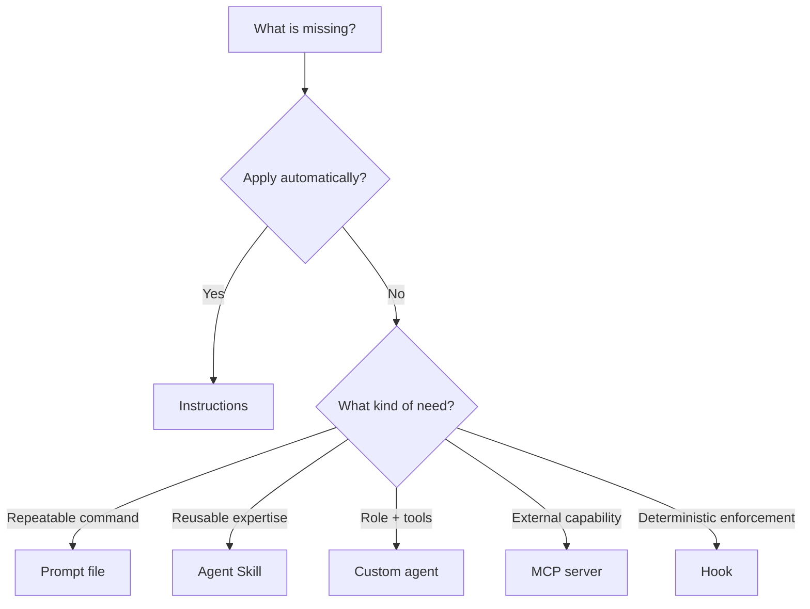

# Customization primitives

Choose the smallest primitive that reliably supplies the missing behavior.

| Need | Primitive | Key boundary |
| --- | --- | --- |
| Context applied automatically | Repository or path-specific instructions | Keep scope explicit and avoid conflicts |
| A manually invoked task template | Prompt file | Local invocation is intentional, not automatic |
| Reusable expertise loaded when relevant | Agent Skill | Expertise is not a permanent persona |
| A role with tools and optional handoffs | Custom agent (`.agent.md`) | Tool access and handoffs must be explicit |
| Access to an external system | Model Context Protocol server | Trust, authentication, data exposure, and side effects vary |
| A deterministic lifecycle command | Hook | Preview schema, shell safety, timeout, and secret handling matter |

> [!IMPORTANT]
> Prompt files are supported by the VS Code Local harness, but agents running in the Agent Host do not use them. Use an Agent Skill when the behavior must travel to the Copilot harness.

> [!WARNING]
> Agent hooks in VS Code are **Preview** as of 2026-09-05. Review every command, input, output, timeout, and secret exposure path.

## Portability

| Primitive | VS Code Local | Copilot harness / Agent Host | Copilot CLI | Cloud agent |
| --- | --- | --- | --- | --- |
| Instructions | Yes, subject to scope | Yes, subject to discovery | Yes, subject to discovery | Yes, documented locations apply |
| Prompt files | Yes | No | Do not assume | Do not assume |
| Agent Skills | Yes | Yes | Yes | Yes |
| Custom agents | Yes | Yes | Yes | Yes, with property differences |
| MCP | Yes | Use portable configuration | Yes | Support and policy vary |
| Hooks | Preview | Preview | Documented support varies | Documented support varies |

Do not use deprecated custom chat modes as a substitute for custom agents. MCP means **Model Context Protocol**.

Practice with [Laws of Eldoria](../adventures/01-basics/eldoria-laws/README.md), [Skills of Algora](../adventures/02-intermediate/algora-skills/README.md), and [Agents of Stellaris](../adventures/02-intermediate/stellaris-agents/README.md).

## Official references

- [Customization concepts](https://code.visualstudio.com/docs/agents/concepts/customization)
- [Custom instructions](https://code.visualstudio.com/docs/agent-customization/custom-instructions)
- [Prompt files](https://code.visualstudio.com/docs/agent-customization/prompt-files)
- [Agent Skills](https://code.visualstudio.com/docs/agent-customization/agent-skills)
- [Custom agents](https://code.visualstudio.com/docs/agent-customization/custom-agents)
- [MCP servers](https://code.visualstudio.com/docs/agent-customization/mcp-servers)
- [Agent hooks — Preview](https://code.visualstudio.com/docs/agent-customization/hooks)
