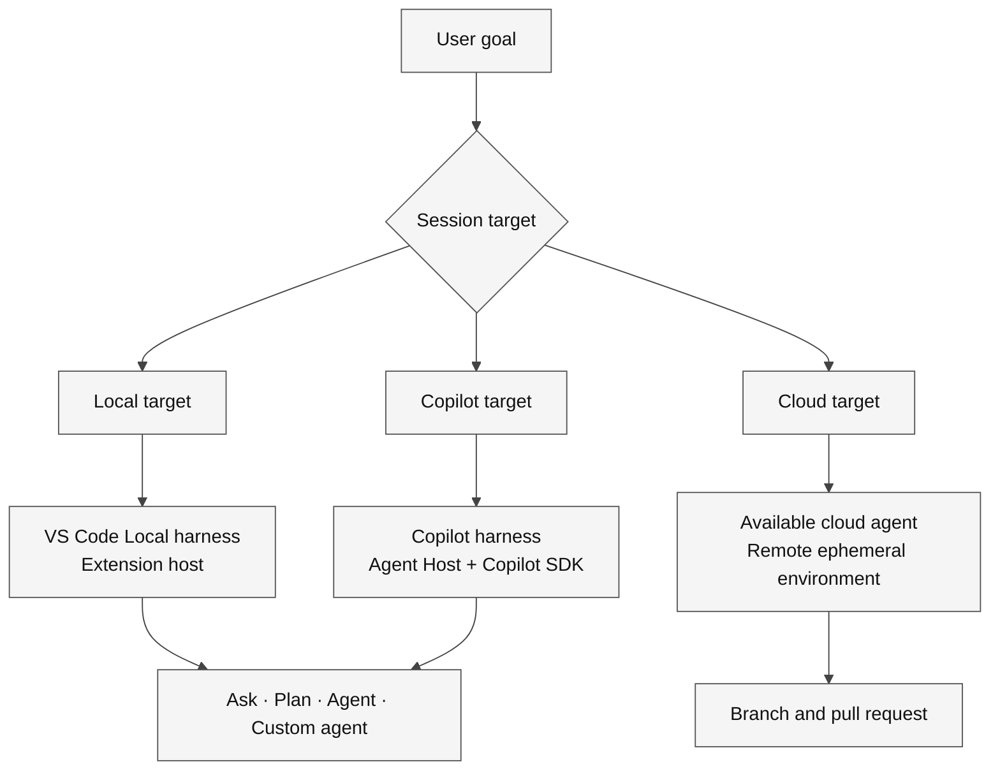
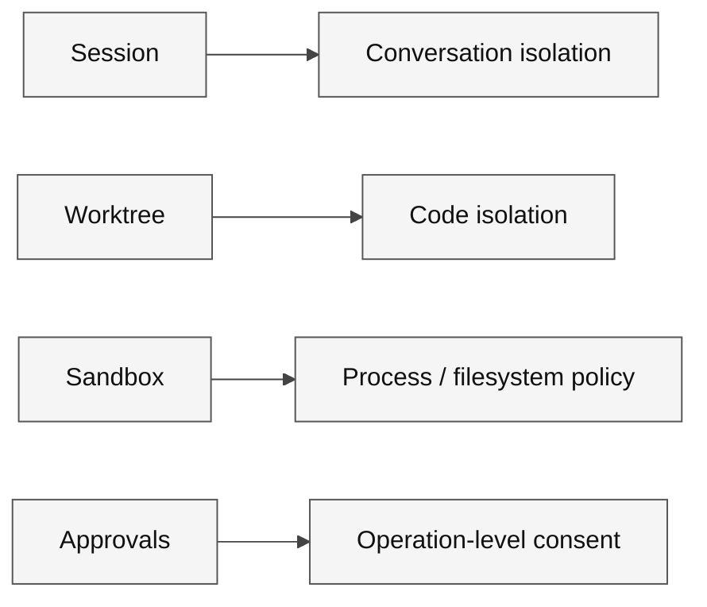

# Harness guide

A **role** describes the responsibility. A **harness** supplies runtime, tools, permissions, context, and lifecycle. A **target** chooses where the session runs. An **environment** contains the files and processes.

**Legend.** The diamond is the target-selection decision. Rectangles describe runtimes, agent roles and the remote review artifact; solid arrows show selection relationships.

**Explanation.** Local is a harness name, not all local execution. Roles, targets and runtimes answer different questions; a remote pull request is an output artifact.

> [!IMPORTANT]
> **Local** is the name of a VS Code harness, not a synonym for every local execution. **Cloud** is a remote target that can expose available cloud agents; it is not one universal harness.

## Decision guide

| Surface or harness | Consider it when | Verify before use |
| --- | --- | --- |
| **VS Code Local harness** | Work depends on editor state, extension-provided tools, or prompt files | Extensions, workspace trust, model, approvals, and local permissions |
| **VS Code Copilot harness** | Work needs Agent Host sessions, background execution, folder/worktree isolation, or portable skills | Tools, policies, model, session target, and isolation |
| **GitHub Copilot CLI** | Terminal-centered investigation and execution are appropriate | Current directory, approvals, environment variables, runtimes, and repository state |
| **Cloud target / cloud agent** | A bounded repository task can run remotely and return a reviewable pull request | Repository access, setup, secrets, network, branch protection, and review plan |
| **Copilot SDK application** | You are intentionally embedding an agent runtime in a product | Supported SDK, authentication, tenancy, tools, permissions, observability, and deployment |

## Isolation is not permission

**Legend.** Rectangles name controls and their responsibilities. Solid arrows connect each control with what it actually governs.

**Explanation.** A worktree is not a security sandbox. Code isolation, process policy and operation approval must each be considered when selecting an execution environment.

A worktree prevents branch collisions; it does not by itself restrict commands, network, or access outside the worktree.

## Before a handoff

- State the goal and non-goals.
- Name the repository, branch, and relevant paths.
- Provide setup and validation commands.
- Separate confirmed facts from assumptions.
- Define stop conditions and expected artifacts.
- Never place secrets in prompts, source files, or captured evidence.

Practice with [The Portals of Nexus](../adventures/00-foundations/portals-of-nexus/README.md).

## Official references

- [Agent harness concepts](https://code.visualstudio.com/docs/agents/concepts/agent-harnesses)
- [Run agents in different harnesses](https://code.visualstudio.com/docs/agents/run/agent-harnesses)
- [Agent Host architecture](https://code.visualstudio.com/docs/agents/concepts/agent-host)
- [Agent sessions](https://code.visualstudio.com/docs/agents/concepts/sessions)
- [GitHub Copilot CLI](https://docs.github.com/en/copilot/concepts/agents/copilot-cli/about-copilot-cli)
- [GitHub Copilot cloud agent](https://docs.github.com/en/copilot/concepts/agents/cloud-agent/about-cloud-agent)
