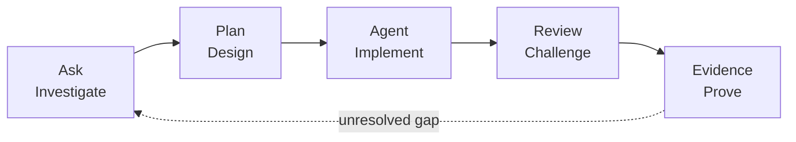

# Awesome Copilot Adventures

Learn agentic software engineering through guided, fantasy-themed laboratories built around observable evidence.

> [!IMPORTANT]
> The curriculum teaches agent roles, harnesses, environments, and customization primitives as separate concepts. It does not teach deprecated custom chat modes.

## One progressive workflow

Ask, Plan, and Agent are **roles**. Local and Copilot are VS Code **agent harnesses**. Cloud is a remote **session target**. A folder, worktree, Codespace, local machine, or remote ephemeral workspace is an **environment**.

## Begin the journey

| Destination | Use it for |
| --- | --- |
| [Start here](start-here.md) | Prepare the environment and first session |
| [Curriculum map](curriculum-map.md) | Follow the complete learning progression |
| [Harness guide](harness-guide.md) | Choose where and how an agent executes |
| [Customization primitives](customization-primitives.md) | Select instructions, prompts, skills, agents, MCP, or hooks |
| [Feature status](feature-status.md) | Check current availability and preview labels |
| [Adventure catalog](adventures/index.md) | Browse every guided mission |

The executable source for each mission lives in the GitHub [adventure tree](https://github.com/paulasilvatech/awesome-copilot-adventures/tree/main/adventures) and [lab tree](https://github.com/paulasilvatech/awesome-copilot-adventures/tree/main/labs).

> [!NOTE]
> Product guidance was last verified against current official GitHub and Microsoft documentation on **2026-09-05**. Recheck the linked source when availability or policy materially affects your task.
