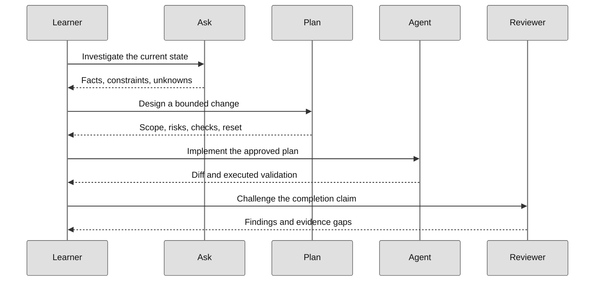

# Start here: your first verified change

**Goal:** open a small working project, explain one behavior, change it with
Copilot and prove the result. This first route uses JavaScript, but you do not
need to choose it as your long-term language.

| Briefing | What to expect |
| --- | --- |
| Starting point | Comfortable opening a folder; terminal steps are explained below |
| Tools | VS Code and Node 24; authorized Copilot access for the AI steps |
| Time | About 20–35 minutes after tools are installed; an estimate, not a guarantee |
| Project | A greeting function with two existing tests |
| Finish | Baseline, reviewed change, passing regression and one detected wrong assertion |
| Next | [Learning order](learning-path.md) or [the full first lab](../mslearn-github-copilot/Instructions/Labs/LAB_AK_01_examine_settings_interface.md) |

> [!TIP]
> **Use one kit, not the whole repository.** Download
> [01-interface.zip](../assets/lab-kits/hands-on/01-interface.zip). No package install,
> Python, .NET, Docker, payment, GitHub repository or cloud deployment is needed.

## 1. Prepare only what this exercise needs

New to the tools or accounts? Follow [Prerequisites and accounts](prerequisites.md)
for personal GitHub signup, Copilot Free and plans, VS Code versus Insiders,
CLI installation on each operating system, and optional Codespaces or Azure.
Then return here; none of the optional cloud offers is required for this lab.

| Requirement | How to check | If it is missing |
| --- | --- | --- |
| VS Code | The editor opens and can select a local folder | Follow [VS Code setup](https://code.visualstudio.com/docs/setup/setup-overview) or your managed installation route |
| Node 24 | Run `node --version` in a terminal | Use the [Node runtime instructions](https://code.visualstudio.com/docs/nodejs/nodejs-tutorial) with the version required here |
| Copilot access | A harmless Ask request succeeds in your intended account | Follow [the Copilot setup lab](../mslearn-github-copilot/Instructions/Labs/LAB_AK_00_enable_github_copilot_in_visual_studio_code.md) |

> [!NOTE]
> You can inspect the project and run local tests without Copilot. If access is
> blocked, record **local baseline completed; agent steps not performed**. Do not
> claim a full Copilot exercise or change billing/policy automatically.

## 2. Download, extract and open

1. Download the ZIP above. On GitHub's file preview, use **Download raw file**.
2. Choose a new folder on your work drive, outside another repository.
3. Use **Extract All** on Windows or your file manager's extract action on macOS/Linux.
4. Open the extracted `01-interface` directory in VS Code using **File → Open Folder**.
5. Confirm that the Explorer shows the following files:

```text
01-interface/
  KIT-START.md          First-run guide
  KIT-LESSON.md         Complete exercise
  KIT-MANIFEST.json     Original file hashes
  KIT-VERIFY.cjs        Integrity check
  greeting.mjs          Code you will investigate
  greeting.test.mjs     Existing tests
```

The archive also includes licenses and setup guidance. For hash verification,
system-specific instructions or GitHub publication, use [the download guide](downloads.md).

**Checkpoint:** the files are extracted and editable. You are not looking inside
the ZIP preview or editing the curriculum's original starter.

## 3. Run the untouched baseline

Select **Terminal → New Terminal** in VS Code. The terminal is a command interface
to your computer; it is not Copilot Chat. Its working directory should be
`01-interface`, the folder containing the two greeting files.

```bash
node KIT-VERIFY.cjs
node --test --test-concurrency=1 greeting.test.mjs
```

The integrity command confirms the packaged bytes before editing. The second
command runs the actual tests. Expect **2 tests, 2 passes and 0 failures** in the
untouched fixture; duration and output formatting may vary.

| Observation | Interpretation |
| --- | --- |
| Two tests pass | The declared baseline works; it does not test the requested whitespace change yet |
| No tests found | Wrong directory/file or discovery; not a successful check |
| Node not found | Runtime setup is incomplete |
| Integrity mismatch before edits | Review the download/extraction before running more code |

Record the command and output in a local evidence note. Do not copy the expected
numbers into the note unless your run actually reports them.

## 4. Understand the concept before changing code

The function formats a name. The tests already reject blank or non-string input.
The new requirement is: **remove surrounding whitespace while keeping those errors**.

| Term | Plain meaning in this lab |
| --- | --- |
| Baseline | How the untouched project behaves |
| Requirement | What must change: surrounding whitespace should not appear in the greeting |
| Regression test | A check that rejects an implementation missing that behavior |
| Diff | The exact lines changed, not the agent's summary |
| Evidence | The command, output and reviewed change that support completion |

With `greeting.mjs` open, choose a supported **Ask** role. Attach the file if
needed and submit:

```text
Explain how greeting handles blank names and surrounding whitespace.
Cite the actual implementation and current tests. Do not edit or run commands.
Separate existing behavior from missing test coverage.
```

Compare the answer with the files. A plausible explanation without source evidence
is not enough.

## 5. Plan, implement and challenge

In a supported **Plan** role, submit:

```text
Plan trimming surrounding whitespace before formatting a greeting, while preserving
errors for blank and non-string values. Include " Ada ", "", "   ", null and a number.
Limit changes to greeting.mjs and greeting.test.mjs. Name the check and reset path.
Do not implement yet.
```

1. Review the affected files and test cases before approving.
2. Ask **Agent** to implement that reviewed plan only.
3. Inspect its proposed commands and the complete diff. Do not accept weakened tests.
4. Run the same test command from step 3 yourself.
5. Add or confirm an assertion for surrounding whitespace.
6. Temporarily change one expected greeting to an obviously wrong value, rerun and
   observe the failed assertion. Restore that assertion and rerun successfully.

**Checkpoint:** both the original errors and the new whitespace behavior are
tested. The deliberate wrong assertion failed. A green UI alone is not evidence.

## Why the role handoff matters



**Legend.** Participants are the learner and agent roles. Solid arrows are requests; dashed arrows are returned findings, plans, changes or review results.

**Explanation.** The learner owns acceptance at each boundary. A role handoff carries task context, but it does not prove a test or review was executed.

Use [the harness guide](harness-guide.md) when choosing where the agent executes.
Ask, Plan and Agent describe responsibilities; not every CLI or runtime presents
them as three identical buttons.

## 6. Finish, reset and choose the next step

- [ ] The starting state is documented.
- [ ] Scope and non-goals are explicit.
- [ ] The chosen harness and environment are justified.
- [ ] Relevant checks were actually run.
- [ ] Output and exit status were recorded.
- [ ] Review findings were resolved or accepted.
- [ ] Temporary resources and credentials were cleaned up.

For a reset, save your evidence and extract the original ZIP into another unused
directory. If you created a Git baseline, restore only the named exercise files
after inspecting your diff. Do not hard-reset another repository.

| Continue with… | Choose it when… |
| --- | --- |
| [Full lab 01](../mslearn-github-copilot/Instructions/Labs/LAB_AK_01_examine_settings_interface.md) | You want the remaining context and inline-assistance experiments |
| [Learning order](learning-path.md) | You are ready to choose C#, Python or the adventure route |
| [Portals of Nexus](../adventures/00-foundations/portals-of-nexus/README.md) | You prefer the story-supported foundations path |
| [Troubleshooting and environment](../mslearn-github-copilot/Instructions/Reference/SETUP.md) | A runtime, working directory or permission is blocking progress |

## What can wait

Git history and GitHub publication are optional for this first local exercise.
Codespaces and Dev Containers are alternative environments, not extra mandatory
steps. Building the whole learning site is a maintainer task. MCP, Spec Kit,
parallel agents, cloud and SDK belong later in [the progression](learning-path.md).
