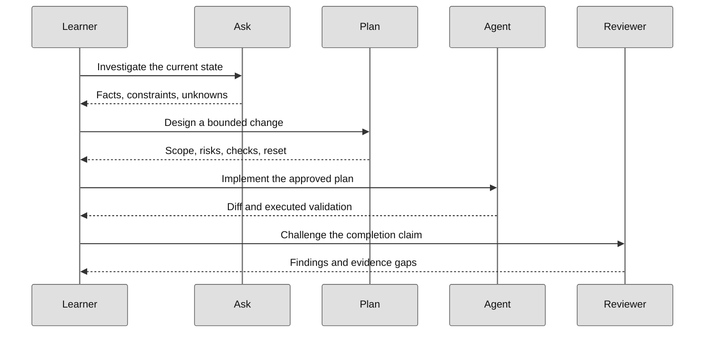

# Start here

## Choose an environment

| Option | Best for |
| --- | --- |
| [GitHub Codespaces](https://codespaces.new/workshop-gbb/awesome-copilot-adventures?quickstart=1) | Fastest reproducible setup |
| VS Code Dev Container | Local work with the repository-defined toolchain |
| Local clone | Learners who already have Node 24, Python 3.14, and .NET 10 |

> [!NOTE]
> GitHub Copilot features, models, targets, and preview capabilities can vary by account, organization policy, client version, and environment.

## Verify the repository

```bash
npm install
npm test
dotnet build solutions/csharp/CopilotAdventures.sln
python solutions/python/test_gridlock_arena.py
```

## Your first session



**Legend.** Participants are the learner and agent roles. Solid arrows are requests; dashed arrows are returned findings, plans, changes or review results.

**Explanation.** The learner owns acceptance at each boundary. A role handoff carries task context, but it does not prove a test or review was executed.

1. Read the [Harness Guide](harness-guide.md).
2. Open [The Portals of Nexus](../adventures/00-foundations/portals-of-nexus/README.md).
3. Create a clean branch, disposable folder, or worktree.
4. Follow Ask → Plan → Agent → Review.
5. Save commands, exit codes, diffs, decisions, and limitations.
6. Complete the reset instructions.

## Completion evidence

- [ ] The starting state is documented.
- [ ] Scope and non-goals are explicit.
- [ ] The chosen harness and environment are justified.
- [ ] Relevant checks were actually run.
- [ ] Output and exit status were recorded.
- [ ] Review findings were resolved or accepted.
- [ ] Temporary resources and credentials were cleaned up.

Continue with the [Curriculum Map](curriculum-map.md) or browse the [Adventure Catalog](adventures/index.md).
