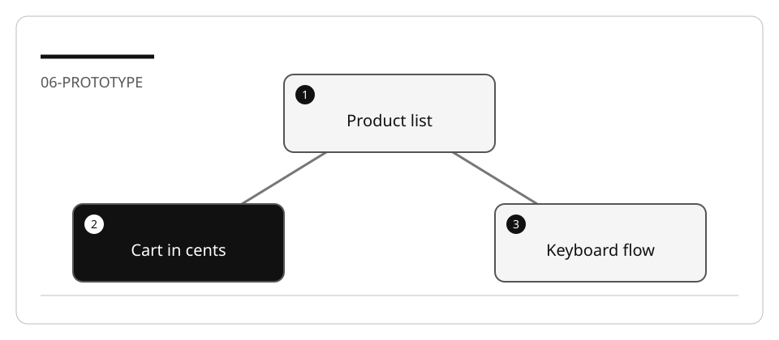

# Scope an agent-assisted exercise



> [!TIP]
> **Scope by evidence, not by ambition.** Pick one user outcome, one controlled
> starting point and a result another learner can verify. Use
> [the PRD examples](Sample%20PRDs.md) to write that contract.

A useful hands-on lab changes one capability and produces evidence that a learner
can inspect. Scope is not a promise that an agent will finish in a particular time.

## Choose one kind of work

| Kind | Starting evidence | Example | Exclude |
| --- | --- | --- | --- |
| Greenfield | Stakeholder needs and explicit non-goals | RSS subscription list | Background polling, real user accounts |
| Brownfield feature | Existing contract and baseline tests | Document metadata for a dashboard | Unrelated framework migration |
| Refactoring | Characterization tests and current side effects | Extract order validation | Changes to prices or eligibility |
| Modernization | Compatibility contract, data inventory, rollback | CSV storage to SQLite | Rewriting every layer at once |
| Runtime-agent integration | Allowed tools and permission boundaries | Read-only order-status assistant | Unrestricted shell or live payments |

## Make the task testable

Replace “make a great shopping site” with:

```text
Build only product listing, details, cart, and a mock summary using the bundled
products. Reuse integer-cents arithmetic. No accounts, tracking, network images,
database, or payment processor. Verify keyboard navigation, quantity errors,
empty cart, and totals at 375px and 1280px viewports.
```

The exclusions prevent unnecessary dependencies; the cases prevent a polished
but unusable result from being mistaken for completion.

## Keep useful struggle

Provide the input data and acceptance criteria. Do not prescribe the exact generated
code or give a screenshot of “all tests passed” as evidence. Include:

1. A baseline inspection.
2. A design decision with at least two reasonable choices.
3. One deliberately failing case.
4. A bounded implementation.
5. A negative check that proves the verifier can reject wrong behavior.
6. A reset limited to the disposable workspace.

## Review scope before implementation

- [ ] The exercise can use local synthetic data, or its external dependency is explicit.
- [ ] Required tools are separated from optional services and language alternatives.
- [ ] The learner knows the working directory and exact baseline command.
- [ ] Preserved behavior is stated alongside the requested change.
- [ ] The negative case can detect an incorrect implementation.
- [ ] Tests have explicit limits; visual appearance is not called complete behavior.
- [ ] The stop condition and a safe reset prevent unbounded repairs.

Use [the PRD examples](Sample%20PRDs.md) to turn these answers into a concrete contract.

## Example scope review

| Proposal | Decision | Why |
| --- | --- | --- |
| Build accounts, payments and shipping in one short exercise | Split into separate exercises | Each introduces a different trust boundary and failure model |
| Use three bundled products and a mock checkout | Suitable for the prototype lab | Domain and UI evidence can be observed locally |
| Compare two implementations while changing the dataset | Redesign the comparison | The result cannot isolate the implementation choice |
| Add one boundary test before refactoring one method | Suitable for a focused mission | The learner can explain both the change and its evidence |

**Independent practice:** write one rejected scope and its smaller replacement.
Name which dependency, authority or claim you removed, and which evidence proves
the reduced exercise is still useful.

| Previous | Next |
| --- | --- |
| [Learning order](../../../docs/learning-path.md) | [PRD examples](Sample%20PRDs.md) |
