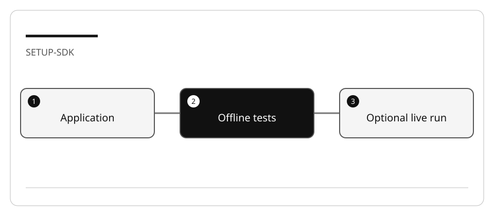

# Configure the Copilot SDK lab environment

The Copilot SDK embeds an agent runtime in **your application**. It is not a library
for sending code completions to the VS Code editor. Application identity, tools,
permissions, and lifecycle are your responsibility.

## Lab briefing



| At a glance | Your route |
| --- | --- |
| Level and time | 200; 20 minutes (facilitation estimate) |
| Starting action | Start with synthetic order-status data and the offline application tests. |
| Learner materials | [Download 16-sdk.zip](../../../assets/lab-kits/hands-on/16-sdk.zip) |
| Workspace | Open the extracted kit root; run the baseline from `.` relative to that root |
| Expected initial check | The supplied baseline tests pass. |
| Setup help | [Download, extract, local Git and optional GitHub](../../../docs/downloads.md) |

> [!NOTE]
> Editor access and SDK runtime authentication are separate boundaries.

[Concepts](#concepts-and-use-cases) · [First task](#task-1---prepare-the-selected-fixture) · [Evidence checklist](#verify-your-work) · [Reset](#reset)

## Learning objectives

- Prepare local tests without invoking a model.
- Identify the runtime/package versions for the selected language.
- Separate VS Code, CLI, and application authentication.

## Before you start

Use [the work-drive setup](../Reference/SETUP.md) and [enable Copilot](LAB_AK_00_enable_github_copilot_in_visual_studio_code.md).
The integrated exercise uses Node 24. A .NET adaptation is optional; LocalDB,
SQL Server, Blazor, cloud resources, and database migrations are not required.

## Concepts and use cases

| Boundary | Responsibility |
| --- | --- |
| Development assistant | Helps you author and review application code |
| SDK client/session | Starts and manages the application's agent runtime |
| Application tool | Validates arguments and limits data/side effects |
| Permission callback | Decides which runtime operation may proceed |
| Offline test double | Verifies your application contract, not model behavior |
| Authenticated live run | Tests real SDK integration; consumes account resources |

## Exercise scenario

You will prepare a small support assistant. It may read only synthetic order-status
records owned by the trusted fixture actor. It must not execute shell commands, read arbitrary files,
make purchases, or pretend a failed tool succeeded.

## Task 1 - Prepare the selected fixture

1. From the curriculum root:

   ```bash
   node scripts/prepare-hands-on.js --lab 16-sdk --destination /Volumes/T9/Dev/oss/workshop-runs/16-sdk
   ```

2. Open the printed directory as the workspace root.
3. Inspect its README, package manifest, application boundary, and tests.
4. Run the offline command documented there before installing the optional SDK
   package. Record both the discovered tests and their exit code.
5. Do not install packages globally to solve a local import error.

## Task 2 - Plan a live SDK run

1. Read the official SDK setup and authentication pages linked below.
2. Record the package version declared by the fixture; do not silently substitute
   `latest` or a different SDK.
3. If you choose the optional live exercise, install that package **in the disposable
   copy**, using the work-drive cache.
4. Verify authentication through the documented CLI/SDK flow. With the interactive
   CLI, start `copilot` and use `/login` when prompted; record only success/failure.
5. Confirm available models rather than assuming a model shown in a screenshot.
6. Review the permission handler before making a request. Do not use unrestricted
   approval to make a sample appear functional.

**Checkpoint:** state whether you validated offline application logic, SDK startup,
authentication, or live inference. These are four different results.

## Verify your work

- [ ] Offline tests can run without credentials or network.
- [ ] Dependencies and logs stay inside the disposable workspace/work drive.
- [ ] The application's allowed data and operations are explicit.
- [ ] Live access, if attempted, uses the intended account and records failures.
- [ ] No API key or access token appears in a file, prompt, screenshot, or commit.

## Troubleshooting

| Symptom | Diagnosis |
| --- | --- |
| SDK package missing | Offline checks should not import it; install only for the live step |
| Editor works, SDK fails | Verify the application's authentication path separately |
| Operation denied | Inspect the request and permission policy; do not approve everything |
| No response or timeout | Record the error, close the session, stop the client |

## Independent practice

Design the same boundary for .NET: session lifetime, cancellation, tool arguments,
permission decisions, and error propagation. Record differences from the Node API;
do not claim one language's API signatures are portable.

## Reset

Stop the application in its own terminal, close its session, and revoke any
exercise-only credentials. Keep the original curriculum untouched. Remove the
disposable copy only after saving redacted evidence.

## Official references

- [Copilot SDK getting started](https://docs.github.com/en/copilot/how-tos/copilot-sdk/getting-started)
- [SDK setup](https://docs.github.com/en/copilot/how-tos/copilot-sdk/setup)
- [SDK authentication](https://docs.github.com/en/copilot/how-tos/copilot-sdk/auth)
- [Install Copilot CLI](https://docs.github.com/en/copilot/how-tos/copilot-cli/set-up-copilot-cli/install-copilot-cli)
