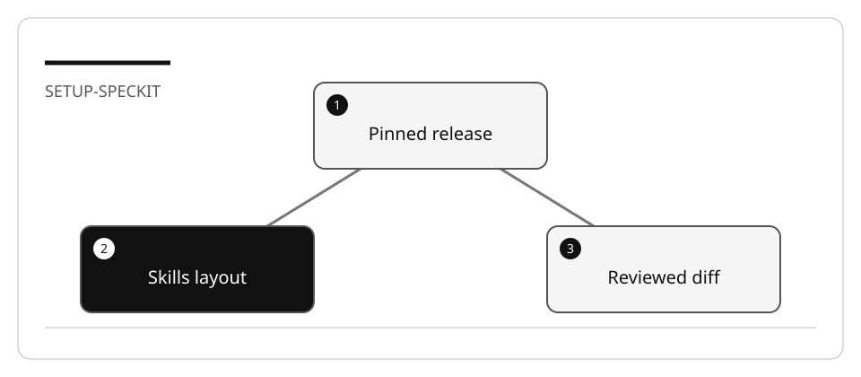

# Prepare the GitHub Spec Kit environment

The filename is retained for incoming links. The product is **GitHub Spec Kit**,
not “GitHub Dev Kit.” C# Dev Kit is a separate VS Code extension.

## Lab briefing



| At a glance | Your route |
| --- | --- |
| Level and time | 200; 25 minutes (facilitation estimate) |
| Starting action | Keep the untouched project and inspect every initialization change. |
| Learner materials | [Download 13-greenfield.zip](../../../assets/lab-kits/hands-on/13-greenfield.zip) |
| Workspace | Open the extracted kit root; run the baseline from `.` relative to that root |
| Expected initial check | The unfinished RSS store fails with the documented exercise error. A missing runtime or syntax error is not the expected failure. |
| Setup help | [Download, extract, local Git and optional GitHub](../../../docs/downloads.md) |

> [!NOTE]
> An installed CLI is not evidence that the selected host discovered its skills.

[Concepts](#concepts-and-use-cases) · [First task](#task-1---verify-tools-before-installing) · [Evidence checklist](#verify-your-work) · [Reset](#reset)

## Learning objectives

- Pin and verify the Specify CLI and its integration.
- Distinguish skills mode from the optional commands layout.
- Avoid overwriting an existing project's customization.

## Before you start

Read [environment and resource limits](../Reference/SETUP.md) and the
[tagged Spec Kit reference](../Reference/SPEC_KIT.md).
Choose one application stack. SQL Server LocalDB is not a requirement: the local
track uses Node/TypeScript contracts and Python's bundled SQLite support.

## Concepts and use cases

Specify installs workflow scaffolding. An AI coding agent consumes that scaffolding.
The application runs on the runtime you choose in the plan. Installing a Python CLI
does not require your application to be written in Python.

## Exercise scenario

You will prepare one project for a greenfield, brownfield, or modernization exercise.
The purpose is discovery and a safe initialization diff, not implementation.

## Task 1 - Verify tools before installing

1. Inspect Git, the selected application runtime, Python, and uv.
2. Set caches/tool paths on your work drive using the shared setup.
3. Check for an existing Specify installation. Install v1.0.4 only when required,
   using one of the documented routes in the reference.
4. Record `specify version`, install source and `specify init --help`.
5. Do not paste a sample version transcript as if it came from your machine.

## Task 2 - Select the integration

1. Choose the default Copilot skills layout for this track.
2. Inspect the generated `.github/skills/speckit-*/SKILL.md` files after initialization.
3. Verify that the selected host discovers `/speckit-constitution` and
   `/speckit-specify`. Skills are relevant capabilities, not new mandatory agent roles.
4. If you intentionally choose `--integration-options="--commands"`, use Local
   for its prompt files and the generated dotted commands. Record that choice.

## Task 3 - Initialize without overwriting

1. Prepare the fixture for lab 13, 14 or 17 in an unused directory.
2. Open only that copy and record a baseline Git commit.
3. Inspect existing `.github`, `.specify`, and editor configuration.
4. Run:

   ```bash
   specify init --here --integration copilot --script sh
   ```

5. Review the nonempty-directory confirmation and resulting diff. If initialization
   proposes replacing a file you need, stop and reconcile it deliberately.
6. On Windows choose `--script ps`; do not run a remote installer with policy bypass
   or disable certificate validation to work around organizational controls.

## Verify your work

- [ ] Release and install source are recorded.
- [ ] The integration is actually discovered in the chosen workspace/host.
- [ ] Generated files match the selected skills or commands layout.
- [ ] The original application and baseline tests remain unchanged.
- [ ] No database, subscription, global identity, or public repository was required.

## Troubleshooting

| Symptom | Check |
| --- | --- |
| Dotted command missing | Default v1.0.4 uses hyphenated skill names |
| Prompt file not invoked | Use Local or select the skills integration |
| CLI not found | Configured `UV_TOOL_BIN_DIR`, not a guessed home path |
| Initialization conflict | Inspect baseline/diff; do not add `--force` blindly |
| Organization blocks download | Use its approved installation route; do not bypass TLS/authentication |

## Independent practice

Compare files generated by skills and commands modes in two separate scratch
projects. Explain which files are portable and which are host-specific.

## Reset

Close the scratch workspace. Preserve the initialization diff and remove only that
scratch copy when no longer needed. Do not uninstall shared tools used by other labs.

## Official references

- [Spec Kit v1.0.4 installation](https://github.com/github/spec-kit/blob/v1.0.4/docs/installation.md)
- [Copilot integration](https://github.com/github/spec-kit/blob/v1.0.4/docs/reference/integrations.md)
- [Prompt files in VS Code](https://code.visualstudio.com/docs/agent-customization/prompt-files)
- [Agent Skills](https://code.visualstudio.com/docs/agent-customization/agent-skills)
