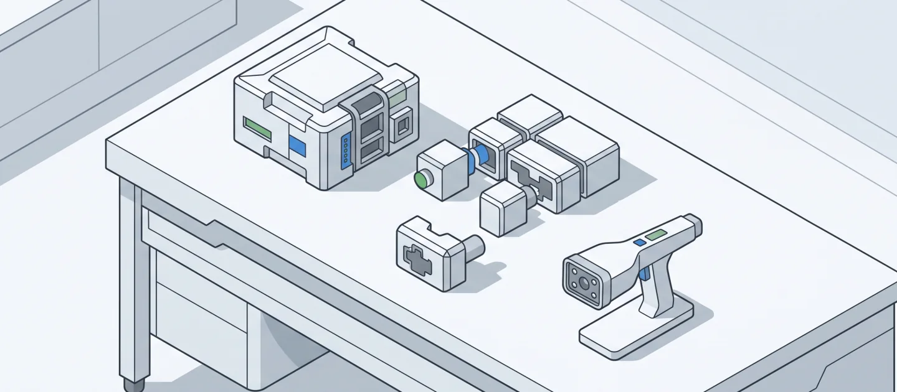
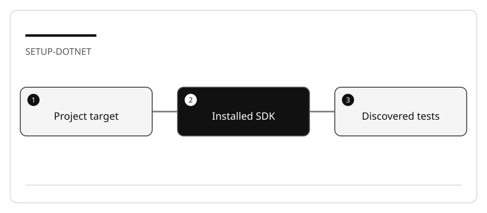

# Prepare the C# hands-on environment

## Lab briefing



<details>
<summary>Original concept illustration (SVG)</summary>



</details>

| At a glance | Your route |
| --- | --- |
| Level and time | 100; 20 minutes (facilitation estimate) |
| Starting action | Open one C# fixture and compare its target framework with the installed runtimes. |
| Learner materials | [Download 02-csharp.zip](../../../assets/lab-kits/hands-on/02-csharp.zip) |
| Workspace | Open the extracted kit root; run the baseline from `.` relative to that root |
| Expected initial check | The supplied tests pass. New feature requirements still need their own tests. |
| Setup help | [Download, extract, local Git and optional GitHub](../../../docs/downloads.md) |

> [!NOTE]
> A compiled project and an executed test suite are different evidence.

[Concepts](#concepts-and-use-cases) · [First task](#task-1---verify-the-selected-tools) · [Evidence checklist](#verify-your-work) · [Reset](#reset)

## Learning objectives

- Distinguish an installed SDK from the target runtime a project needs.
- Build one copied project without touching other workspaces.
- Verify test discovery rather than assuming compilation is testing.

## Before you start

Read [work-drive setup and resource limits](../Reference/SETUP.md).
The integrated C# fixtures target .NET 10. C# Dev Kit is useful for editor test
discovery; command-line builds and tests remain the reproducible baseline.

## Concepts and use cases

`dotnet build` compiles a project. `dotnet test` discovers and executes its tests.
`dotnet run` starts the application and may depend on the current working directory.
A newer SDK alone does not mean every older runtime is installed.

## Exercise scenario

Prepare the library fixture for investigation, not a new console template or a
global configuration change.

## Task 1 - Verify the selected tools

1. Inspect the runtime required by the selected fixture's `.csproj`.
2. Run `dotnet --list-sdks` and `dotnet --list-runtimes`.
3. If the required runtime is missing, use your organization's approved installation
   route or the repository Dev Container. Do not install every SDK.
4. Verify Git and the VS Code C# extension if using editor features.
5. For Copilot access, use [the account setup lab](LAB_AK_00_enable_github_copilot_in_visual_studio_code.md).

## Task 2 - Prepare and build one fixture

1. From the curriculum root:

   ```bash
   node scripts/prepare-hands-on.js --lab 02-csharp --destination /Volumes/T9/Dev/oss/workshop-runs/02-csharp
   ```

2. Open the printed directory alone.
3. With the work-drive cache variables set, run from that copy's root:

   ```bash
   dotnet build src/Library.Console/Library.Console.csproj -m:1 -p:UseSharedCompilation=false
   dotnet test tests/UnitTests/UnitTests.csproj -m:1 -p:UseSharedCompilation=false --list-tests
   dotnet test tests/UnitTests/UnitTests.csproj -m:1 -p:UseSharedCompilation=false
   ```

4. Record discovered tests, exit codes, and any warnings. A missing feed/network
   dependency is an environment blocker, not evidence of a failed domain test.
5. Do not add the same NuGet source repeatedly or change global feed configuration.

## Verify your work

- [ ] The project target and installed runtime agree.
- [ ] The console project builds and the test project discovers actual tests.
- [ ] Test output is recorded separately from build output.
- [ ] Caches and generated files remain on the selected work drive.

## Troubleshooting

If `appSettings.json` is missing when running the console app, change to
`src/Library.Console` in the disposable copy before running it. If tests are absent
in the editor, select/build the test project and refresh discovery; do not equate
“zero tests” with success.

## Independent practice

Explain why `--no-restore` is appropriate after a successful restore but not on a
fresh checkout. Demonstrate the difference without installing a new test framework.

## Reset

Close the fixture window. Keep shared SDKs intact. Remove only the inspected
disposable copy if no evidence or changes need preservation.

## Official references

- [.NET CLI overview](https://learn.microsoft.com/en-us/dotnet/core/tools/)
- [C# testing in VS Code](https://code.visualstudio.com/docs/csharp/testing)
- [C# Dev Kit](https://code.visualstudio.com/docs/csharp/get-started)
