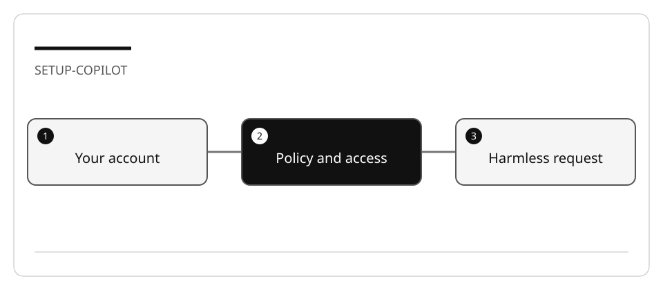

# Enable and verify GitHub Copilot in VS Code

Setup is complete when an authorized account can perform a small, observable task.
Two installed extensions or an old screenshot are not proof of access.

## Lab briefing


<details>
<summary>Original concept illustration (SVG)</summary>



</details>

| At a glance | Your route |
| --- | --- |
| Level and time | 100; 15 minutes (facilitation estimate) |
| Starting action | Record the active account alias and a harmless request result. |
| Learner materials | [Download 01-interface.zip](../../../assets/lab-kits/hands-on/01-interface.zip) |
| Workspace | Open the extracted kit root; run the baseline from `.` relative to that root |
| Expected initial check | The supplied baseline tests pass. |
| Setup help | [Download, extract, local Git and optional GitHub](../../../docs/downloads.md) |

> [!NOTE]
> A successful Git login is not proof that the editor uses that identity.

[Concepts](#concepts-and-use-cases) · [First task](#task-1---sign-in-through-the-editor) · [Evidence checklist](#verify-your-work) · [Reset](#reset)

## Learning objectives

- Distinguish GitHub authentication from Copilot entitlement.
- Choose a session target and role deliberately.
- Record the permissions and features actually available.

## Before you start

Read [environment and resource limits](../Reference/SETUP.md). Use an account you are
authorized to use. Do not change subscriptions or repository visibility for a lab.

## Concepts and use cases

| Concept | Example | Evidence |
| --- | --- | --- |
| Authentication | Signing in to GitHub from VS Code | Account shown in the editor |
| Entitlement/policy | Copilot is available for that account | A request can be submitted; restrictions are visible |
| Role | Ask investigates without implementing | No file changes in a read-only task |
| Harness/target | Local versus Copilot | Selected target and its tool list |

## Exercise scenario

You are preparing a workstation shared with other projects. Your goal is to verify
your own learning session without changing other projects, global Git identity,
global extension state, or organization policy.

## Task 1 - Sign in through the editor

1. Open a new VS Code window for a disposable workspace.
2. Open the Copilot status menu. Current documentation uses **Use AI Features**;
   if your build shows different text, use **GitHub Copilot: Sign in** from the
   Command Palette or follow the linked setup page.
3. Complete browser authentication yourself. Do not paste passwords, device codes,
   or access tokens into the chat or an evidence note.
4. Confirm which account the Copilot integration uses. A Git terminal credential
   can be different from the editor account.
5. Inspect the available targets and permissions without enabling new services.

**Checkpoint:** record the editor version, account alias (not email or token),
available target, chosen role, and any policy restriction.

## Task 2 - Test access with a harmless request

1. Select a supported **Ask** role in a Local session.
2. Submit:

   ```text
   Explain the difference between an agent role, a harness, a session target,
   and an execution environment. Do not edit files or run commands.
   ```

3. Compare the answer with [the concepts reference](../Reference/COPILOT.md).
4. Inspect your workspace and Git status. The request must not require file changes.
5. If access fails, record the actual error and stop; do not activate a paid plan
   or grant broader permissions as an automatic repair.

## Verify your work

- [ ] The intended account is selected.
- [ ] A harmless request completed, or the exact access blocker is recorded.
- [ ] The selected role and harness are distinct in your notes.
- [ ] No global setting, subscription, repository visibility, or file was changed.

## Troubleshooting

| Symptom | Check |
| --- | --- |
| Wrong account | Editor account preferences, not only `gh auth status` |
| Target absent | Current window, organization policy, client support |
| Usage limit reached | Current plan/usage page; do not assume a fixed monthly quota |
| Screenshot does not match | Follow current command names rather than screen coordinates |

## Independent practice

Explain why signing in with `gh` does not prove that VS Code or an SDK application
is authenticated with the same account. Include the evidence you would collect.

## Reset

Close the disposable session. Restore only preferences you deliberately changed.
Do not sign out other projects or delete shared credentials.

## Official references

- [Copilot setup in VS Code](https://code.visualstudio.com/docs/setup/copilot)
- [Choose an agent harness](https://code.visualstudio.com/docs/agents/run/agent-harnesses)
- [Copilot plans](https://docs.github.com/en/copilot/get-started/plans)
