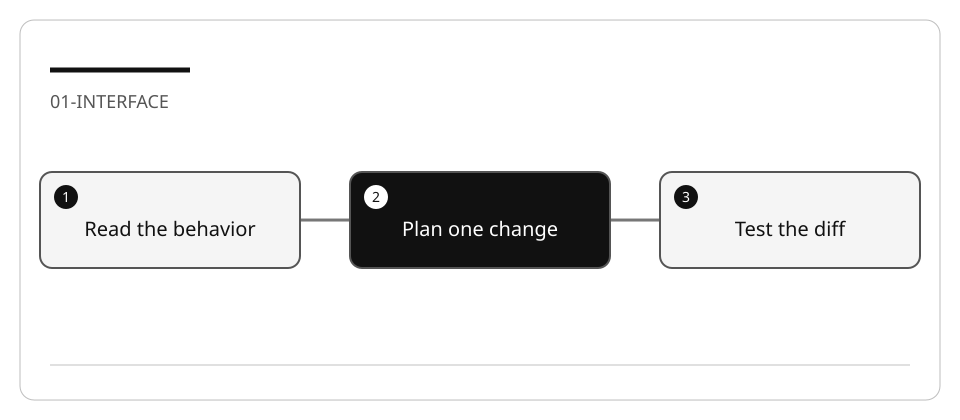

# Examine Copilot settings and interaction boundaries

Do not memorize the position of a button. Learn which control changes the role,
which changes the runtime, and which changes permission to act.

## Lab briefing



| At a glance | Your route |
| --- | --- |
| Level and time | 100; 35 minutes (facilitation estimate) |
| Starting action | Run the two original tests before asking Copilot to change the function. |
| Learner materials | [Download 01-interface.zip](../../../assets/lab-kits/hands-on/01-interface.zip) |
| Workspace | Open the extracted kit root; run the baseline from `.` relative to that root |
| Expected initial check | The supplied baseline tests pass. |
| Setup help | [Download, extract, local Git and optional GitHub](../../../docs/downloads.md) |

> [!NOTE]
> Approving an answer is not the same as reviewing a change.

[Concepts](#concepts-and-use-cases) · [First task](#task-1---establish-the-starting-behavior) · [Evidence checklist](#verify-your-work) · [Reset](#reset)

## Learning objectives

- Identify role, harness/target, model, context, and permissions independently.
- Compare explanation, design, implementation, and inline suggestions.
- Validate one small change without broadening authority.

## Before you start

Complete [Copilot setup](LAB_AK_00_enable_github_copilot_in_visual_studio_code.md) and
read [the concepts reference](../Reference/COPILOT.md).
Prepare `01-interface` using [the work-drive procedure](../Reference/SETUP.md).
The tiny Node fixture requires no package installation.

## Concepts and use cases

| Interaction | Appropriate use | Not proof of |
| --- | --- | --- |
| Ask | Trace behavior and explain code | Correctness of a generated implementation |
| Plan | Define a safe change and checks | Files being changed |
| Agent | Implement with permitted tools | Every command requiring manual approval |
| Inline completion/NES | Accept or reject a local suggestion while editing | A complete repository refactor |
| Semantic rename | Rename one symbol across references | A change to its runtime behavior |

Tool approval depends on your policy, not on whether a screenshot shows a Continue
button. Only approve a command after reading its target, side effects, and scope.

## Exercise scenario

The fixture formats a short welcome message. The requested change is to trim a
name before formatting it while retaining the existing empty-name error.

## Task 1 - Establish the starting behavior

1. Open the prepared workspace and inspect `greeting.mjs` and `greeting.test.mjs`.
2. Run:

   ```bash
   node --test --test-concurrency=1 greeting.test.mjs
   ```

3. Record the output and exit status. A missing runtime is an environment failure,
   not a test of the greeting implementation.
4. Inspect the session target, role, model, and allowed tools. Keep unrelated MCP
   servers and background sessions out of this exercise.

## Task 2 - Explain with and without explicit context

1. In Ask, request:

   ```text
   Explain how a blank name is handled. Do not edit or run commands.
   Cite the file and branch that support your answer.
   ```

2. Record whether the agent retrieved files itself or lacked evidence. Do not
   assume that removing an attachment makes the file inaccessible.
3. Attach `greeting.mjs` explicitly and repeat. Compare correctness and cited
   evidence, not response length or confidence.
4. Confirm that the exercise request did not change files.

## Task 3 - Plan a small, risky boundary change

1. Select Plan in a supported session.
2. Submit:

   ```text
   Trim the name before producing the greeting, without changing the error
   for blank or non-string input. Identify whitespace and wrong-type cases,
   affected files, the test command, and a one-change rollback plan. Do not edit.
   ```

3. Challenge any missing case: `" Ada "`, `""`, `"   "`, `null`, and a number.
4. Approve only the bounded plan. Plan is useful even for a two-line change.

## Task 4 - Implement and inspect

1. Hand the reviewed plan to Agent.
2. Allow only changes to the greeting implementation and its tests.
3. Review the diff before accepting it. Test weakening is not an acceptable fix.
4. Run the same test command yourself and add the missing whitespace case if it
   was not already covered.
5. Change one expected assertion deliberately, verify a nonzero result, then
   restore that assertion. This proves the test can reject wrong behavior.

## Task 5 - Compare inline assistance

1. In a separate scratch file, begin writing a similar greeting function.
2. If inline suggestions are available, accept one and reject another. If none
   appears, record it; do not invent a suggestion.
3. Compare a manual symbol rename with next-edit suggestions.
4. Restore any language-specific preference you changed. Do not modify account-
   wide privacy settings or undocumented advanced engine URLs for this lab.

## Verify your work

- [ ] Baseline and after-change test outputs are recorded.
- [ ] A negative assertion produces nonzero exit.
- [ ] Role, target/harness, environment, model and permissions are not conflated.
- [ ] Ask/Plan evidence is separate from the Agent diff.
- [ ] No setting change leaks into other workspaces.

## Troubleshooting

Use Command Palette names rather than screenshot coordinates. For missing context,
inspect references and permissions. For a missing target, check policy and current
client support. Old Ask/Edit screenshots are historical, not the current curriculum.

## Independent practice

Repeat the change using a different available harness. Compare the actual tool list,
instruction discovery, and validation output. Do not claim a speed improvement from
a single trial.

## Reset

Restore only the two exercise files from your disposable baseline, close the scratch
file, and start a fresh session. Keep all original repository files untouched.

## Official references

- [Choose an agent harness](https://code.visualstudio.com/docs/agents/run/agent-harnesses)
- [Planning](https://code.visualstudio.com/docs/agents/run/planning)
- [AI-powered suggestions](https://code.visualstudio.com/docs/editing/ai-powered-suggestions)
- [Custom instructions and their scope](https://code.visualstudio.com/docs/agent-customization/custom-instructions)
