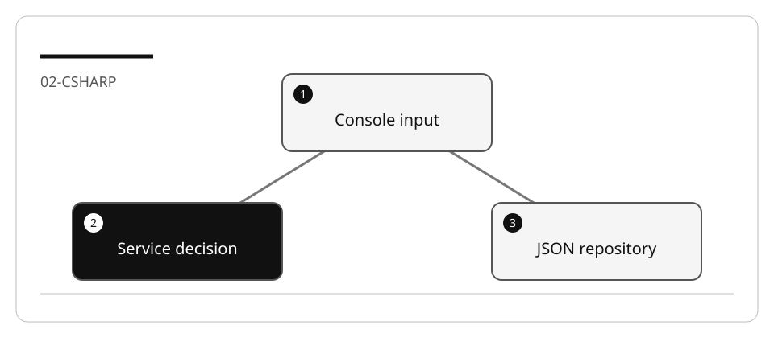
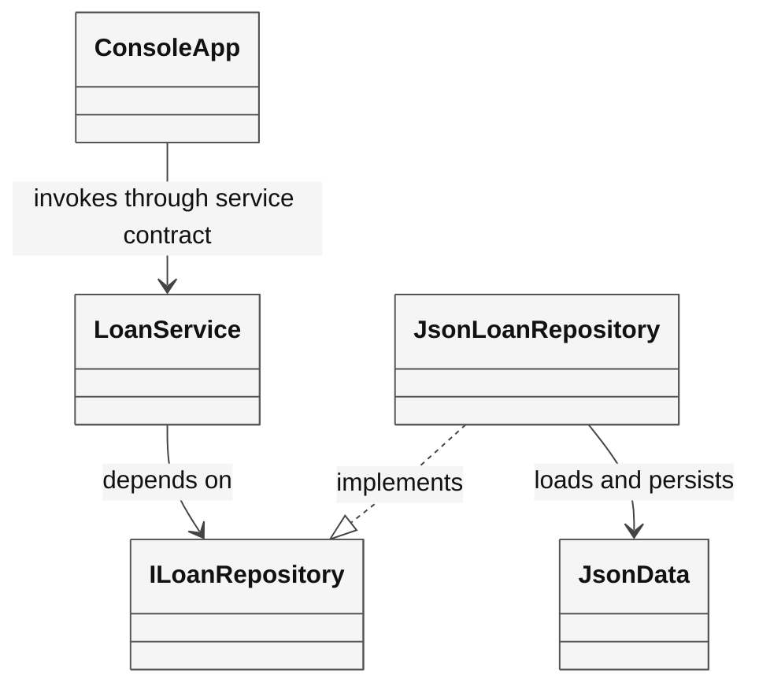

# Analyze and document the C# library

Copilot can propose an explanation, but the code and observed behavior are the
authority. `#codebase` performs retrieval; it does not guarantee every source file
was inspected or every claim is correct.

## Lab briefing



| At a glance | Your route |
| --- | --- |
| Level and time | 200; 45 minutes (facilitation estimate) |
| Starting action | Follow one loan operation from the console to storage and its tests. |
| Learner materials | [Download 02-csharp.zip](../../../assets/lab-kits/hands-on/02-csharp.zip) |
| Workspace | Open the extracted kit root; run the baseline from `.` relative to that root |
| Expected initial check | The supplied tests pass. New feature requirements still need their own tests. |
| Setup help | [Download, extract, local Git and optional GitHub](../../../docs/downloads.md) |

> [!NOTE]
> Source references must name real types, registrations and working directories.

[Concepts](#concepts-and-use-cases) · [First task](#task-1---establish-the-source-and-baseline) · [Evidence checklist](#verify-your-work) · [Reset](#reset)

## Learning objectives

- Trace behavior through the console, application core and infrastructure.
- Explain physical book copies, loans and patrons accurately.
- Produce run instructions that work from a stated directory.

## Before you start

Complete [C# setup](LAB_AK_00_configure_lab_environment.md), then prepare `02-csharp`.
The bundled fixture is
[AccelerateDevGHCopilot](https://github.com/workshop-gbb/awesome-copilot-adventures/tree/main/mslearn-github-copilot/LabFiles/02-analyze-document-code/AccelerateDevGHCopilot).
No remote clone or new GitHub repository is required.

## Concepts and use cases

| Layer | Responsibility | Evidence to inspect |
| --- | --- | --- |
| Console | Menu/input and rendering | `Program.cs`, `ConsoleApp.cs` |
| Application core | Loan/membership decisions and interfaces | Services, entities, interfaces |
| Infrastructure | Load/populate/save JSON | `JsonData`, JSON repositories |
| Tests | Selected service contracts with substitutes | `tests/UnitTests` |

## Exercise scenario

A teammate has delivered a small library console app without sufficient onboarding
documentation. Write a README that distinguishes implemented features, limitations,
and proposed work.

## Task 1 - Establish the source and baseline

1. Open the prepared root. Inspect all four project files.
2. Run:

   ```bash
   dotnet build src/Library.Console/Library.Console.csproj -m:1 -p:UseSharedCompilation=false
   dotnet test tests/UnitTests/UnitTests.csproj -m:1 -p:UseSharedCompilation=false
   ```

3. Record the commands, tests, errors and warnings. Do not copy a transcript from
   a different run.
4. Read `src/Library.Console/appSettings.json`. The console uses its working
   directory to locate this file and the `Json` directory.

## Task 2 - Ask for a source-grounded trace

```text
Trace returning a loan from ConsoleApp through ILoanService and the JSON repository.
Cite the files and relevant methods. Explain how Book, BookItem, Loan, and Patron
relate. List unverified assumptions and existing error-handling limitations.
Do not edit or publish anything.
```

Verify each relationship manually. A book title is not a physical `BookItem`.
A `Loan` relates a physical copy to a patron and carries its own dates.



**Legend.** Rectangles are code types. Solid arrows are dependencies/calls; the
dashed realization arrow denotes interface implementation.

**Explanation.** The diagram describes dependency roles, not proof that every
failure branch is tested. Confirm the actual DI registrations and methods in this
fixture rather than assuming a generic “clean architecture” template.

## Task 3 - Plan and write a useful README

1. In Plan, outline setup, execution directory, architecture, data files, tests,
   implemented flows, limitations and reset.
2. Require source references for each claim.
3. In Agent, write only the README. Do not “improve” production code during a
   documentation task.
4. Document this console launch from the copied project:

   ```bash
   cd src/Library.Console
   dotnet run --no-build
   ```

5. Explain that return/renew operations can modify JSON in the copy; use synthetic
   records and inspect changes before reset.

## Verify your work

- [ ] All run commands include their working directory.
- [ ] Implemented behavior is separated from future feature ideas.
- [ ] The diagram matches actual types and DI registrations.
- [ ] Test scope is described without a fabricated coverage percentage.
- [ ] Only documentation changed in the exercise diff.

## Troubleshooting

If Copilot describes classes it never read, attach and inspect those files.
If the console cannot find settings, fix the documented working directory.
If the README says all edge cases are covered, ask for the specific test proving each.

## Independent practice

Write a troubleshooting entry for a missing JSON file using the real loader behavior.
Do not promise graceful recovery when the code throws or merely logs a failure.

## Reset

Save the documentation evidence, restore only the exercise README and any JSON
records modified by manual exploration, then close the disposable workspace.

## Official references

- [Context engineering](https://code.visualstudio.com/docs/agents/guides/context-engineering-guide)
- [Planning](https://code.visualstudio.com/docs/agents/run/planning)
- [C# test support](https://code.visualstudio.com/docs/csharp/testing)
