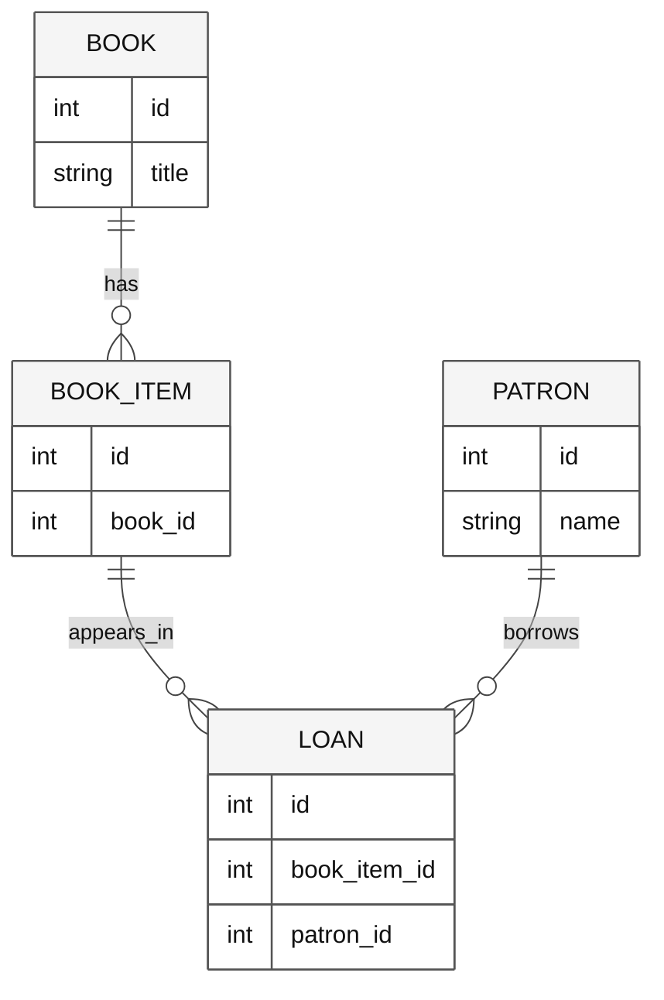

# Analyze and document the Python library

Explain the implementation you have, not the application a model expects. Python
and C# variants have similar concepts but are not guaranteed to have identical APIs,
case sensitivity, or error handling.

## Learning objectives

- Identify the correct Python import and execution root.
- Trace console actions through services to JSON storage.
- Document tested behavior and limitations without invented guarantees.

## Before you start

Complete [Python setup](LAB_AK_00_configure_lab_environment_py.md) and prepare
`02-python`. Use the bundled
[Python library fixture](https://github.com/workshop-gbb/awesome-copilot-adventures/tree/main/mslearn-github-copilot/LabFiles/02-python-analyze-document-code/AccelerateDevGHCopilot).
Run commands below from its `library` directory.

## Concepts and use cases

| Folder | Role |
| --- | --- |
| `console` | Build dependencies, read input and render results |
| `application_core` | Entities, interfaces, service decisions |
| `infrastructure` | JSON loading, reference population and persistence |
| `tests` | Service scenarios using unittest and mocks |

## Exercise scenario

A teammate needs reliable onboarding instructions for the library. Document
patron search, membership renewal, loan return/extension, and the limitations that
the source actually exhibits.

## Task 1 - Run and inspect the baseline

```bash
python -m unittest discover -s tests -p "test_*.py" -v
python console/main.py
```

1. Record test names and exit codes.
2. Read `console/main.py` and trace how `JsonData`, repositories and services are
   constructed.
3. Inspect the loader's paths relative to its module. Do not assume the C# settings
   convention applies to Python.
4. Use only the supplied synthetic records. Return/renew flows may persist changes.

## Task 2 - Investigate one workflow

```text
Trace return_loan from the console into LoanService and JsonLoanRepository.
Identify populated entities and when data is saved. Cite source paths.
What happens when an ID is missing or a file cannot be loaded? Do not edit.
```

Verify with the code. A printed error from `JsonData` does not imply an exception
was propagated or a partially loaded object is usable.

## Task 3 - Model the data



**Legend.** Boxes are conceptual record types; crow's feet mean multiple related
records. Field names correspond to the Python entities.

**Explanation.** Availability belongs to a physical copy and its active loan, not
to every copy of a title. This model does not create foreign-key constraints in JSON.

## Task 4 - Produce documentation with a bounded edit

1. Ask Plan for README sections with source references and exact commands.
2. Review setup, import root, implemented workflows, JSON side effects, test scope
   and reset.
3. Ask Agent to edit the README only.
4. Run its commands from the documented directory. Record errors rather than
   silently altering the app during documentation.
5. Compare the README with actual tests; avoid statements such as “fully covered.”

## Verify your work

- [ ] Import root and console command are reproducible.
- [ ] Data relationships are accurate.
- [ ] Current behavior and proposed improvements are separated.
- [ ] Loader/persistence limitations are explicit.
- [ ] Only intended documentation/data-exploration changes appear in the diff.

## Troubleshooting

If `application_core` cannot be imported, check that the working directory is
`library`. If no tests are found, inspect the runner and file pattern. If a flow
modifies JSON, restore only the copied fixture file after saving evidence.

## Independent practice

Compare one workflow with the C# variant. Name one actual implementation difference
rather than claiming the two stacks are semantically identical.

## Reset

Close the console, preserve the README and evidence, then restore only files changed
in the disposable copy. Do not modify the source curriculum.

## Official references

- [Python testing in VS Code](https://code.visualstudio.com/docs/python/testing)
- [Context engineering](https://code.visualstudio.com/docs/agents/guides/context-engineering-guide)
- [Agent planning](https://code.visualstudio.com/docs/agents/run/planning)
