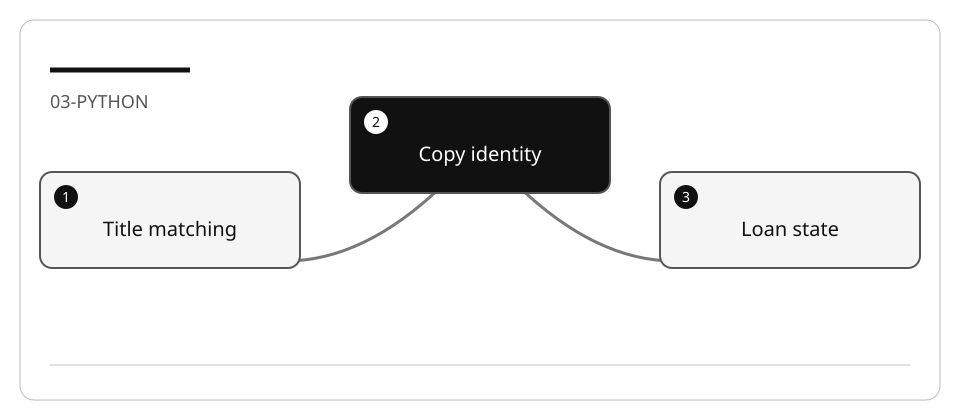

# Develop book availability in Python

This is a new feature in an existing application, not a request to regenerate the
entire library. Track the change from menu input to observed result.

## Lab briefing


<details>
<summary>Original concept illustration (SVG)</summary>



</details>

| At a glance | Your route |
| --- | --- |
| Level and time | 200; 70 minutes (facilitation estimate) |
| Starting action | Use controlled dates and test one available and one borrowed copy. |
| Learner materials | [Download 03-python.zip](../../../assets/lab-kits/hands-on/03-python.zip) |
| Workspace | Open the extracted kit root; run the baseline from `library` relative to that root |
| Expected initial check | The existing unittest tests are discovered and pass. |
| Setup help | [Download, extract, local Git and optional GitHub](../../../docs/downloads.md) |

> [!NOTE]
> A passing helper is incomplete until the console menu reaches it.

[Concepts](#concepts-and-use-cases) · [First task](#task-1---inspect-the-workflow-and-baseline) · [Evidence checklist](#verify-your-work) · [Reset](#reset)

## Learning objectives

- Define search and availability semantics before implementation.
- Use the actual Python interfaces and import root.
- Connect a tested feature to existing console actions.

## Before you start

Prepare `03-python` using [the common setup](../Reference/SETUP.md) and open the
copy alone. Run the following commands from its `library` directory. The bundled
[feature fixture](https://github.com/workshop-gbb/awesome-copilot-adventures/tree/main/mslearn-github-copilot/LabFiles/03-python-develop-code-features/AccelerateDevGHCopilot)
uses synthetic JSON data.

## Concepts and use cases

Search normalizes input for matching, not necessarily for storage. Availability
belongs to a `book_item`, not to every copy of a `book`.
An active loan is one with no return date; a due date in the past does not return it.

## Exercise scenario

The librarian requests partial title search and copy-level availability. New loans,
reservations, accounts and persistence changes are out of scope.

## Task 1 - Inspect the workflow and baseline

```bash
python -m unittest discover -s tests -p "test_*.py" -v
```

1. Record test discovery and results.
2. Read `console/common_actions.py`, `console/console_app.py`, the entities, and the
   JSON repository methods.
3. Ask for a trace of existing patron search and the proposed book-search insertion
   points. Verify method names against this Python fixture.
4. Inspect how loans are linked to `book_item` and `patron`.

## Task 2 - Set the contract

| ID | Case | Expected behavior |
| --- | --- | --- |
| BOOK-1 | Mixed case and surrounding whitespace | Defined normalized partial match |
| BOOK-2 | Blank input | Explicit prompt/error; no silent fallback |
| BOOK-3 | Missing title | No-results message |
| BOOK-4 | Two copies, one borrowed | Separate availability for each copy |
| BOOK-5 | Historical returned loan | Does not block availability |
| BOOK-6 | Overdue unreturned loan | Still unavailable |

Construct these scenarios in tests with controlled dates. Choose result ordering
explicitly. Do not claim `lower()` and `casefold()` have identical behavior for all
Unicode strings; record the normalization you choose for the feature.

## Task 3 - Plan before editing

```text
Plan the book-availability feature in the current Python library. Reuse the
existing input loop and repository contracts. Map BOOK-1..6 to tests, distinguish
Book from BookItem, and keep search read-only. Do not implement loans/reservations.
```

Inspect data access, active-loan joins and menu wiring. A design that joins a loan
to a title instead of a copy cannot satisfy BOOK-4.

## Task 4 - Implement and test

1. Write the two-copy regression before implementation.
2. Ask Agent to implement one reviewed slice and no unrelated cleanup.
3. Connect the new action to prompt, input mapping and dispatch.
4. Add boundary tests and run the whole small fixture suite.
5. Run `python console/main.py` and exercise search manually.
6. Compare JSON files before/after search; search must not persist changes.
7. Temporarily treat every past due date as returned. Confirm BOOK-6 fails, then
   restore the correct implementation.

## Verify your work

- [ ] The menu reaches the feature.
- [ ] Search behavior and ordering are explicit.
- [ ] Availability is calculated for each physical copy.
- [ ] A negative mutation is detected.
- [ ] Borrowing, membership and existing tests remain unchanged.

## Troubleshooting

Run from `library` for imports. Distinguish a no-results response from a loader
failure. If the supplied tests all pass before the feature exists, add the missing
regression rather than assuming they cover the new behavior.

## Independent practice

Add an author filter as a separately specified feature. Preserve existing title
normalization and declare how combined filters behave.

## Reset

Stop the console, save evidence, and restore only named feature/test files in the
disposable copy. Do not change the original data or publish a repository automatically.

## Official references

- [Python testing](https://code.visualstudio.com/docs/python/testing)
- [Context engineering](https://code.visualstudio.com/docs/agents/guides/context-engineering-guide)
- [Agent planning](https://code.visualstudio.com/docs/agents/run/planning)
