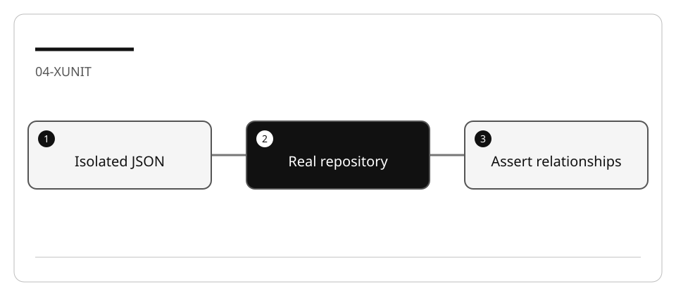

# Develop discriminating xUnit tests with Copilot

A test can pass while proving very little. Verify behavior of the production
repository instead of testing a helper defined only inside the test.

## Lab briefing


<details>
<summary>Original concept illustration (SVG)</summary>



</details>

| At a glance | Your route |
| --- | --- |
| Level and time | 300; 65 minutes (facilitation estimate) |
| Starting action | Add one found-ID component test and assert populated entities. |
| Learner materials | [Download 04-xunit.zip](../../../assets/lab-kits/hands-on/04-xunit.zip) |
| Workspace | Open the extracted kit root; run the baseline from `.` relative to that root |
| Expected initial check | The supplied tests pass. New feature requirements still need their own tests. |
| Setup help | [Download, extract, local Git and optional GitHub](../../../docs/downloads.md) |

> [!NOTE]
> Mocking the method under test cannot prove its implementation works.

[Concepts](#concepts-and-use-cases) · [First task](#task-1---inspect-and-discover-the-baseline) · [Evidence checklist](#verify-your-work) · [Reset](#reset)

## Learning objectives

- Distinguish unit, component and UI tests.
- Use existing xUnit and NSubstitute conventions.
- Isolate filesystem data and prove failure detection.

## Before you start

Prepare `04-xunit` with [the common setup](../Reference/SETUP.md).
Use the bundled
[xUnit fixture](https://github.com/workshop-gbb/awesome-copilot-adventures/tree/main/mslearn-github-copilot/LabFiles/04-develop-unit-tests-xunit/AccelerateDevGHCopilot).
Do not replace xUnit with another framework or install packages globally.

## Concepts and use cases

| Test type | Subject | Appropriate seam |
| --- | --- | --- |
| Service unit test | Loan/membership decision | Substitute repository contract |
| Repository component test | Load/populate actual JSON records | Temporary files plus real `JsonLoanRepository` |
| Console check | Input and rendering | Manual scripted scenario |

The existing test project references ApplicationCore. Testing Infrastructure requires
an explicit project reference; a mocked `GetLoan` cannot test its own implementation.

## Exercise scenario

Add repository tests for `GetLoan`: found, absent, and populated relationships.
Do not add undocumented type-conversion rules to an integer-ID API.

## Task 1 - Inspect and discover the baseline

```bash
dotnet test tests/UnitTests/UnitTests.csproj -m:1 -p:UseSharedCompilation=false --list-tests
dotnet test tests/UnitTests/UnitTests.csproj -m:1 -p:UseSharedCompilation=false
```

Read `JsonLoanRepository`, `JsonData`, the existing service tests and `LoanFactory`.
Explain which tests use substitutes and which need actual storage behavior.

## Task 2 - Design cases before generating tests

| Case | Assert |
| --- | --- |
| Existing ID | Returned loan fields match the fixture |
| Missing ID | Result is null; no synthetic success record |
| Found relationships | Correct patron, physical copy, book and author |
| Empty loans file | No false match |
| Read-only query | Source files remain unchanged |
| Missing/corrupt file | Characterize current loader behavior; do not invent a fallback |

Use a temporary directory on the work drive with the five JSON files and configuration
paths pointing there. Avoid writing to the distributed `src/Library.Console/Json`.

## Task 3 - Plan and generate one test

Ask:

```text
Trace GetLoan and JsonData.EnsureDataLoaded. What must a repository component test
construct? Cite the constructor and configuration keys. Do not mock the method
under test or create a replacement validation function in the test.
```

Plan the fixture lifecycle, expected data and cleanup. Then in Agent:

1. Add the Infrastructure project reference to the test project.
2. Create one found-ID component test using the real repository.
3. Assert fields/relationships, not only “not null.”
4. Use a `Task`-returning test and await the method.
5. Add the remaining cases without duplicating setup excessively.

## Task 4 - Validate test quality

1. Run the new filtered tests, then the fixture suite:

   ```bash
   dotnet test tests/UnitTests/UnitTests.csproj -m:1 -p:UseSharedCompilation=false --filter "FullyQualifiedName~JsonLoanRepository"
   dotnet test tests/UnitTests/UnitTests.csproj -m:1 -p:UseSharedCompilation=false
   ```

2. Confirm discovered names match the intended tests. Adjust the filter to the
   actual class name rather than accepting zero matches.
3. Deliberately change the expected ID. Verify failure, then restore it.
4. Confirm temporary data is cleaned up without deleting another test's directory.
5. Optional: run the existing coverage collector. Report the actual metric and
   its scope; a percentage does not prove every requirement.

## Verify your work

- [ ] Tests exercise the production repository.
- [ ] The async method is awaited.
- [ ] Fields and populated references are asserted.
- [ ] Files are isolated and read-only queries leave them unchanged.
- [ ] A wrong assertion produces nonzero exit.

## Troubleshooting

An unresolved Infrastructure namespace usually means a missing project reference.
A file not found often means configuration points at the source fixture or wrong
working directory. Do not fix it by copying machine-specific absolute paths into code.

## Independent practice

Test `UpdateLoan` for a known ID and document what happens for an absent ID.
Separate characterization from a proposed change in missing-ID semantics.

## Reset

Restore only test/project-reference changes in the copied project. Remove its own
temporary directory after verifying the path. Keep original JSON fixtures unchanged.

## Official references

- [C# Dev Kit testing](https://code.visualstudio.com/docs/csharp/testing)
- [Unit testing with xUnit](https://learn.microsoft.com/en-us/dotnet/core/testing/unit-testing-csharp-with-xunit)
- [.NET testing best practices](https://learn.microsoft.com/en-us/dotnet/core/testing/unit-testing-best-practices)
