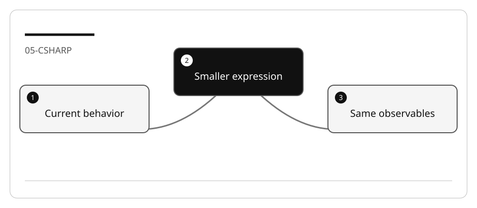

# Refactor existing C# library code safely

Replacing a loop with LINQ is not automatically an improvement. The refactor must
preserve comparison, ordering, null behavior, populated references and side effects.

## Lab briefing


<details>
<summary>Original concept illustration (SVG)</summary>



</details>

| At a glance | Your route |
| --- | --- |
| Level and time | 300; 60 minutes (facilitation estimate) |
| Starting action | Characterize one method before replacing its loop. |
| Learner materials | [Download 05-csharp.zip](../../../assets/lab-kits/hands-on/05-csharp.zip) |
| Workspace | Open the extracted kit root; run the baseline from `.` relative to that root |
| Expected initial check | The supplied tests pass. New feature requirements still need their own tests. |
| Setup help | [Download, extract, local Git and optional GitHub](../../../docs/downloads.md) |

> [!NOTE]
> Shorter code is not evidence of semantic equivalence.

[Concepts](#concepts-and-use-cases) · [First task](#task-1---inspect-and-characterize) · [Evidence checklist](#verify-your-work) · [Reset](#reset)

## Learning objectives

- Derive current behavior from the repository methods.
- Separate refactoring from bug fixes and new search semantics.
- Prove equivalence at selected boundary cases.

## Before you start

Prepare `05-csharp` using [the setup guide](../Reference/SETUP.md).
Use the bundled
[C# refactoring fixture](https://github.com/workshop-gbb/awesome-copilot-adventures/tree/main/mslearn-github-copilot/LabFiles/05-refactor-improve-existing-code/AccelerateDevGHCopilot).
Do not change dependency versions during a refactor.

## Concepts and use cases

| Behavior | Preservation question |
| --- | --- |
| `SearchPatrons` | Does `Contains` remain case-sensitive as in this fixture? |
| Sort | Is the current comparison/culture behavior preserved? |
| Populate | Are related loans still attached? |
| `GetPatron` | Is absent-ID behavior still null? |
| Update | Are the same fields persisted and reloaded? |

## Exercise scenario

The repository uses manual iteration to find and filter patrons/loans. Simplify one
method while keeping the existing interface and result semantics.

## Task 1 - Inspect and characterize

1. Read `JsonPatronRepository`, `JsonLoanRepository`, `JsonData`, and their interfaces.
2. Run the small fixture suite:

   ```bash
   dotnet test tests/UnitTests/UnitTests.csproj -m:1 -p:UseSharedCompilation=false
   ```

3. Add characterization cases before editing: found/missing, empty list, mixed case,
   duplicate display names with distinct IDs, and populated references.
4. Use isolated data; do not mutate distributed JSON to obtain expected results.

## Task 2 - Ask for alternatives, then Plan

```text
Compare the current loop in SearchPatrons with a LINQ alternative. Preserve
comparison and sort semantics, missing-input behavior, and populated loans.
Identify any material difference; do not edit or claim a speedup.
```

Choose one method. Require a before/after behavior table and a focused test command.
If the current behavior is undesirable, document a separate feature instead of
changing it under the name “refactoring.”

## Task 3 - Implement one equivalent slice

1. Ask Agent to simplify the chosen method only.
2. Inspect deferred execution versus materialized lists. Do not return a lazy
   iterator where callers expect a snapshot.
3. Run focused characterization and the original suite.
4. Temporarily alter case comparison or omit population. Confirm a regression
   fails, then restore the refactor.
5. Review public signatures and save/reload calls for unintended changes.

## Verify your work

- [ ] Existing tests and new characterization cases pass.
- [ ] Case, ordering and null semantics remain explicit.
- [ ] Related entities are still populated.
- [ ] Update/persistence side effects are unchanged.
- [ ] A deliberate semantic mutation is detected.

## Troubleshooting

If tests pass with or without population, improve the assertions. If a sort changes
on another machine, inspect culture rather than calling it random. If a missing ID
starts throwing, that is a behavior change needing its own acceptance criteria.

## Independent practice

Apply the same approach to one loan lookup. Explain when the simpler loop is
preferable to a chain of LINQ operators.

## Reset

Save the behavior table, restore only the refactored and test files in the copied
project, and stop the console if it was started. Never hard-reset the curriculum.

## Official references

- [String comparison guidance](https://learn.microsoft.com/en-us/dotnet/standard/base-types/best-practices-strings)
- [LINQ](https://learn.microsoft.com/en-us/dotnet/csharp/linq/)
- [C# tests](https://code.visualstudio.com/docs/csharp/testing)
