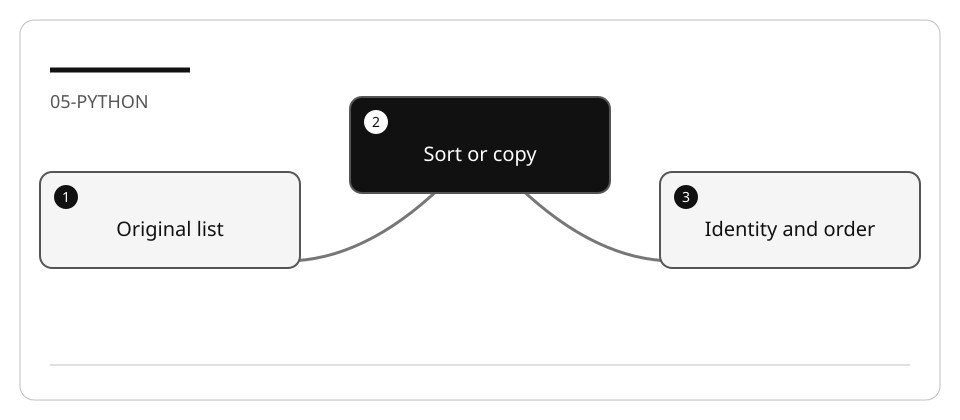

# Refactor existing Python library code safely

Python's `sorted`, comprehensions and `next` can express intent clearly, but they
have different copying and mutation semantics. Preserve the behavior users depend on.

## Lab briefing



| At a glance | Your route |
| --- | --- |
| Level and time | 300; 60 minutes (facilitation estimate) |
| Starting action | Test duplicates, ties and mutation before simplifying iteration. |
| Learner materials | [Download 05-python.zip](../../../assets/lab-kits/hands-on/05-python.zip) |
| Workspace | Open the extracted kit root; run the baseline from `library` relative to that root |
| Expected initial check | The existing unittest tests are discovered and pass. |
| Setup help | [Download, extract, local Git and optional GitHub](../../../docs/downloads.md) |

> [!NOTE]
> sorted and list.sort are not interchangeable contracts.

[Concepts](#concepts-and-use-cases) · [First task](#task-1---establish-tests-and-current-behavior) · [Evidence checklist](#verify-your-work) · [Reset](#reset)

## Learning objectives

- Identify what filtering/sorting actually returns and mutates.
- Preserve case and missing-result semantics.
- Use characterization before replacing loops.

## Before you start

Prepare `05-python` using [the setup guide](../Reference/SETUP.md).
Run commands from `library` in the bundled
[Python refactoring fixture](https://github.com/workshop-gbb/awesome-copilot-adventures/tree/main/mslearn-github-copilot/LabFiles/05-python-refactor-improve-existing-code/AccelerateDevGHCopilot).

## Concepts and use cases

| Existing code | Semantic trap |
| --- | --- |
| Patron substring search uses `lower()` | Switching to case-sensitive membership changes results |
| A bubble sort orders matching names | Replacing it with a set loses duplicates and order |
| `sort_loans_by_due_date` mutates the loans list | `sorted(...)` returns a new list instead |
| Lookup returns `None` for absent ID | `next(...)` without a default raises |
| Returned entities are shared objects | Deep-copying may change callers' assumptions |

## Exercise scenario

Simplify one patron-search or loan-sort method without changing the observable
contract. Performance profiling is a separate exercise; do not promise speedups.

## Task 1 - Establish tests and current behavior

```bash
python -m unittest discover -s tests -p "test_*.py" -v
```

1. Read the repository methods and callers.
2. Characterize empty input, absent IDs, mixed-case names, duplicate display names,
   equal dates and mutation of the original list.
3. Record date/time assumptions. Use controlled test dates.
4. Keep JSON read/write behavior outside the first refactor unless explicitly tested.

## Task 2 - Compare alternatives with Ask

```text
Compare the existing manual search/sort with comprehension, sorted, list.sort,
and next alternatives. Explain which returns a new list, which mutates, how ties
are handled, and what missing-result behavior must be preserved. Do not edit.
```

Do not assume that a one-line expression is clearer or that another language's
repository behavior applies here.

## Task 3 - Plan and implement one slice

1. In Plan, choose one method and list preserved semantics and tests.
2. Ask Agent to implement only that slice.
3. Inspect return type, identity, ordering and mutation.
4. Run focused tests and the existing suite.
5. Introduce one deliberate difference, such as replacing in-place sorting with a
   returned sorted copy. Confirm the appropriate characterization test fails.
6. Restore the correct refactor and record limitations.

## Verify your work

- [ ] Missing-ID behavior is unchanged.
- [ ] Search normalization and ordering remain the same.
- [ ] In-place versus copied results are tested explicitly.
- [ ] Equal-key order and duplicates are not accidentally lost.
- [ ] The negative mutation fails and unrelated behavior stays green.

## Troubleshooting

If only snapshots are compared, you may miss object mutation. If the refactor changes
error handling, classify it as a separate fix. If imports fail, run from `library`
rather than adding ad hoc `sys.path` edits.

## Independent practice

Refactor one update operation while preserving exactly when `save_loans` and
`load_data` are invoked. Test missing-record behavior without inventing a new policy.

## Reset

Save evidence, restore only the selected method/tests in the disposable copy, and
close the learning session. Leave shared interpreters and source data intact.

## Official references

- [Python testing](https://code.visualstudio.com/docs/python/testing)
- [Python sorting guide](https://docs.python.org/3/howto/sorting.html)
- [Agent planning](https://code.visualstudio.com/docs/agents/run/planning)
