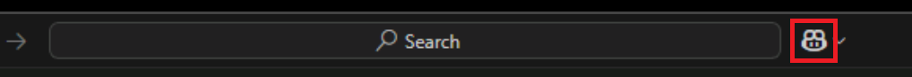

---
lab:
  title: Exercise - Refactor existing code using GitHub Copilot (Python)
  description: Learn how to refactor and improve existing code sections using GitHub Copilot in Visual Studio Code.
  duration: 30 minutes
  level: 200
  islab: true
  primarytopics:
    - GitHub
    - Visual Studio Code
---

# Refactor existing code using GitHub Copilot

GitHub Copilot can be used to evaluate your entire codebase and suggest updates that help you to refactor and improve your code. In this exercise, you use GitHub Copilot to refactor specified sections of a Python application while making improvements to code quality, reliability, performance, and security.

This exercise should take approximately **30** minutes to complete.

> **IMPORTANT**: To complete this exercise, you must provide your own GitHub account and GitHub Copilot subscription. If you don't have a GitHub account, you can <a href="https://go.microsoft.com/fwlink/?linkid=2320148" target="_blank">sign up</a> for a free individual account and use a GitHub Copilot Free plan to complete the exercise. If you have access to a GitHub Copilot Pro, GitHub Copilot Pro+, GitHub Copilot Business, or GitHub Copilot Enterprise subscription from within your lab environment, you can use your existing GitHub Copilot subscription to complete this exercise.

## Before you start

Your lab environment MUST include the following resources:

- Git 2.48 or later.
- Python 3.10 or later
- Access to a GitHub account with GitHub Copilot enabled.
- Visual Studio Code (version 1.116 or later) with the Python Extension for VS Code installed

If you're using a local PC as a lab environment for this exercise:

- For help configuring your local PC as your lab environment, open the following link in a browser: <a href="https://microsoftlearning.github.io/mslearn-github-copilot-dev/Instructions/Labs/LAB_AK_00_configure_lab_environment_py.html" target="_blank">Configure your lab environment resources</a>.

- For help enabling your GitHub Copilot subscription in Visual Studio Code, open the following link in a browser: <a href="https://go.microsoft.com/fwlink/?linkid=2320158" target="_blank">Enable GitHub Copilot within Visual Studio Code</a>.

If you're using a hosted lab environment for this exercise:

- For help enabling your GitHub Copilot subscription in Visual Studio Code, paste the following URL into a browser's site navigation bar: <a href="https://go.microsoft.com/fwlink/?linkid=2320158" target="_blank">Enable GitHub Copilot within Visual Studio Code</a>.

- Open a command terminal and then run the following commands:

    To ensure that Visual Studio Code is configured to use the correct version of Python, verify your Python installation is version 3.10 or later:

    ```bash
    python --version
    ```

    To ensure that Git is configured to use your name and email address, update the following commands with your information, and then run the commands:

    ```bash

    git config --global user.name "John Doe"

    ```

    ```bash

    git config --global user.email johndoe@example.com

    ```

## Exercise scenario

You're a developer working in the IT department of your local community. The backend systems that support the public library were lost in a fire. Your team needs to develop a temporary project to help the library staff manage their operations until the system can be replaced. Your team chose GitHub Copilot to accelerate the development process.

You handed off an initial version of the library application for review. The review team identified opportunities to improve code quality, performance, readability, maintainability, and security.

This exercise includes the following tasks:

1. Set up the library application in Visual Studio Code.
1. Analyze and refactor code using the Chat view in Ask and Edit modes.
1. Refactor code using inline chat and the Chat view in Edit and Agent modes.

## Set up the library application in Visual Studio Code

You need to clone the training repository and then open the library project in Visual Studio Code.

Use the following steps to set up the library application:

> **NOTE**: If you already cloned the `mslearn-github-copilot-dev` repository for a previous exercise, skip the cloning steps below. Open the cloned repository in Visual Studio Code and continue with the verification step.

1. Open a new Visual Studio Code window.

1. On the Welcome page, select **Clone Git Repository...** (or open the Command Palette with **Ctrl+Shift+P** and run **Git: Clone**), and then enter the following URL:

    ```plaintext
    https://github.com/MicrosoftLearning/mslearn-github-copilot-dev.git
    ```

1. When the file selection dialog appears, create a new folder in a convenient location to hold the repository (for example, `learn-github-copilot`), select it, and then click **Select as Repository Destination**.

1. After the clone completes, select **Open** to open the cloned repository in Visual Studio Code.

1. In the Visual Studio Code Explorer view, navigate to the `LabFiles/05-python-refactor-improve-existing-code/AccelerateDevGHCopilot` folder and verify the following project structure:

    - AccelerateDevGHCopilot/library
        ├── application_core
        ├── console
        ├── infrastructure
        └── tests

1. Ensure that the initial code runs by tests successfully in the next section. Optionally, run the application if you're familiar with the previous labs from the **LabFiles/05-python-refactor-improve-existing-code/AccelerateDevGHCopilot/library** folder in the terminal using **`python console/main.py`**.

### Enable Pytest

Compared to Unittest, Pytest some advantages such as concise syntax, features like fixtures and parameterization, and better failure reporting. Pytest makes tests easier to write and maintain and Pytest runs Unittest test cases.

1. Pytest is enabled from the install of the <a href="https://marketplace.visualstudio.com/items?itemName=ms-python.python" target="_blank">Visual Studio Microsoft Python extension</a>, install if needed.

1. Select the flask icon   on the toolbar once tests are discovered. If the icon isn't present review the previous instructions

1. Choose "Configure Python Tests" or if previously configured:

1. if the tests haven't been configured or are testing the correct project go to the next step. If you need to change the test project continue with:
    - `Ctrl+Shift+P` to open the Command Palette.
    - enter **"Python: Configure Tests"**.
    - Select "pytest."
    - Select the directory for your python code.
    - Select the play icon to run tests.

1. Select Pytest from the options.

1. Choose the (`library\`) folder containing your test code.

1. Select the play icon to run tests.
    

1. Optionally, run the ptytest command from the `library` path in the Terminal:

    ```plaintext
    pytest -v
    ```

## Analyze and refactor code using the Chat view in Ask and Edit mode

Reflection is a powerful coding feature that allows you to inspect and manipulate objects at runtime. However, reflection can be slow and there are potential security risks associated with reflection that should be considered.

You need to:

1. Analyze your workspace and investigate how to address your assigned task.
1. Refactor the the use of Python Enum into an enum_helper class to use static dictionaries instead of reflection and pythons built in Enum.

### Analyze Enum use with the Chat view in Ask mode

GitHub Copilot's Chat view has three modes: **Ask**, **Edit**, and **Agent**. Each mode is designed for different types of interactions with GitHub Copilot.

- **Ask**: Use this mode to ask GitHub Copilot questions about your codebase. You can ask GitHub Copilot to explain code, suggest changes, or provide information about the codebase.
- **Edit**: Use this mode to edit selected code files. You can use GitHub Copilot to refactor code, add comments, or make other changes to your code.
- **Agent**: Use this mode to run GitHub Copilot as an agent. You can use GitHub Copilot to run commands, execute code, or perform other tasks in your workspace.

In this section of the exercise, you use the Chat view in **Ask** mode to analyze your coding assignment.

Use the following steps to complete this section of the exercise:

1. In the Explorer view, expand the **library** folder.

1. Open the GitHub Copilot Chat view.

    The Chat view provides a managed conversational interface for interacting with GitHub Copilot.

    You can toggle the Chat view between open and closed using the **Toggle Chat** button, which is located at the top of the Visual Studio Code window, just to the right of the search textbox.

    

    You can also use the keyboard shortcut **Ctrl+Alt+I** to toggle the Chat view.

1. Notice that the Chat view opens in **Ask** mode by default.

    The current Chat mode is displayed near the bottom-right corner of the Chat view. Chat responses are displayed in the Chat view when you're working in **Ask** mode.

1. Set the chat mode to **Ask** and select the **Auto** model.

    The Set Mode and Pick Model menus are in the bottom-left corner of the Chat view.

    > **NOTE**: You can use a different model if your plan allows it, but responses may differ from those shown in this exercise. Free-plan users have a limited number of monthly chat requests, so each prompt counts against your quota.

1. Review and then submit the following prompt:

    ```plaintext
    @workspace Provide an explanation of how the current Python code can be improved with code refactoring to:
    - avoid reflection
    - avoid repeated `if/elif`
    - make the code more explicit and efficient.
    Then provide suggestion for refactoring this Python project to implement the improvement suggestions.
    ```

1. Take a minute to review the response, such as this , with code suggestions removed:

    >**NOTE** It is normal to see a very different response, but there should be similar themes.

    -----

    >### Code Improvement Explanation
    >
    > To improve the current code, consider the following refactoring strategies:
    >
    > 1. **Avoid Reflection**:  
    >    Reflection can be slow and error-prone. Instead, use explicit method calls, interfaces, or dictionaries to map actions to functions. This makes the code more maintainable and performant.
    >
    > 2. **Avoid Repeated `if/elif` Chains**:  
    >    Long `if/elif` chains are hard to read and maintain. Replace them with a dictionary (in Python) or a switch expression (in C# 8+), or use polymorphism (object-oriented design) to delegate behavior.
    >
    > 3. **Make Code More Explicit and Efficient**:  
    >    Explicit code is easier to understand and debug. Use clear variable names, avoid magic strings/numbers, and structure logic so that intent is obvious. Efficiency can often be improved by reducing unnecessary checks or lookups.
    >
    >#### Refactoring Suggestions
    >
    > Suppose you have code like this (Python example):
    >
    > ```python
    > # ...existing code...
    > def handle_action(action, data):
    >     if action == "create":
    >         return create_item(data)
    >     elif action == "update":
    >         return update_item(data)
    >     elif action == "delete":
    >         return delete_item(data)
    >     else:
    >         raise ValueError("Unknown action")
    > # ...existing code...
    > ```
    >
    > **Refactored Version (Avoids Reflection and if/elif, More Explicit)**
    >
    > ```python
    > # ...existing code...
    > def handle_action(action, data):
    >     action_map = {
    >         "create": create_item,
    >         "update": update_item,
    >         "delete": delete_item,
    >     }
    >     try:
    >         return action_map[action](data)
    >     except KeyError:
    >         raise ValueError(f"Unknown action: {action}")
    > # ...existing code...
    > ```
    >
    > **Benefits:**
    >
    > - No reflection is used.
    > - No repeated `if/elif`.
    > - The mapping is explicit and easy to extend.
    > - More efficient due to direct function lookup.
    >
    >### Summary
    >
    > - Use dictionaries or switch expressions instead of reflection or long `if/elif` chains.
    > - Make mappings explicit for maintainability and efficiency.
    > - Use clear error handling for unknown cases.
    >
    > These changes will make your codebase easier to maintain, more efficient, and less error-prone.

1. Review and then submit the following prompt:

    ```plaintext
    @workspace which Python files in this workspace use reflection or long `if/elif` chains?
    ```

    The response should tell you **console/console_app.py**  (`getattr`) and that **console/console_app.py** also uses long `if/elif` chains for command and input handling.

1. Add the **console/console_app.py** file to the Chat context:

    You can use a drag-and-drop operation to add the files from Visual Studio Code's explorer view to the Chat view. You can also use the **Add Context** button in the Chat view to add files and other resources.

    > **NOTE**: Adding files to the Chat context ensures that GitHub Copilot considers those files when generating a response. The relevance and accuracy of responses increase when GitHub Copilot understands the context associated with your prompts.

1. Review and then submit the following prompt:

    ```plaintext

    @workspace I need to refactor the `library\console\console_app.py` Python file to: Use dictionaries or switch expressions instead of reflection or long `if/elif` chains; Make mappings explicit for maintainability and efficiency; Use clear error handling for unknown cases; Provide refactored code to apply.

    ```

    When writing any prompt, clarity and context are important. Using chat participants, slash commands, and chat variables helps to define context in a way that GitHub Copilot can understand.

    For a prompt that asks GitHub Copilot how to solve a problem, start with the problem that you're trying to solve. Use concise sentences to describe details, specify constraints, and identify resources. Finally, be sure to tell GitHub Copilot what to include in the response.

    In this case, your prompt begins with a description of your problem/goal. You tell GitHub Copilot that you need to refactor the `library\console\console_app.py` file to:

    - Use dictionaries or switch expressions instead of reflection or long `if/elif` chains.
    - Make mappings explicit for maintainability and efficiency.
    - Use clear error handling for unknown cases.

    For clarity, to finish the prompt by you provide the instruction to "provide refactored code to apply."

1. Take a minute to review the response provided by GitHub Copilot. You **don't apply the edits** in this step.

    > ### Code Improvement Explanation
    >
    > To improve the current code, consider the following refactoring strategies:
    >
    > 1. **Avoid Reflection**:  
    >    Reflection can be slow and error-prone. Instead, use explicit method calls, interfaces, or dictionaries to map actions to functions. This makes the code more maintainable and performant.
    >
    > 2. **Avoid Repeated `if/elseif` Chains**:  
    >    Long `if/elseif` chains are hard to read and maintain. Replace them with a dictionary (in Python) or a switch expression (in C# 8+), or use polymorphism (object-oriented design) to delegate behavior.
    >
    > 3. **Make Code More Explicit and Efficient**:  
    >    Explicit code is easier to understand and debug. Use clear variable names, avoid magic strings/numbers, and structure logic so that intent is obvious. Efficiency can often be improved by reducing unnecessary checks or lookups.
    >
    >
    > ### Refactoring Suggestions
    >
    > Suppose you have code like this (Python example):
    >
    > ```python
    > # ...existing code...
    >    def _handle_patron_details_selection(self, selection, patron, valid_loans):
    >        if selection == 'q':
    >            return ConsoleState.QUIT
    >        elif selection == 's':
    >            return ConsoleState.PATRON_SEARCH
    >        elif selection == 'm':
    >            status = self._patron_service.renew_membership(patron.id)
    >            print(status)
    >            self.selected_patron_details = self._patron_repository.get_patron(patron.id)
    >            return ConsoleState.PATRON_DETAILS
    > # ...existing code...
    > ```
    >
    > #### Refactored Version (Avoids Reflection and if/elif, More Explicit)
    >
    > ```python
    > # ...existing code...
    >    def _handle_patron_details_selection(self, selection, patron, valid_loans):
    >        def renew_membership():
    >           status = self._patron_service.renew_membership(patron.id)
    >           print(status)
    >           self.selected_patron_details = self._patron_repository.get_patron(patron.id)
    >           return ConsoleState.PATRON_DETAILS
    > # ...existing code...
    > ```
    >
    > **Benefits:**
    >
    > - No reflection is used.
    > - No repeated `if/elif`.
    > - The mapping is explicit and easy to extend.
    > - More efficient due to direct function lookup.
    >
    >
    > ### Summary
    >
    > - Use dictionaries or switch expressions instead of reflection or long `if/elseif` chains.
    > - Make mappings explicit for maintainability and efficiency.
    > - Use clear error handling for unknown cases.
    >
    > These changes will make your codebase easier to maintain, more efficient, and less error-prone.

1. In the Chat view, hover the mouse pointer over the code sample included in the response.

1. Notice the three buttons that appear in the top-right corner of the code snippet.

1. Hover the mouse pointer over each of the buttons to see a tooltip that describes the action.

    The first two buttons copies code into the editor. The third button copies code to the clipboard. You **don't apply the edits** in this step.

> **NOTE**: You could use the Ask mode to update the code. However, the Edit mode refactors your code directly within the code editor and provides more options for accepting updates.

### Refactor the class ConsoleApp (console/console_app.py) file using the Chat view in Edit mode

The Chat view's Edit mode is designed for editing code in your workspace. You can use the Edit mode to refactor code, add comments, or make other changes to your code.

1. In the Chat view, select **Set Mode**, and then select **Edit**.

    When prompted to start a new session in the Edit mode, select **Yes**.

    In **Edit** mode, GitHub Copilot displays responses as code update suggestions in code editor. The Edit mode is generally used when implementing a new feature, fixing a bug, or refactoring code.

1. Add the console/console_app.py file to the Chat context:

1. Review and then submit the following prompt:

    ```plaintext

    @codebase I need to refactor the ConsoleApp class. Use static dictionaries to supply enum description attributes. Use dictionaries or switch expressions instead of reflection or long `if/elif` chains. Make mappings explicit for maintainability and efficiency. Use clear error handling for unknown cases.

    ```

    The Edit mode agent response should propose updates in the `ConsoleApp` class and proved a response similar to the following:

    ```plaintext
    The ConsoleApp class has been refactored to use static dictionaries for enum descriptions, explicit dictionaries for state and input handling, and clear error handling for unknown cases, improving maintainability and efficiency.
    ```

1. Take a minute to review the suggested code updates in **console_app.py**. Results should complete the following:

    - Introduced static dictionaries for enum descriptions (`CONSOLE_STATE_DESCRIPTIONS` and `COMMON_ACTIONS_DESCRIPTIONS`) to replace reflection and long `if/elif` chains.
    - Refactored `write_input_options` to use the static dictionary for displaying input options.
    - Replaced the main state loop in `run` with a dictionary-based handler lookup for maintainability and efficiency.
    - Added explicit error handling for unknown states and next states.
    - All action mappings in input handlers are now explicit dictionaries for clarity and maintainability.

1. In the Chat view, to accept all updates, select **Keep**.

    You could also use the Chat Edits toolbar near the bottom of the code editor tab to accept or reject code updates.

1. Take a minute to review the updated **run** method.

    GitHub Copilot should have updated the **run** method to replace the long if/elif chain with a state_handlers dictionary that maps each ConsoleState to its corresponding handler function. The updated method should look similar to one of the following:

    ```python

    def run(self) -> None:
        state_handlers = {
            ConsoleState.PATRON_SEARCH: self.patron_search,
            ConsoleState.PATRON_SEARCH_RESULTS: self.patron_search_results,
            ConsoleState.PATRON_DETAILS: self.patron_details,
            ConsoleState.LOAN_DETAILS: self.loan_details,
            ConsoleState.QUIT: lambda: ConsoleState.QUIT
        }
        while True:
            handler = state_handlers.get(self._current_state)
            if handler is None:
                print(f"Unknown state: {self._current_state}")
                break
            next_state = handler()
            if next_state == ConsoleState.QUIT:
                print("Exiting application.")
                break
            if next_state not in state_handlers:
                print(f"Unknown next state: {next_state}")
                break
            self._current_state = next_state
    ```

    This code uses the `state_handlers` dictionary that maps each `ConsoleState` to its corresponding handler function. It now retrieves the handler from the dictionary, raises an error for unknown states, and updates the current state based on the handler’s return value.

1. Run Pytest and manually Test to ensure that there are no errors were introduced.

    You'll see the same warnings that you saw at the start of this exercise, but there shouldn't be any error messages.

## Refactor code using inline chat, and the Chat view in Edit and Agent modes

By adopting Python’s **list comprehensions**, **generator expressions**, and **built-in functions** like `any()`, `all()`, `sum()`, `map()`, `filter()`, and `sorted()`, the codebase can become more concise, expressive, and efficient, reducing boilerplate and potential errors associated with manual iteration and data processing.

This section of the exercise includes the following tasks:

- **Inline Chat: Generator expression refactoring**
- **Edit Mode Chat:List list comprehensions and Python built-in methods refactoring**
- **Agent Mode: Built-in Functions Refactoring**

### Generator Expression refactoring using Inline Chat

1. In the Explorer view, expand the **infrastructure/json_patron_repository.py** project, and then open the **json_loan_repository.py** file and examine the **`JsonLoanRepository` class**.

1. To elect the **`JsonLoanRepository` class**, you highlight the entire class.

    ```python

    class JsonPatronRepository(IPatronRepository):
        def __init__(self, json_data: JsonData):
            self._json_data = json_data
    
        def get_patron(self, patron_id: int) -> Optional[Patron]:
            for patron in self._json_data.patrons:
                if patron.id == patron_id:
                    return patron
            return None
    
        def search_patrons(self, search_input: str) -> List[Patron]:
            results = []
            for p in self._json_data.patrons:
                if search_input.lower() in p.name.lower():
                    results.append(p)
            n = len(results)
            for i in range(n):
                for j in range(0, n - i - 1):
                    if results[j].name > results[j + 1].name:
                        results[j], results[j + 1] = results[j + 1], results[j]
            return results
    
        def update_patron(self, patron: Patron) -> None:
            for idx in range(len(self._json_data.patrons)):
                if self._json_data.patrons[idx].id == patron.id:
                    self._json_data.patrons[idx] = patron
                    self._json_data.save_patrons(self._json_data.patrons)
                    return
    
        def add_patron(self, patron: Patron) -> None:
            self._json_data.patrons.append(patron)
            self._json_data.save_patrons(self._json_data.patrons)
            self._json_data.load_data()
    
        def get_all_patrons(self) -> List[Patron]:
            return self._json_data.patrons
    
        def find_patrons_by_name(self, name: str) -> List[Patron]:
            result = []
            for patron in self._json_data.patrons:
                if patron.name.lower() == name.lower():
                    result.append(patron)
            return result
    
        def get_all_books(self):
            return self._json_data.books
    
        def get_all_book_items(self):
            return self._json_data.book_items

    ```

1. Open an inline Copilot Chat, and then enter a prompt that refactors the method.

    ```plaintext
    #selection Refactor any manual aggregation or search over loans in this method to use generator expressions with built-in functions like any(), all(), sum(), or max() for improved readability and performance.
    ```

1. Take a minute to review the suggested update.

    The suggested updates should look similar to the following code:

    ```python
    # --code continues-- 
    def get_patron(self, patron_id: int) -> Optional[Patron]:
        return next((patron for patron in self._json_data.patrons if patron.id == patron_id), None)

    def search_patrons(self, search_input: str) -> List[Patron]:
        results = [p for p in self._json_data.patrons if search_input.lower() in p.name.lower()]
        results.sort(key=lambda p: p.name)
        return results

    def update_patron(self, patron: Patron) -> None:
        for idx, existing_patron in enumerate(self._json_data.patrons):
            if existing_patron.id == patron.id:
                self._json_data.patrons[idx] = patron
                self._json_data.save_patrons(self._json_data.patrons)
                return

    # --code continues--    
    def find_patrons_by_name(self, name: str) -> List[Patron]:
        return [patron for patron in self._json_data.patrons if patron.name.lower() == name.lower()]
    # --code continues-- 
    ```

1. To accept the suggested update, select **Accept**.

#### Use **Inline Chat "Explain" smart action** to examine a method

1. Use the **Explain** smart action to see an explanation of the `search_patrons` method.

1. select the following lines of code (after the comment) from the `search_patrons` method.:

    ```python
    # def search_patrons(self, search_input: str) -> List[Patron]:
        results = [p for p in self._json_data.patrons if search_input.lower() in p.name.lower()]
        results.sort(key=lambda p: p.name)
    ```

    To open the **Explain** smart action, select the `search_patrons` method code in the editor, right-click the selected code, select Copilot, and then select **Explain**. The **Explain** smart action provides a detailed explanation of the selected code.

    For example, the explanation might look like this:

    ```plaintext

    The `search_patrons` method is responsible for finding patrons whose names contain a given search string, regardless of case. It takes a single argument, `search_input`, which is the string to search for. The method iterates over all patrons stored in `self._json_data.patrons` and uses a list comprehension to filter those whose `name` attribute contains the `search_input` substring. Both the patron's name and the search input are converted to lowercase to ensure the search is case-insensitive.
    
    After collecting the matching patrons, the method sorts the results alphabetically by the patron's name using the `sort()` method with a key function that extracts the `name` attribute from each patron. Finally, the sorted list of matching patrons is returned. This ensures that users receive a case-insensitive, alphabetically ordered list of patrons matching their search criteria.
    
    A potential consideration is that the search will match any part of the name, not just the beginning, which may lead to more results than expected. Also, the sorting is done in-place on a new list,

    ```

1. Test & run  your project to ensure that there are no errors were introduced.

#### Continue Generator Expression refactoring using InlineChat

1. Next, continue with the refactoring process for **loan_service.py**.

1. In the Explorer view, expand the **application_core\services\loan_service.py** project, and then open the **loan_service.py** file and examine the **`LoanService` class**.

1. To elect the **`LoanService` class**, you highlight the entire class, examine the`checkout_book` method.

    ```python

    class LoanService(ILoanService):
        EXTEND_BY_DAYS = 14
    
        def __init__(self, loan_repository: ILoanRepository):
            self._loan_repository = loan_repository
    
        def return_loan(self, loan_id: int) -> LoanReturnStatus:
            loan = self._loan_repository.get_loan(loan_id)
            if loan is None:
                return LoanReturnStatus.LOAN_NOT_FOUND
            if loan.return_date is not None:
                return LoanReturnStatus.ALREADY_RETURNED
            loan.return_date = datetime.now()
            try:
                self._loan_repository.update_loan(loan)
                return LoanReturnStatus.SUCCESS
            except Exception:
                return LoanReturnStatus.ERROR
    
        def extend_loan(self, loan_id: int) -> LoanExtensionStatus:
            loan = self._loan_repository.get_loan(loan_id)
            if loan is None:
                return LoanExtensionStatus.LOAN_NOT_FOUND
            if loan.patron and loan.patron.membership_end < datetime.now():
                return LoanExtensionStatus.MEMBERSHIP_EXPIRED
            if loan.return_date is not None:
                return LoanExtensionStatus.LOAN_RETURNED
            if loan.due_date < datetime.now():
                return LoanExtensionStatus.LOAN_EXPIRED
            try:
                loan.due_date = loan.due_date + timedelta(days=self.EXTEND_BY_DAYS)
                self._loan_repository.update_loan(loan)
                return LoanExtensionStatus.SUCCESS
            except Exception:
                return LoanExtensionStatus.ERROR
    
        def checkout_book(self, patron, book_item, loan_id=None) -> None:
            from ..entities.loan import Loan
            from datetime import datetime, timedelta
            # Generate a new loan ID if not provided
            if loan_id is None:
                all_loans = getattr(self._loan_repository, 'get_all_loans', lambda: [])()
                max_id = 0
                for l in all_loans:
                    if l.id > max_id:
                        max_id = l.id
                loan_id = max_id + 1 if all_loans else 1
            now = datetime.now()
            due = now + timedelta(days=14)
            new_loan = Loan(
                id=loan_id,
                book_item_id=book_item.id,
                patron_id=patron.id,
                patron=patron,
                loan_date=now,
                due_date=due,
                return_date=None,
                book_item=book_item
            )
            self._loan_repository.add_loan(new_loan)
            return new_loan

    ```

1. Open an inline chat, and then enter a prompt that refactors the method.

    ```plaintext
    #selection Refactor any manual aggregation or search over loans in this method to use generator expressions with built-in functions like any(), all(), sum(), or max() for improved readability and performance.
    ```

1. Take a minute to review the suggested update with the added code in the `checkout_book` method:

    ```python

            loan_id = max((l.id for l in all_loans), default=0) + 1 if all_loans else 1
    ```

    The full  `checkout_book` method should look similar to the following code:

    ```python
    # --code continues-- 

    def checkout_book(self, patron, book_item, loan_id=None) -> None:
            from ..entities.loan import Loan
            from datetime import datetime, timedelta
            if loan_id is None:
                all_loans = getattr(self._loan_repository, 'get_all_loans', lambda: [])()
                loan_id = max((l.id for l in all_loans), default=0) + 1 if all_loans else 1
            now = datetime.now()
            due = now + timedelta(days=14)
            new_loan = Loan(
                id=loan_id,
                book_item_id=book_item.id,
                patron_id=patron.id,
                patron=patron,
                loan_date=now,
                due_date=due,
                return_date=None,
                book_item=book_item
            )
            self._loan_repository.add_loan(new_loan)
            return new_loan
    ```

    Refactoring to use generator expressions replaces manual iteration with concise, memory-efficient constructs that *work seamlessly with built-in functions* like `max()`, `any()`, and `sum()`. This not only reduces boilerplate code and potential errors but also improves performance, especially when processing large datasets, since generator expressions do not create intermediate lists in memory. Overall, these changes make the codebase more Pythonic, readable, and maintainable.

### Refactor the JsonPatronRepository class using the Chat view in Edit mode

The **JsonPatronRepository** class includes the following three methods:

- SearchPatrons: The SearchPatrons method is used to search for patrons by name. This method returns a sorted list of patrons.
- GetPatron: The GetPatron method is used to retrieve a patron by ID. This method returns a populated patron object.
- UpdatePatron: The UpdatePatron method is used to update a patron's information. This method updates the existing patron with the new data and saves the updated patrons collection.

Each of the three methods uses a foreach loop to iterate over the patrons and find matches based on the search input or ID.

Use the following steps to complete this section of the exercise:

1. Open the **json_loan_repository.py** file.

    The **JsonPatronRepository** class is designed to manage library patrons.

1. Take a minute to review some of the methods included in the **JsonPatronRepository** class.

    The **SearchPatrons** method is designed to search for patrons by name.

    ```python

    #  ----code continues----   
    class JsonLoanRepository(ILoanRepository):
        def **init**(self, json_data: JsonData):
            self._json_data = json_data
    
        #  ----code continues----   
        def get_loans_by_patron_id(self, patron_id: int):
            result = []
            for loan in self._json_data.loans:
                if loan.patron_id == patron_id:
                    result.append(loan)
            return result
    
        #  ----code continues----  
        def get_overdue_loans(self, current_date):
            overdue = []
            for loan in self._json_data.loans:
                if loan.return_date is None and loan.due_date < current_date:
                    overdue.append(loan)
            return overdue
    
        def sort_loans_by_due_date(self):
            # Manual bubble sort for demonstration
            n = len(self._json_data.loans)
            for i in range(n):
                for j in range(0, n - i - 1):
                    if self._json_data.loans[j].due_date > self._json_data.loans[j + 1].due_date:
                        self._json_data.loans[j], self._json_data.loans[j + 1] = self._json_data.loans[j + 1], self._json_data.loans[j]
            return self._json_data.loans

        #  ----code continues----  
    ```

1. In the Chat view, select **Set Mode**, and then select **Edit**.

    When prompted to start a new session in the Edit mode, select **Yes**.

    In **Edit** mode, GitHub Copilot displays responses as code update suggestions in code editor. The Edit mode is generally used when implementing a new feature, fixing a bug, or refactoring code.

1. Enter the prompt

    ```plaintext
    @codebase Refactor methods in the JsonLoanRepository class with for-loops to use list comprehensions 
    or Python built-in methods to improve code clarity, conciseness, and efficiency.
    ```

1. Notice in the updated code that follows that `get_loans_by_patron_id` and `get_overdue_loans` methods are now using list comprehensions and the`sort_loans_by_due_date` method now uses a Python built-in `sorted` function.

    ```python
    #  ----code continues----

    def get_loan(self, loan_id: int) -> Optional[Loan]:
        return next((loan for loan in self._json_data.loans if loan.id == loan_id), None)

    def update_loan(self, loan: Loan) -> None:
        idx = next((i for i, l in enumerate(self._json_data.loans) if l.id == loan.id), None)
        if idx is not None:
            self._json_data.loans[idx] = loan
            self._json_data.save_loans(self._json_data.loans)
            return

    #  ----code continues----
    def get_loans_by_patron_id(self, patron_id: int):
        return [loan for loan in self._json_data.loans if loan.patron_id == patron_id]
    
    #  ----code continues----
    def get_overdue_loans(self, current_date):
        return [loan for loan in self._json_data.loans if loan.return_date is None and loan.due_date < current_date]

    def sort_loans_by_due_date(self):
        # Use built-in sorted for clarity and efficiency
        self._json_data.loans = sorted(self._json_data.loans, key=lambda l: l.due_date)
        return self._json_data.loans
    ```

    List comprehensions and built-in functions replaced manual for-loops for filtering and sorting, making the code shorter, clearer, and more efficient.

### Refactor the JsonLoanRepository & JsonPatronRepository classes using the Chat view in Agent mode

1. In the Chat view, change the mode to **Agent**

    Agent mode is designed for running GitHub Copilot as an agent. You can use natural language to specify a high-level task. The agent will evaluate the assigned task, plan the work needed, and apply the changes to your codebase.

    Agent mode uses a combination of code editing and tool invocation to accomplish the task you specified. As it processes your request, it monitors the outcome of edits and tools, and iterates to resolve any issues that arise. If the agent is unable to resolve an issue, it will ask you to intervene. For example, if the agent uses several iterations working to resolve the same issue, it will pause the process and ask you to provide additional context to clarify your request or cancel the process.

    > **IMPORTANT**: When you use the Chat view in agent mode, GitHub Copilot may make multiple premium requests to complete a single task. Premium requests can be used by user-initiated prompts and follow-up actions Copilot takes on your behalf. The total number of premium requests used is based on the complexity of the task, the number of steps involved, and the model selected.

1. Take a minute to consider the task that you need to assign to the agent.

    The task is to refactor the **JsonLoanRepository** & **JsonPatronRepository** classes. The goal is to locate manual loops to refactor with **Built-in Python Functions** that produce the same result as the original foreach code.

    You can use your experience with the previous refactoring to help you write the task for the agent.

1. To assign the agent task, enter the following prompt using **AGENT mode**:

    ```plaintext

    #codebase Review the manual loop code used in the methods of the JsonLoanRepository and JsonPatronRepository classes to make them more pythonic. Refactor with Built-in Python Functions that produce the same result as the original foreach code.

    ```

    This prompt tells the agent to refactor the **JsonPatronRepository** class. It specifies that the foreach loops should be replaced with Built-in Python Functions.

1. Monitor the agent's progress as it refactors the code.

    Notice that the agent completes the task in several iterations. Each code edit pass is followed by a review pass that check for issues. If the agent encounters an issue, it will refactor the code to resolve the issue. If the agent is unable to resolve an issue, it will ask you to intervene.

1. Once the agent has finished, take a minute to review the suggested updates.

    The changes made in JsonLoanRepository should be:
        - `update_patron` now uses `next` with `enumerate` for efficient index lookup.
        - `search_patrons` uses a generator expression and `sorted` for concise, readable code.
        - All manual bubble sort and redundant code have been removed.

    > **NOTE:** No changes were needed for JsonPatronRepository, as it already uses built-in functions and comprehensions for filtering and searching.

    The suggested updates should look similar to the following code:

    ```python
    #  ----code continues----
    def search_patrons(self, search_input: str) -> List[Patron]:
        return sorted(
            (p for p in self._json_data.patrons if search_input.lower() in p.name.lower()),
            key=lambda patron: patron.name
        )

    def update_patron(self, patron: Patron) -> None:
        idx = next((i for i, existing_patron in enumerate(self._json_data.patrons) if existing_patron.id == patron.id), None)
        if idx is not None:
            self._json_data.patrons[idx] = patron
            self._json_data.save_patrons(self._json_data.patrons)

        #  ----code continues----

    ```

1. To accept all updates, select **Keep**.

These updates make the code more concise, readable, and Pythonic while preserving the original behavior.

### Test and run the application

Now that you've refactored the code, it's time to test and run the application to ensure that everything is working correctly. You'll also test the application to ensure that the refactored code is functioning as expected.

1. To run the application in Visual Studio Code using Python, open **console/main.py** in the editor, press **CTRL+Shift+D** to open the Run and Debug panel, choose **Python: Current File** or another debug configuration, and then **F5** to start debugging.

    The following steps guide you through a simple use case.

1. When prompted for a patron name, type **One** and then press Enter.

    You should see a list of patrons that match the search query.

    > **NOTE**: The application uses a case-sensitive search process.

1. At the "Input Options" prompt, type **2** and then press Enter.

    Entering **2** selects the second patron in the list.

    You should see the patron's name and membership status followed by book loan details.

1. At the "Input Options" prompt, type **1** and then press Enter.

    Entering **1** selects the first book in the list.

    You should see book details listed, including the due date and return status.

1. At the "Input Options" prompt, type **r** and then press Enter.

    Entering **r** returns the book.

1. Verify that the message "Book was successfully returned." is displayed.

    The message "Book was successfully returned." should be followed by the book details. Returned books are marked with **Returned: True**.

1. To begin a new search, type **s** and then press Enter.

1. When prompted for a patron name, type **One** and then press Enter.

1. At the "Input Options" prompt, type **2** and then press Enter.

1. Verify that first book loan is marked **Returned: True**.

1. At the "Input Options" prompt, type **q** and then press Enter.

1. Stop the debug session.

## Summary

In this exercise, the focus was on refactoring and improving existing code with the help of GitHub Copilot. You systematically enhanced the codebase by replacing manual loops and repetitive patterns with Pythonic constructs such as list comprehensions, generator expressions, and built-in functions. You used GitHub Copilot's various modes—Ask, Inline, Edit, and Agent—to analyze code, generate refactoring suggestions, and apply improvements directly in Visual Studio Code. These approaches improved code quality, readability, maintainability, and performance. With these skills, you can now confidently refactor and modernize Python projects, making your codebase more robust and efficient as you continue to develop new features.

## Clean up

Now that you've finished the exercise, take a minute to ensure that you haven't made changes to your GitHub account or GitHub Copilot subscription that you don't want to keep. If you made any unwanted changes, revert them now.
