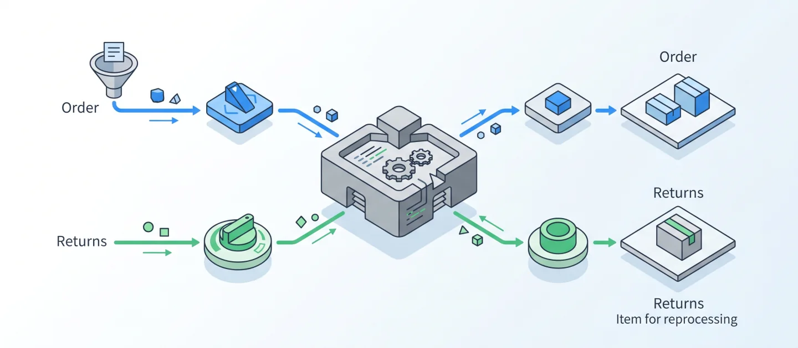
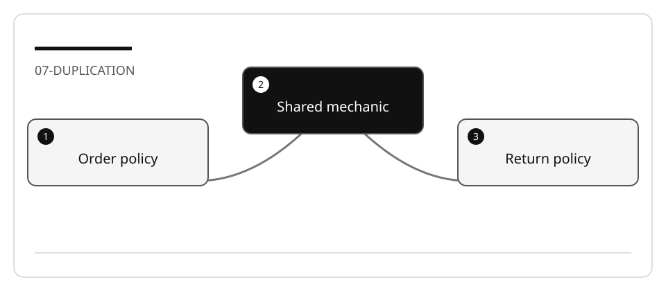

# Consolidate duplicate code while preserving business rules

Two similar methods are not necessarily one rule. The order and return processors
share validation mechanics but use different prefixes, shipping thresholds, and
inventory directions. Removing those differences would be a behavior change.

## Lab briefing



<details>
<summary>Original concept illustration (SVG)</summary>



</details>

| At a glance | Your route |
| --- | --- |
| Level and time | 200; 55 minutes (facilitation estimate) |
| Starting action | Capture equality thresholds before extracting one helper. |
| Learner materials | [Download 07-duplication.zip](../../../assets/lab-kits/hands-on/07-duplication.zip) |
| Workspace | Open the extracted kit root; run the baseline from `.` relative to that root |
| Expected initial check | The selected project builds. Compilation alone does not prove behavior. |
| Setup help | [Download, extract, local Git and optional GitHub](../../../docs/downloads.md) |

> [!NOTE]
> Similar code does not mean the same shipping or inventory policy.

[Concepts](#concepts-and-use-cases) · [First task](#task-1---capture-a-real-baseline) · [Evidence checklist](#verify-your-work) · [Reset](#reset)

## Learning objectives

- Identify exact versus semantic duplication using real code.
- Capture current outputs and side effects before extraction.
- Choose a small shared abstraction without over-generalizing policy.
- Detect a refactor that accidentally changes a boundary.

## Before you start

Prepare `07-duplication` with [the common setup](../Reference/SETUP.md).
The source is the bundled
[ECommerceOrderAndReturn fixture](https://github.com/workshop-gbb/awesome-copilot-adventures/tree/main/mslearn-github-copilot/LabFiles/07-consolidate-duplicate-code/ECommerceOrderAndReturn).
Use its .NET SDK target and one build process.

## Concepts and use cases

| Candidate | Possible shared mechanic | Keep explicit |
| --- | --- | --- |
| `Validate` | Blank/length checks | `ORD` versus `RET` prefixes |
| `CalculateShipping` | Applying a policy | Order and return thresholds/amounts |
| Notifications | Formatting and output | Message purpose and recipients |
| Inventory | Bounds and logging | Reserve decreases; restore increases |

The processors catch and log exceptions. A zero exit code from the demo therefore
does **not** prove that an expected exception was thrown. This is a characterization
exercise, not proof of production security.

## Exercise scenario

You need to reduce maintenance duplication without changing totals, inventory,
validation messages, or event ordering. A separate business change would need its own
acceptance criteria and review.

## Task 1 - Capture a real baseline

1. Read `OrderProcessor.cs`, `ReturnProcessor.cs`, `Configuration/AppConfig.cs`,
   and the services they call.
2. Build the copied project:

   ```bash
   dotnet build ECommerceOrderAndReturn.csproj -m:1 -p:UseSharedCompilation=false
   dotnet run --no-build --project ECommerceOrderAndReturn.csproj
   ```

3. Record current order/return shipping totals, inventory before/after, and rejected
   IDs. Treat `EXPECTED_OUTPUT.md` as a historical illustration, not today's output.
4. Identify timestamps or generated identifiers before comparing logs. Do not
   remove business values merely to make a diff look equal.

## Task 2 - Analyze duplication with Ask

```text
Compare OrderProcessor.Validate and ReturnProcessor.Validate. Cite the shared
mechanics and the policy differences. Do the same for shipping and inventory.
Do not edit. Flag swallowed exceptions separately from the refactoring scope.
```

Check the answer against these concrete shipping rules:

| Rule | Orders | Returns |
| --- | --- | --- |
| Base | 5.00 | 3.00 |
| Weight surcharge | Above 10: +2.00 | Above 5: +1.50 |
| Value discount | Above 50: -1.00 | Above 30: -0.50 |
| Special handling | Fragile: +3.00 | Oversized: +4.00 |

Do not replace “above” with “at least.” Test values immediately below, at, and above
the thresholds before moving code.

## Task 3 - Plan one extraction

1. In Plan, choose either validation or shipping for the first change.
2. Require a table of preserved rules, proposed parameters, existing callers,
   regression cases, and rollback.
3. Explain why a shared helper is simpler than a new class hierarchy.
4. Keep the original public processing methods and side-effect order.
5. Define a stopping point after one behavior-safe extraction.

## Task 4 - Implement and challenge the result

1. Ask Agent to implement only that extraction.
2. Inspect all callers; unused helpers do not constitute consolidation.
3. Add assertions around deterministic values or a narrowly scoped characterization
   harness. Do not rename a console transcript “unit tests.”
4. Re-run the same build/demo and the added assertions.
5. Temporarily invert one threshold in the disposable copy. Confirm the relevant
   assertion fails, then restore it.
6. Consider a second extraction only after the first one is verified.

## Verify your work

- [ ] Public entry points and observable rules remain unchanged.
- [ ] Weight/value equality boundaries are tested.
- [ ] Reserve and restore still have opposite inventory effects.
- [ ] New assertions reject an intentionally wrong threshold.
- [ ] The diff contains actual reuse rather than an unused abstraction.

## Troubleshooting

| Symptom | Likely cause |
| --- | --- |
| Every run has a different log | Dynamic time/IDs; compare stable fields explicitly |
| Order and return prices converge | Distinct policies were merged accidentally |
| All demo scenarios exit zero | Exceptions are logged internally; add discriminating assertions |
| Refactor expands across many layers | Return to one extraction and state non-goals |

## Independent practice

Refactor one notification helper while preserving the public methods and messages.
Explain why changing retry behavior would be a separate feature.

## Reset

Stop the demo, save the baseline and comparison evidence, and restore only named
exercise files in the disposable copy. Do not overwrite the source fixture.

## Official references

- [Plan with agents](https://code.visualstudio.com/docs/agents/run/planning)
- [Agent best practices](https://code.visualstudio.com/docs/agents/best-practices)
- [C# test support](https://code.visualstudio.com/docs/csharp/testing)
