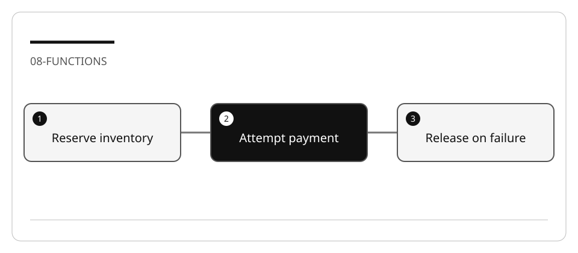
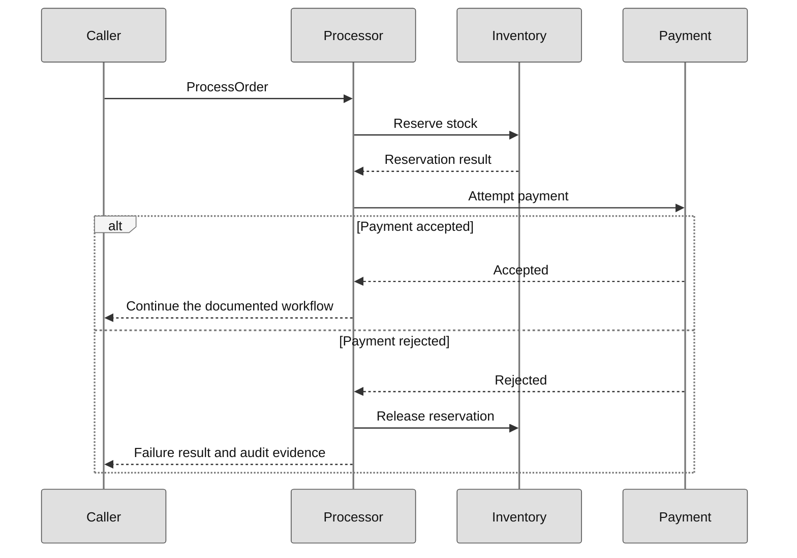

# Refactor a large function without losing error paths

A shorter method is not automatically safer. Extracting a payment step can move
inventory cleanup out of the failure path. Your evidence must cover failure and
side effects, not just the successful order.

## Lab briefing



| At a glance | Your route |
| --- | --- |
| Level and time | 300; 60 minutes (facilitation estimate) |
| Starting action | Trace success and failure before choosing the extraction boundary. |
| Learner materials | [Download 08-functions.zip](../../../assets/lab-kits/hands-on/08-functions.zip) |
| Workspace | Open the extracted kit root; run the baseline from `.` relative to that root |
| Expected initial check | The console entry project builds; compensation behavior needs separate assertions. |
| Setup help | [Download, extract, local Git and optional GitHub](../../../docs/downloads.md) |

> [!NOTE]
> A payment rejection must not leave inventory incorrectly reserved.

[Concepts](#concepts-and-use-cases) · [First task](#task-1---trace-the-existing-method) · [Evidence checklist](#verify-your-work) · [Reset](#reset)

## Learning objectives

- Map a long method into responsibilities and state transitions.
- Preserve order, error messages, and compensation during extraction.
- Prefer one executable extraction over a collection of unused stubs.
- Review before/after behavior independently of an agent's explanation.

## Before you start

Prepare `08-functions` using [the environment guide](../Reference/SETUP.md).
Use the bundled
[ECommerceOrderProcessing fixture](https://github.com/workshop-gbb/awesome-copilot-adventures/tree/main/mslearn-github-copilot/LabFiles/08-refactor-large-functions/ECommerceOrderProcessing).
All payments, addresses, and notifications are synthetic.

## Concepts and use cases

| Concept | Why it matters |
| --- | --- |
| Cohesion | An extracted method should have one meaningful responsibility |
| Contract | Parameters/results express what must survive an extraction |
| Compensation | Undo a reservation when a later step fails |
| Ordering | Moving audit or inventory calls changes observable behavior |
| Characterization | Tests record current behavior before a refactor |

## Exercise scenario

`OrderProcessor.ProcessOrder` coordinates validation, inventory, payment, shipping,
notifications, and audit output. Keep the existing behavior while making each step
easier to inspect.

## Task 1 - Trace the existing method

1. Read `src/ECommerce.ApplicationCore/Services/OrderProcessor.cs`, its interfaces,
   and the implementations under `src/ECommerce.Infrastructure/Services`.
2. In Ask:

   ```text
   Trace ProcessOrder from input validation to completion. For each exit path,
   list changed state, audit events, inventory release, and the returned result.
   Cite the implementation rather than assuming the interface guarantees it.
   ```

3. Annotate the following conceptual sequence against the actual source.



**Legend.** Participant headers identify collaborators. Solid arrows are calls;
dashed arrows are responses. The `alt` branches distinguish success from rejection.

**Explanation.** This diagram emphasizes the compensation obligation. Complete it
from the fixture's shipping and notification branches before treating it as a full
model; it is not a trace of a payment service actually contacted.

## Task 2 - Establish branch evidence

1. Build only the console project:

   ```bash
   dotnet build src/ECommerce.Console/ECommerce.Console.csproj -m:1 -p:UseSharedCompilation=false
   dotnet run --no-build --project src/ECommerce.Console/ECommerce.Console.csproj
   ```

2. Record valid-order, invalid-email, declined-payment, and suspicious-order outcomes.
3. Inspect the generated audit file in the process working directory.
4. Distinguish business fields from timestamps. Old transcript timestamps and
   sample card expiry dates must not be used as current expected results.
5. Add an assertion on reservation release for a declined payment. If the existing
   demo only prints results, a zero exit code is insufficient evidence.

## Task 3 - Design a bounded extraction

Use Plan:

```text
Extract only payment processing and its documented compensation boundary.
Preserve public signatures, result semantics, audit order, and inventory release.
List tests for acceptance, rejection, and failure before reservation.
Do not add retry, concurrency, or exception-swallowing fallbacks.
```

Review where ownership of cleanup remains. Reject an extraction that makes both
caller and helper release the same reservation.

## Task 4 - Implement one slice

1. Ask Agent to make the planned extraction and update callers.
2. Inspect the entire diff, especially early returns and `finally` blocks.
3. Run the same checks and your compensation assertion.
4. Temporarily omit the release call. Confirm the assertion fails, then restore it.
5. Only then consider validation or shipping extraction as another slice.

## Verify your work

- [ ] Existing scenarios preserve their result semantics.
- [ ] A payment rejection releases a reservation exactly as before.
- [ ] Failure before reservation does not perform inappropriate compensation.
- [ ] Audit event order is explained and verified.
- [ ] A negative mutation is detected.

## Troubleshooting

If exceptions disappear, compare error boundaries rather than adding a catch-all.
If inventory differs, check double release and changed call order. If the method
gets shorter but responsibilities remain coupled through many output parameters,
review the abstraction instead of counting lines.

## Independent practice

Apply the approach to the bundled ServerLogAnalysisUtility in a separate copy.
Specify file encoding, malformed-line behavior, and output ordering before extracting.

## Reset

Stop the console process, save the evidence, and restore only the named source and
test files in the disposable copy. Remove only that copy's generated audit file.

## Official references

- [Planning](https://code.visualstudio.com/docs/agents/run/planning)
- [C# testing](https://code.visualstudio.com/docs/csharp/testing)
- [Exception best practices](https://learn.microsoft.com/en-us/dotnet/standard/exceptions/best-practices-for-exceptions)
