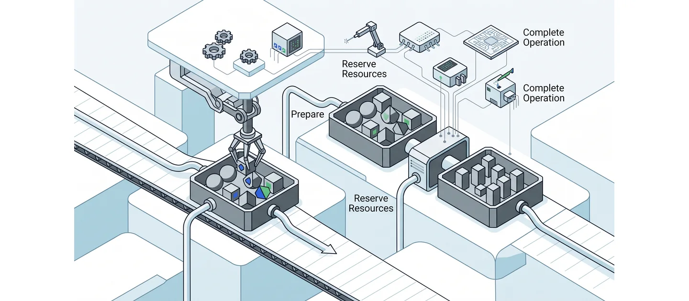
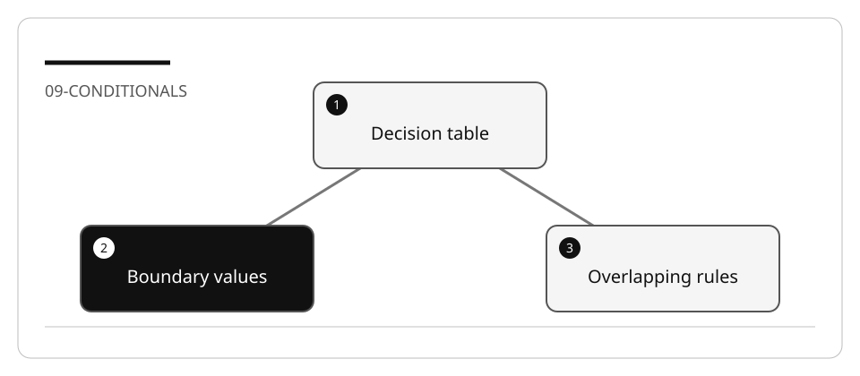

# Simplify complex conditionals without changing decisions

Flattening nested conditions can broaden eligibility accidentally. A coupon that
applies only inside a premium/high-value branch must not become a global rule.

## Lab briefing



<details>
<summary>Original concept illustration (SVG)</summary>



</details>

| At a glance | Your route |
| --- | --- |
| Level and time | 300; 55 minutes (facilitation estimate) |
| Starting action | Choose rows that distinguish equality, overlap and cap behavior. |
| Learner materials | [Download 09-conditionals.zip](../../../assets/lab-kits/hands-on/09-conditionals.zip) |
| Workspace | Open the extracted kit root; run the baseline from `.` relative to that root |
| Expected initial check | The selected project builds. Compilation alone does not prove behavior. |
| Setup help | [Download, extract, local Git and optional GitHub](../../../docs/downloads.md) |

> [!NOTE]
> Moving a condition outside its parent can broaden eligibility.

[Concepts](#concepts-and-use-cases) · [First task](#task-1---establish-the-decision-surface) · [Evidence checklist](#verify-your-work) · [Reset](#reset)

## Learning objectives

- Derive a decision table before rewriting conditions.
- Preserve threshold equality, precedence, discount caps, and error behavior.
- Choose named predicates or guard clauses based on semantics.

## Before you start

Prepare `09-conditionals` using [the setup guide](../Reference/SETUP.md).
The primary fixture is
[ECommercePricingEngine](https://github.com/workshop-gbb/awesome-copilot-adventures/tree/main/mslearn-github-copilot/LabFiles/09-simplify-complex-conditionals/ECommercePricingEngine).
The loan-approval demo is optional and purely fictional; it is not a credit policy
or a system for real financial decisions.

## Concepts and use cases

| Technique | Useful when | Risk |
| --- | --- | --- |
| Named predicate | One condition has a meaningful domain name | Hiding different conditions behind one name |
| Guard clause | Invalid input exits early | Skipping required audit/cleanup work |
| Decision table | Rules overlap | Assuming rows are mutually exclusive |
| Strategy per policy | Distinct policies evolve independently | Adding a class hierarchy for trivial branching |

## Exercise scenario

`PricingEngine.CalculateFinalPrice` evaluates membership, seasonal events, coupons,
shipping, and category-specific caps. Preserve the current outputs while clarifying
one family of conditions.

## Task 1 - Establish the decision surface

1. Read `ECommercePricingDemo.cs` and `SecurityTest.cs`.
2. Identify `User`, `Coupon`, `Order`, `SafeAddDiscount`, and category-specific logic.
3. Ask for a rule inventory with source references, not a proposed rewrite yet.
4. Build and run:

   ```bash
   dotnet build ECommercePricingEngine.csproj -m:1 -p:UseSharedCompilation=false
   dotnet run --no-build --project ECommercePricingEngine.csproj
   ```

5. Record results, including warnings and rejected inputs. Demo scenarios and
   security-labeled methods are not a comprehensive security or coverage report.

## Task 2 - Derive a boundary table

Start with these dimensions, then record the actual expected value from the source
and baseline for every selected row:

| Dimension | Cases |
| --- | --- |
| Membership | Guest, Silver, Gold, Premium |
| High-value order | Just below, equal to, and above the relevant threshold |
| Coupon | Absent, valid, expired, invalid type, excessive value |
| Category cap | Electronics and a non-electronics category |
| Shipping | Domestic, international, free-shipping coupon |
| Invalid order | Null, empty, negative price, excessive total |

Do not generate the full Cartesian product blindly. Choose cases that distinguish
branches and interactions, then explain the remaining coverage gaps.

## Task 3 - Plan one equivalent transformation

```text
Plan a refactor of membership conditions only. Keep coupon order, category caps,
shipping, and public output unchanged. Show how each selected decision-table row
maps to the new structure. Preserve > versus >= exactly. Do not edit yet.
```

Review short-circuit behavior. A `switch` can improve readability, but is not evidence
that overlapping rules or side effects are preserved.

## Task 4 - Implement and validate

1. Ask Agent to implement the reviewed slice with no dependency changes.
2. Compare the decision table against the diff before accepting it.
3. Turn chosen rows into executable assertions using the project's current entry
   points or a small characterization harness.
4. Re-run the same build/demo and assertions.
5. Deliberately change one strict comparison to an inclusive comparison; confirm
   the equality case fails, then restore it.

## Verify your work

- [ ] Decision-table rows include equality and overlapping conditions.
- [ ] Discount caps and shipping rules retain their ordering.
- [ ] Invalid inputs retain their documented failure behavior.
- [ ] Negative mutation is detected by an executable check.
- [ ] No “fewer lines means correct” claim is used as evidence.

## Troubleshooting

If a flattened condition produces an extra discount, reconstruct its original parent
conditions. If logging changes unexpectedly, inspect early returns. If only happy
paths are green, add one failing and one equality case before further refactoring.

## Independent practice

Repeat one extraction in the optional LoanApprovalWorkflow copy, using only synthetic
data. Document rule equivalence without presenting the demo as a fair, lawful, or
production-ready credit decision system.

## Reset

Save the decision table and outputs, then restore only the files changed in your
disposable copy. Do not overwrite imported reference output with fabricated results.

## Official references

- [Plan with agents](https://code.visualstudio.com/docs/agents/run/planning)
- [C# pattern matching](https://learn.microsoft.com/en-us/dotnet/csharp/fundamentals/functional/pattern-matching)
- [C# testing](https://code.visualstudio.com/docs/csharp/testing)
