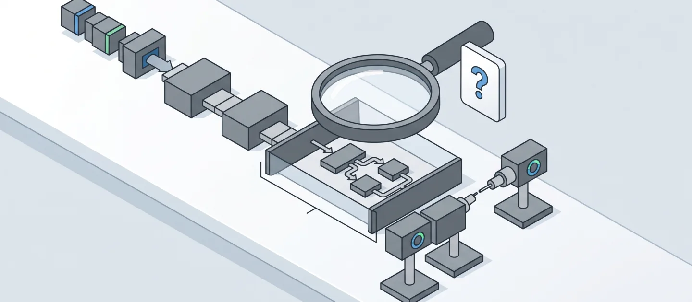
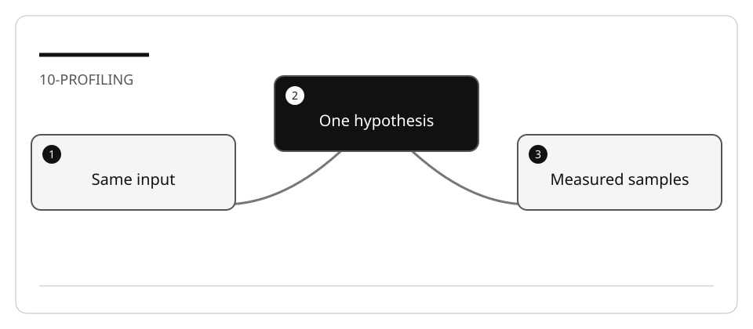

# Profile a bounded workload with GitHub Copilot

An agent can suggest a bottleneck. Only a measurement can show what happened on
your workload. A valid result may be **no measurable improvement**.

## Lab briefing



<details>
<summary>Original concept illustration (SVG)</summary>



</details>

| At a glance | Your route |
| --- | --- |
| Level and time | 300; 60 minutes (facilitation estimate) |
| Starting action | Keep the measurement boundary and functional output unchanged. |
| Learner materials | [Download 10-profiling.zip](../../../assets/lab-kits/hands-on/10-profiling.zip) |
| Workspace | Open the extracted kit root; run the baseline from `.` relative to that root |
| Expected initial check | The selected project builds. Compilation alone does not prove behavior. |
| Setup help | [Download, extract, local Git and optional GitHub](../../../docs/downloads.md) |

> [!NOTE]
> An inconclusive result is better than fabricated timing.

[Concepts](#concepts-and-use-cases) · [First task](#task-1---bound-and-inspect-the-workload) · [Evidence checklist](#verify-your-work) · [Reset](#reset)

## Learning objectives

- Define a measurement boundary before optimizing.
- Preserve functional output while comparing a single change.
- Distinguish elapsed time, allocations, retained memory, and peak memory.
- Avoid load tests, unbounded concurrency, and large datasets on a shared machine.

## Before you start

Prepare `10-profiling` with [the resource-limited setup](../Reference/SETUP.md).
The default fixture is the small DataAnalyzerReporter. The imported
[ContosoOnlineStore and benchmark examples](https://github.com/workshop-gbb/awesome-copilot-adventures/tree/main/mslearn-github-copilot/LabFiles/10-implement-performance-profiling)
are an **optional isolated-machine extension**, not part of the default run.
Do not launch BenchmarkDotNet, a load test, or parallel request fan-out here.

## Concepts and use cases

| Measure | What it tells you | What it does not tell you |
| --- | --- | --- |
| `Stopwatch` elapsed time | Wall time inside a named boundary | Why time was spent there |
| Allocation counter | Bytes allocated over a scope | Peak working set |
| `GC.GetTotalMemory` | Managed memory estimate at an instant | Total allocations or process peak memory |
| Profiler sample | Where execution was sampled | Guaranteed savings from a code suggestion |

The current demo starts its stopwatch **after loading input**. Its printed duration
therefore does not measure file loading. Explain that limitation before changing
`FileLoader`.

## Exercise scenario

The analyzer reads lines of numbers, ignores blank lines, sums successfully parsed
values, and writes one report line per processed record. `ReportGenerator` opens
the output file for each appended line. Investigate batching without changing data
parsing or output order.

## Task 1 - Bound and inspect the workload

1. Read `Program.cs`, `FileLoader.cs`, `DataAnalyzer.cs`, and `ReportGenerator.cs`.
2. Inspect the bundled `data.txt` size. Use a small copy for experimentation; do not
   generate a larger dataset just to obtain impressive timing.
3. Record working directory and culture. Parsing uses the current numeric culture;
   a culture change is a behavior change, not an I/O optimization.
4. Build once in Release mode:

   ```bash
   dotnet build DataAnalyzerReporter.csproj -c Release -m:1 -p:UseSharedCompilation=false
   dotnet run --no-build -c Release --project DataAnalyzerReporter.csproj -- data.txt
   ```

5. Keep the generated report as functional evidence. Run only in the disposable
   copy because the demo replaces `output.txt`.

## Task 2 - State a falsifiable hypothesis

In Ask:

```text
Inspect the loading, parsing and report-writing boundaries. Which operation is
inside the current stopwatch? Propose one bounded measurement that can compare
per-line append with a buffered writer. Do not change parsing, culture, or output.
```

In Plan, require:

- the same input, build, machine state and measurement boundary;
- one warm-up and at most three sequential measured runs;
- elapsed samples and functional-output comparison;
- no caching, parallelism, or unrelated algorithm changes;
- a stop condition if the machine is busy or results are noisy.

## Task 3 - Capture the baseline

Record raw samples without claiming a target:

| Variant | Input hash/rows | Build | Boundary | Samples | Output equal? |
| --- | --- | --- | --- | --- | --- |
| Before | Record actual values | Release | Report processing | Record actual durations | Baseline |
| After | Same values | Release | Same boundary | Record actual durations | Yes/No |

For tiny workloads a millisecond timer may report zero. Report inadequate resolution;
do not invent a faster number or subtract hypothetical “simulated delay” time.

## Task 4 - Implement one optimization

1. Ask Agent to batch report writes while preserving order and parsing behavior.
2. Inspect resource disposal and errors. A writer must be closed even after failure.
3. Re-run functional checks before timing.
4. Repeat the same bounded measurement.
5. Compare outputs and observed samples. If output changes, reject the optimization
   regardless of any apparent speedup.

## Verify your work

- [ ] The measured boundary is explicit and unchanged.
- [ ] Input, culture, build mode and output comparison are recorded.
- [ ] Raw samples are retained; no universal percentage is claimed.
- [ ] One optimization is isolated from parsing and business-rule changes.
- [ ] The run stayed within the agreed resource budget.

## Troubleshooting

Noisy samples may reflect other projects, JIT, file cache, or measurement resolution.
Do not fix noise by saturating the machine. A smaller test or an inconclusive result
is preferable to a misleading benchmark.

## Independent practice

On an authorized idle machine, profile one existing ContosoOnlineStore benchmark.
Record its exact configuration, synthetic delays, setup costs, and what the benchmark
excludes. Do not infer latency savings from asymptotic complexity alone.

## Reset

Stop only the process/profiler you started. Preserve small evidence files and restore
the changed implementation in the disposable copy. Remove only its generated reports.

## Official references

- [Overview of .NET diagnostics](https://learn.microsoft.com/en-us/dotnet/core/diagnostics/)
- [dotnet-counters](https://learn.microsoft.com/en-us/dotnet/core/diagnostics/dotnet-counters)
- [Stopwatch](https://learn.microsoft.com/en-us/dotnet/api/system.diagnostics.stopwatch)
- [Agent best practices](https://code.visualstudio.com/docs/agents/best-practices)
