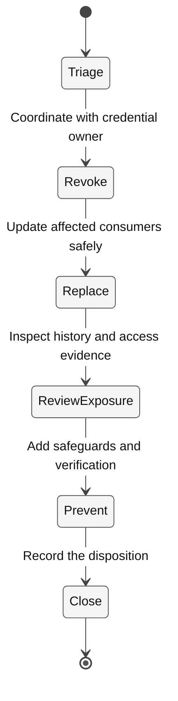

# Rehearse secret remediation safely

Deleting a leaked credential from the latest file does not revoke it or remove it
from history. The credential provider is the authority on validity.

> [!CAUTION]
> Never create or commit a real token for this exercise. Do not bypass push protection,
> publish an intentionally vulnerable repository, or paste secret values into Copilot.
> The core lab is a simulation and contacts no provider.

## Learning objectives

- Separate triage, revocation, code remediation, exposure review, and prevention.
- Use evidence to justify closing an alert.
- Recognize what a local simulation cannot prove.

## Before you start

Prepare `12-secrets` with [the common setup](../Reference/SETUP.md).
Node 24 is enough. Private-repository secret scanning depends on plan and policy;
do not make a repository public to enable a lab feature.

## Concepts and use cases

| Action | Establishes | Does not establish |
| --- | --- | --- |
| Remove a literal | Current file no longer contains it | Provider revocation |
| Revoke/rotate with the owner | Old credential loses authority | No past unauthorized access occurred |
| Review exposure/history | Scope of exposure and dependent consumers | Automatic deletion of every remote copy |
| Close an alert | A documented disposition | Safety if no mitigation was performed |
| Push protection | Prevention for supported patterns | Detection of every possible secret |

## Exercise scenario

The fixture describes a simulated service token exposure using only the value
`TRAINING_ONLY_NOT_A_CREDENTIAL`. It deliberately contains no live token or provider-
formatted credential. Your output is an incident-response plan, not a claim that
GitHub detected or revoked anything.

## Task 1 - Read the incident and establish scope

1. Inspect `incident.json` and `response.json`.
2. Identify owner, hypothetical affected consumer, exposure scope, and missing evidence.
3. In Ask:

   ```text
   This is a simulation with no real credential. Draft the triage questions:
   owner, provider, exposure locations, validity, dependent consumers, and
   possible misuse. Do not request or print a token value.
   ```

4. Keep unverified facts labeled as questions.

## Task 2 - Plan revocation-first remediation

Use this sequence:



**Legend.** Rounded nodes are response stages, arrows show their order, and filled
circles indicate the start/end of the exercise. Labels describe the evidence gate.

**Explanation.** The sequence prevents “delete the string and close the alert” from
counting as remediation. In a real incident, revocation and consumer coordination
follow the owner's incident process; this diagram does not execute those operations.

1. Add the six stage IDs from the fixture to `response.json` in the reviewed order.
2. For each, state the evidence that would be required.
3. Include an interruption plan for affected consumers. Never log the replacement.
4. Propose only a scoped code change: read a named configuration value, fail clearly
   if it is absent, and avoid a hardcoded “development” fallback.

## Task 3 - Verify the plan, not a fabricated incident

```bash
node --test --test-concurrency=1 policy.test.mjs
node verify.mjs
```

The policy tests should pass. The response verifier rejects the blank starter;
after completion it validates stage order and evidence descriptions only.

Then temporarily place closure before revocation. Confirm the verifier fails,
and restore the correct plan.

## Task 4 - Optional authorized GitHub inspection

If you already own a repository with legitimate alerts and are authorized to inspect
them, review the Security tab and record only redacted metadata. Do not create an
alert by leaking a token. Keep provider actions manual and separately approved.
Use current documented alert reasons; do not dismiss a real secret as “used in tests.”

If Actions, billing, or policy blocks the feature, the simulation remains usable.
Record “GitHub/provider operations not executed” in the evidence.

## Verify your work

- [ ] No credential was generated, committed, printed, or sent to a model.
- [ ] The response separates revocation, replacement, history/exposure and prevention.
- [ ] Closing an alert requires evidence rather than absence of a literal.
- [ ] A reordered response fails locally.
- [ ] Simulation results are not presented as provider or GitHub verification.

## Troubleshooting

No GitHub alert for the training marker is expected. A clean latest commit does not
prove history is clean. Do not rewrite shared Git history or remove someone else's
credential without the owner-approved incident process.

## Independent practice

Write a deployment checklist for replacing a revoked secret without exposing the
replacement in logs. Use placeholders and no real infrastructure.

## Reset

Restore only `response.json` in your copy. Close the learning session. There are no
credentials, repositories, paid services, or cloud resources to remove in the core lab.

## Official references

- [Remediate a leaked secret](https://docs.github.com/en/code-security/tutorials/remediate-leaked-secrets/remediating-a-leaked-secret)
- [Secret scanning](https://docs.github.com/en/code-security/secret-scanning/introduction/about-secret-scanning)
- [Push protection](https://docs.github.com/en/code-security/secret-scanning/introduction/about-push-protection)
