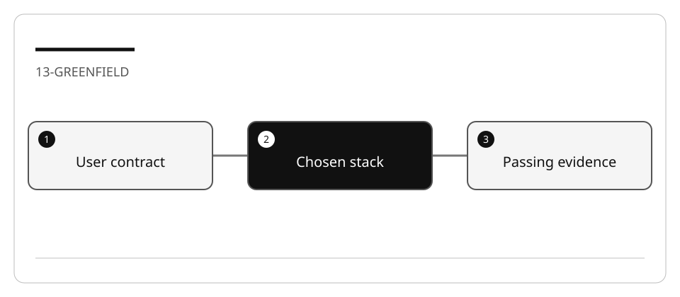

# Develop a greenfield RSS reader with Spec Kit

Greenfield means there is no existing application behavior to preserve. It does not
mean no constraints. You will implement only subscription management, not remote
feed fetching or a production reader.

## Lab briefing



| At a glance | Your route |
| --- | --- |
| Level and time | 300; 80 minutes (facilitation estimate) |
| Starting action | Record the initial failure, then map every RSS criterion to a task. |
| Learner materials | [Download 13-greenfield.zip](../../../assets/lab-kits/hands-on/13-greenfield.zip) |
| Workspace | Open the extracted kit root; run the baseline from `.` relative to that root |
| Expected initial check | The unfinished RSS store fails with the documented exercise error. A missing runtime or syntax error is not the expected failure. |
| Setup help | [Download, extract, local Git and optional GitHub](../../../docs/downloads.md) |

> [!NOTE]
> The starter is intentionally incomplete; do not replace its contract.

[Concepts](#concepts-and-use-cases) · [First task](#task-1---review-stakeholder-intent-and-the-red-baseline) · [Evidence checklist](#verify-your-work) · [Reset](#reset)

## Learning objectives

- Separate governance, user requirements, technical design and execution.
- Use clarification to settle duplicate and invalid-input behavior.
- Select a stack against the same acceptance contract.
- Validate a generated implementation with predeclared tests.

## Before you start

Complete [Spec Kit setup](LAB_AK_00_configure_github_dev_kit_lab.md).
Prepare `13-greenfield` with [the work-drive guide](../Reference/SETUP.md).
Default implementation: Node 24 ES modules, no packages or network.
TypeScript, .NET, Python and Go are compared below; only execute the chosen stack.

## Concepts and use cases

| Artifact | Question answered |
| --- | --- |
| Constitution | What rules constrain all work? |
| Specification | What user-visible behavior is required? |
| Plan | How will the chosen stack implement and verify it? |
| Tasks | What is the smallest ordered work that covers every requirement? |
| Tests | Does this implementation satisfy the declared contract? |

## Exercise scenario

A reader curates feed subscriptions locally. They can add an HTTP(S) URL and list
subscriptions. Duplicates, malformed URLs and embedded credentials must be rejected.
The app must **not fetch the URL**. URLs under `example.test` are intentional fixtures.

## Task 1 - Review stakeholder intent and the red baseline

1. Read `StakeholderDocuments/ProjectGoals.md`, `AppFeatures.md`, and `TechStack.md`.
2. Inspect `contract.test.mjs` without changing its assertions.
3. Run:

   ```bash
   node --test --test-concurrency=1 contract.test.mjs
   ```

4. The unfinished `createStore` should fail with the documented exercise error.
   A syntax error, missing test, or missing Node runtime is not the expected failure.
5. Record RSS-1 through RSS-4 and identify what is deliberately outside the contract.

## Task 2 - Initialize and establish principles

1. Record the untouched fixture as a local Git baseline.
2. Initialize using the skills layout documented in [Spec Kit reference](../Reference/SPEC_KIT.md).
3. Invoke:

   ```text
   /speckit-constitution Use StakeholderDocuments/ProjectGoals.md.
   Require local deterministic tests, no remote feed fetches or credentials,
   explicit errors, immutable returned records, and bounded changes.
   ```

4. Review `.specify/memory/constitution.md`. Principles must be actionable.
5. Do not let the constitution workflow implement the application or rewrite tests.

## Task 3 - Specify and clarify

```text
/speckit-specify Use StakeholderDocuments/AppFeatures.md.
Build only add/list subscription behavior. Assign stable IDs, reject normalized
duplicates, accept only HTTP(S) without userinfo, and never fetch a submitted URL.
Map requirements to the supplied acceptance tests.
```

Then use `/speckit-clarify` to settle these questions:

- Are surrounding whitespace and URL fragments normalized?
- Are URL host names case-insensitive? What happens to path case?
- Do failed adds consume IDs or modify state?
- Does a caller receive mutable copies or live internal records?

The supplied contract answers these for the default implementation. If a stakeholder
changes the contract, record approval before changing both specification and tests.

## Task 4 - Choose a stack and plan

| Route | Implementation seam | Validation | Status in this repository |
| --- | --- | --- | --- |
| Node ES modules | `createStore`, `add`, `list` | Supplied `contract.test.mjs` | Runnable starter and instructor reference |
| TypeScript on Node | Same exports, explicit record types | Same contract with a TS import | Instructor reference included; no framework required |
| .NET 10 | Store plus Minimal API; optional Blazor UI | Port RSS-1..4 to existing xUnit patterns | Guided adaptation, not claimed as executed |
| Python | Store class; optional HTTP adapter | Port RSS-1..4 to unittest/pytest | Guided adaptation |
| Go | Store and `net/http` adapter | Port RSS-1..4 to `go test` | Guided adaptation |

Example for the default route:

```text
/speckit-plan Use Node 24 ES modules and the built-in test runner. Implement
subscriptions.mjs only. Use URL parsing, retain IDs and insertion order, return
copies, and add no dependencies, persistence, or HTTP calls.
```

Separate “different stack” from “different requirements.” A UI is optional until the
domain contract is green; it needs separate keyboard and network-behavior checks.

## Task 5 - Decompose, implement, and converge

1. Run `/speckit-tasks`, then `/speckit-analyze`.
2. Ensure RSS-1..4 each has an implementation task and a check.
3. Run `/speckit-implement` for one reviewed slice.
4. Re-run `contract.test.mjs` yourself; inspect the complete diff.
5. Run `/speckit-converge` if present in the pinned integration. Independently
   verify its claims. Stop after two unsuccessful repairs, not an unlimited loop.
6. Deliberately make `list()` return internal records. Confirm RSS-4 fails, then
   restore the correct behavior.

## Verify your work

- [ ] Initial red result and final green result are recorded.
- [ ] Every RSS requirement maps to spec, plan, task and executed check.
- [ ] No test was weakened to accept incorrect behavior.
- [ ] URL validation performs no remote request.
- [ ] Stack adaptations are labeled as proposed versus executed.

## Troubleshooting

Use the generated skill names, not dotted commands copied from another version.
Do not “repair” an invalid URL test by accepting arbitrary strings. If the model adds
a database or fetcher, stop and restate the non-goals.

## Independent practice

Implement the same contract in a second stack, or add subscription deletion as a
new specification. Keep a traceability table showing which original checks remain.

## Reset

Save the red/green evidence. Restore only implementation changes in the disposable
copy or prepare a new copy. Do not run Specify initialization in the curriculum root.

## Official references

- [Spec Kit v1.0.4](https://github.com/github/spec-kit/tree/v1.0.4)
- [Integration reference](https://github.com/github/spec-kit/blob/v1.0.4/docs/reference/integrations.md)
- [Constitution workflow](https://github.com/github/spec-kit/blob/v1.0.4/templates/commands/constitution.md)
- [Agent planning](https://code.visualstudio.com/docs/agents/run/planning)
