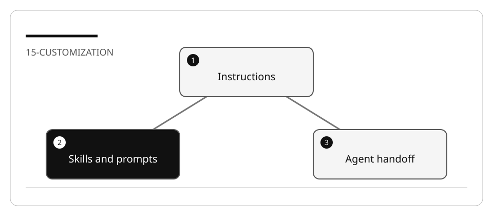

# Customize Copilot for a bounded inventory task

Instructions influence responses; they do not enforce permissions. A custom agent
defines a role/tool profile; its `target` metadata does not mean “run in the cloud.”
Select execution through the actual session target control.

## Lab briefing



| At a glance | Your route |
| --- | --- |
| Level and time | 300; 80 minutes (facilitation estimate) |
| Starting action | Verify discovery and test the inventory change separately. |
| Learner materials | [Download 15-customization.zip](../../../assets/lab-kits/hands-on/15-customization.zip) |
| Workspace | Open the extracted kit root; run the baseline from `.` relative to that root |
| Expected initial check | The supplied baseline tests pass. |
| Setup help | [Download, extract, local Git and optional GitHub](../../../docs/downloads.md) |

> [!NOTE]
> A file existing on disk is not proof that the host loaded it.

[Concepts](#concepts-and-use-cases) · [First task](#task-1---establish-the-baseline-and-workspace-boundary) · [Evidence checklist](#verify-your-work) · [Reset](#reset)

## Learning objectives

- Use the smallest customization primitive for each need.
- Verify discovery from a disposable workspace root.
- Distinguish instructions, task prompts, skills and handoffs.
- Implement one inventory change without assuming customization guarantees correctness.

## Before you start

Prepare `15-customization` using [the common setup](../Reference/SETUP.md).
The bundled Node inventory fixture needs no package install and replaces a mandatory
external Blazor/database project. A C# service/controller adaptation is optional.
Read [the concepts reference](../Reference/COPILOT.md).

## Concepts and use cases

| Need | File | Verification |
| --- | --- | --- |
| Durable conventions | `.github/copilot-instructions.md` | Discovered/applied context and compliant diff |
| Test-specific rules | `.github/instructions/tests.instructions.md` | `applyTo` matches test paths |
| Manual review task | `.github/prompts/review-change.prompt.md` | Invocation in a supported Local session |
| Reusable verification expertise | `.github/skills/check-evidence/SKILL.md` | Discovery and relevant use |
| Read-only planner | `.github/agents/planner.agent.md` | Tool list lacks edit/execute authority |
| Implement/review workflow | Handoffs between profiles | Human reviews the prefilled prompt |

## Exercise scenario

The fixture lists inventory categories. Add an item lookup by exact SKU, retaining
the category contract and returning copies. Do not add persistence, authentication,
cloud deployment, or a whole CRUD application.

## Task 1 - Establish the baseline and workspace boundary

```bash
node --test --test-concurrency=1 inventory.test.mjs
```

Open only the copied fixture as the workspace root. Capture the selected role,
harness, model and permission state. A customization file buried in another
workspace is not proof it loaded.

## Task 2 - Create focused instructions

1. Create `.github/copilot-instructions.md` with a short project description:
   integer quantities, immutable return values, standard library only, focused tests.
2. Create a path-specific file:

   ```markdown
   ---
   applyTo: "**/*.test.mjs"
   ---
   Use node:test and node:assert/strict. Test invalid and missing IDs.
   A passing test must call production code and assert observable behavior.
   ```

3. Inspect the current customization discovery UI/references for the chosen host.
4. Attach one test file and ask which guidance applies.
5. Do not create conflicting instructions to “test precedence”: VS Code does not
   promise a combination order. Resolve contradictions explicitly.

## Task 3 - Compare a prompt and a skill

1. In Local, create a prompt using `agent: ask` and read/search tools:

   ```markdown
   ---
   description: Review an inventory change against its acceptance criteria.
   agent: ask
   tools: [read, search]
   ---
   Inspect the selected change and tests. Report missing cases with source paths.
   Do not edit files or claim tests ran unless their output is available.
   ```

2. Invoke it and record how it differs from automatic instructions.
3. Create a `check-evidence/SKILL.md` with frontmatter `name` and `description`,
   followed by steps to select/run existing checks and report actual evidence.
4. Inspect skill discovery in the Copilot harness when available.
5. Do not expect the prompt file to run on Agent Host; do not copy its whole text
   into always-on instructions as a workaround.

## Task 4 - Define a planner and a bounded handoff

Create `.github/agents/planner.agent.md`:

```markdown
---
name: inventory-planner
description: Plan a small inventory change without editing source.
tools: [read, search]
handoffs:
  - label: Implement reviewed plan
    agent: agent
    prompt: Implement only the reviewed inventory slice and run its focused tests.
    send: false
---
Inspect current source and tests. State acceptance criteria, files, checks and
non-goals. Do not edit, execute commands, or invent validation results.
```

Inspect the profile and tools in the host. Tool names/aliases and handoffs differ
across surfaces; use the documented picker rather than adding guessed tool names.
Do not set `target: cloud`: that is not the documented execution mechanism.

## Task 5 - Complete a reviewed change

1. Ask the planner to specify `findBySku(sku)` with found, missing, invalid and
   copy-isolation cases.
2. Review the plan and the prefilled handoff prompt before sending.
3. Let Agent implement only that feature and its tests.
4. Review in a clean read/search-only session.
5. Run the full small fixture test file yourself.
6. Compare actual compliant behavior with the mere existence of instruction files.

## Verify your work

- [ ] Customizations are discovered from the copied root.
- [ ] Instructions and prompts are not conflated.
- [ ] The planner has no edit/execute tools.
- [ ] Handoff is human-reviewed; unavailable features are recorded.
- [ ] New item lookup and old category behavior are both tested.
- [ ] No customization is described as a sandbox or deterministic policy.

## Troubleshooting

If the profile is absent, inspect workspace root, filename and frontmatter.
If a tool is unavailable, choose a supported alias rather than granting all tools.
If the implementation ignores a convention, inspect context and tests; do not claim
instructions enforce it automatically.

## Independent practice

Adapt the same conventions to a C# inventory service and test project. Explain which
rules are cross-stack and which `applyTo` patterns/tool names must change.

## Reset

Save redacted discovery evidence. Close the copied workspace and its agent sessions.
Restore only exercise customizations/source in that copy, never the curriculum's
shared `.github` directory.

## Official references

- [Custom instructions](https://code.visualstudio.com/docs/agent-customization/custom-instructions)
- [Prompt files](https://code.visualstudio.com/docs/agent-customization/prompt-files)
- [Agent Skills](https://code.visualstudio.com/docs/agent-customization/agent-skills)
- [Custom agents and handoffs](https://code.visualstudio.com/docs/agent-customization/custom-agents)
- [Choose a harness](https://code.visualstudio.com/docs/agents/run/agent-harnesses)
