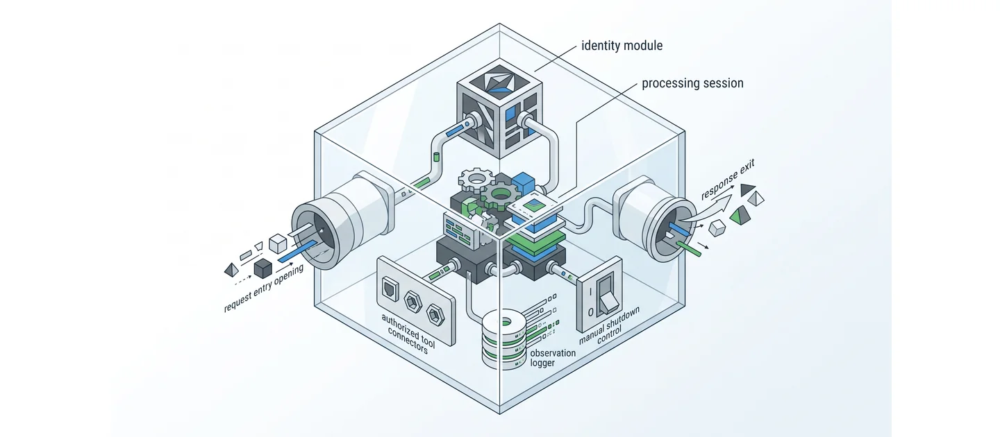
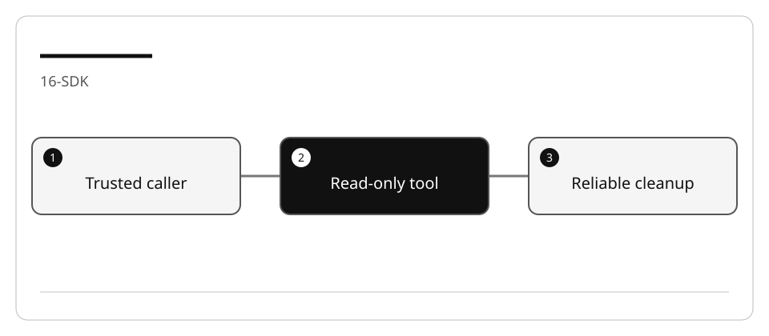
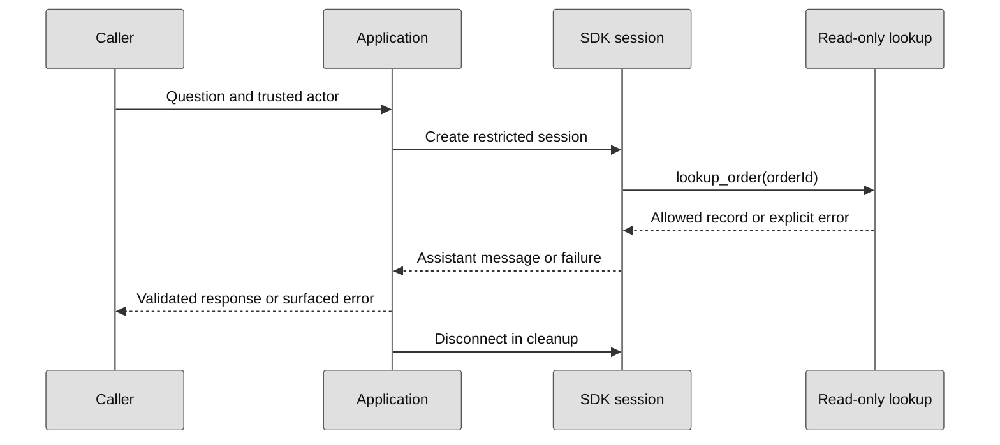

# Build a bounded Copilot SDK application

An agent embedded in an application is different from the development assistant
used to author it. Tool arguments, identity, permissions, timeout, cleanup and
error handling are application contracts, not prompt-writing details.

## Lab briefing



<details>
<summary>Original concept illustration (SVG)</summary>



</details>

| At a glance | Your route |
| --- | --- |
| Level and time | 300; 90 minutes (facilitation estimate) |
| Starting action | Keep actor identity outside model-supplied tool arguments. |
| Learner materials | [Download 16-sdk.zip](../../../assets/lab-kits/hands-on/16-sdk.zip) |
| Workspace | Open the extracted kit root; run the baseline from `.` relative to that root |
| Expected initial check | The supplied baseline tests pass. |
| Setup help | [Download, extract, local Git and optional GitHub](../../../docs/downloads.md) |

> [!NOTE]
> Offline doubles test the application; they do not evaluate a model.

[Concepts](#concepts-and-use-cases) · [First task](#task-1---inspect-and-run-the-offline-baseline) · [Evidence checklist](#verify-your-work) · [Reset](#reset)

## Learning objectives

- Test a real tool handler and session orchestration without a model.
- Keep caller identity outside model-supplied tool arguments.
- Restrict tools and explicitly reject additional permission requests.
- Separate offline test evidence from optional authenticated SDK execution.

## Before you start

Complete [SDK setup](LAB_AK_00_configure_github_copilot_sdk_lab.md) and prepare `16-sdk`
using [the work-drive guide](../Reference/SETUP.md).
The integrated Node fixture pins `@github/copilot-sdk` to **1.0.13**, whose tagged
API was checked on 2026-09-07. This is a reproducible reference, not a claim that it
will always be the newest package.

No Blazor app, LocalDB, test password, real customer order, payment or email service
is required. Those would introduce separate identity and side-effect contracts.

## Concepts and use cases

| Boundary | Responsibility |
| --- | --- |
| Application caller | Establish trusted actor identity |
| Tool handler | Validate input and return only that actor's allowed records |
| SDK session | Expose only the named custom tool |
| Permission handler | Reject extra operations rather than approving everything |
| Lifecycle | Close the session and stop the client on success and failure |
| Offline test double | Exercise application behavior; it is not a model evaluation |

## Exercise scenario

A support assistant can look up synthetic order status for one fixture actor.
It cannot initiate a refund, send an email, read arbitrary files, or trust a
`userId` supplied in the model's tool arguments.



**Legend.** Solid arrows are calls; dashed arrows are returns. The lookup receives
only an order ID; trusted identity is captured by the application, not chosen by
the model. The final call represents cleanup, not another user request.

**Explanation.** This contract prevents an unrestricted tool from becoming an
authority escalation. The offline tests drive the same orchestration with a fake
client; only an explicitly labeled live run exercises the real SDK/runtime.

## Task 1 - Inspect and run the offline baseline

1. Read `catalog.mjs`, `app.mjs`, `app.test.mjs`, `live.mjs`, and the package manifest.
2. Run without installing the SDK:

   ```bash
   node --test --test-concurrency=1 app.test.mjs
   ```

3. Record what the tests prove: tool ownership, missing/invalid input, denial policy,
   timeout propagation and cleanup.
4. They do not prove model answers, account entitlement or cloud availability.

## Task 2 - Explain tool and identity design with Ask

```text
Trace lookup_order and its captured actor. What data can the model supply?
What prevents it from requesting another actor's order? Explain the permission
policy and why a missing tool result must not become a success-shaped answer.
Do not make a live model request.
```

Verify that order-not-found and unauthorized ownership share an intentional
not-available outcome. Do not disclose another actor's data in an error.

## Task 3 - Plan a bounded extension

Add a local formatting improvement or another read-only field already present in
the fixture. The plan must preserve:

- exact ownership boundary and argument validation;
- no writes, shell, network tools or arbitrary filesystem access;
- explicit error propagation and cleanup;
- unit tests for the new behavior.

Do not implement the original lesson's automatic refunds or email fallback. A
write tool requires separate confirmation, idempotency, audit and rollback design.

## Task 4 - Implement and validate offline

1. Ask Agent to implement only the approved extension.
2. Run `app.test.mjs`.
3. Deliberately remove the ownership check and confirm the cross-actor case fails.
4. Restore it and inject a controlled `sendAndWait` error. Confirm cleanup runs and
   no success content is returned.
5. Compare the diff with the plan before any live invocation.

## Task 5 - Optional authenticated SDK run

1. In the disposable copy, install only the pinned SDK dependency:

   ```bash
   npm install
   ```

2. Review the pinned API references below and the tool/permission configuration.
3. `live.mjs` keeps runtime data inside the copied workspace and uses `mode: "empty"`.
   Authenticate through the approved SDK/CLI flow for that runtime; editor access
   alone does not prove this application's identity.
4. Run one bounded request:

   ```bash
   node live.mjs "What is the status of order ORD-1?"
   ```

5. Record the actual response, invoked tools, errors and cleanup. If the runtime
   asks for an additional permission, this example rejects it; do not bypass policy.
6. Mark live execution as **not performed** if access or policy is unavailable.

## Verify your work

- [ ] Offline tests call actual application/tool code.
- [ ] Actor identity is not accepted from tool arguments.
- [ ] Unknown, unauthorized and malformed requests return explicit errors.
- [ ] Extra permission requests are denied.
- [ ] Session/client cleanup is observed after both success and failure.
- [ ] Live/model evidence, if any, is labeled separately from offline evidence.

## Troubleshooting

| Symptom | Action |
| --- | --- |
| SDK not installed | Offline tests still work; install only for the live step |
| Editor access works but live auth fails | Check the application's runtime identity separately |
| Tool request rejected | Inspect the exact operation; do not use blanket approval |
| No message returned | Surface an error; do not print `undefined` as a successful answer |
| Cleanup fails | Report the cleanup failure rather than masking it |

## Independent practice

Design a two-step return workflow: a read-only proposal, then a separate authenticated,
confirmed, idempotent write. Specify authorization, duplicate requests, partial failure,
audit and retry limits. Do not execute real refunds or emails.

For .NET, map the same contract to its current SDK session and disposal APIs. A
Blazor front end must never provide the trusted owner directly from an arbitrary form.
This adaptation is proposed until you build and test it.

## Reset

Stop the live process in its owning terminal. Revoke any exercise-only authentication,
save redacted evidence, and remove only the copied workspace/runtime data when finished.
Do not remove shared Copilot profiles or another project's credentials.

## Official references

- [SDK v1.0.13 Node reference](https://github.com/github/copilot-sdk/blob/v1.0.13/nodejs/README.md)
- [Tagged SDK types](https://github.com/github/copilot-sdk/blob/v1.0.13/nodejs/src/types.ts)
- [Permission decisions](https://github.com/github/copilot-sdk/blob/v1.0.13/nodejs/src/generated/rpc.ts)
- [SDK authentication](https://docs.github.com/en/copilot/how-tos/copilot-sdk/auth)
- [SDK getting started](https://docs.github.com/en/copilot/how-tos/copilot-sdk/getting-started)
