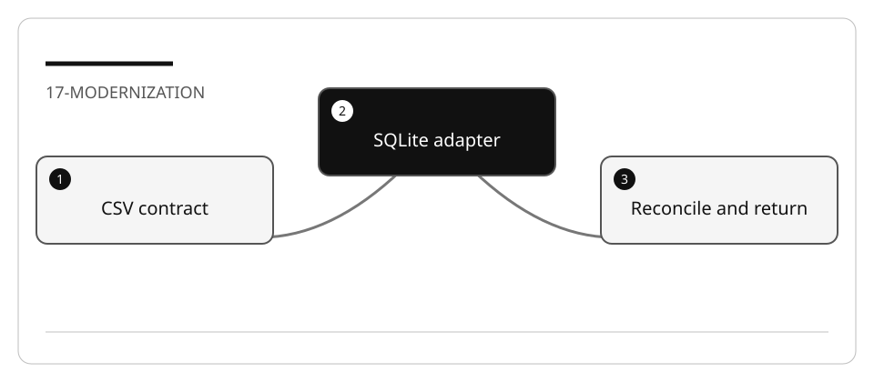
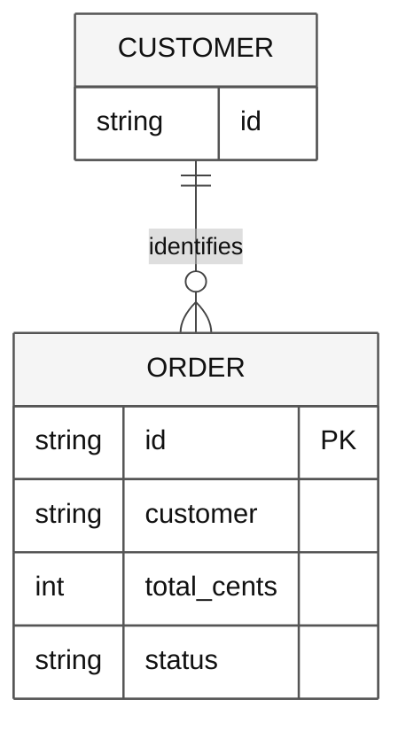

# Modernize an existing order ledger with Spec Kit

Modernization changes technical structure while preserving a declared business
contract. Unlike greenfield work, success is not “the new application runs.”
Unlike a brownfield feature, the goal here is **not** new business behavior.

## Lab briefing



| At a glance | Your route |
| --- | --- |
| Level and time | 400; 100 minutes (facilitation estimate) |
| Starting action | Verify counts, exact integers, non-overwrite and CSV rollback. |
| Learner materials | [Download 17-modernization.zip](../../../assets/lab-kits/hands-on/17-modernization.zip) |
| Workspace | Open the extracted kit root; run the baseline from `.` relative to that root |
| Expected initial check | The CSV characterization tests pass. The separate modernization suite intentionally fails until implementation. |
| Setup help | [Download, extract, local Git and optional GitHub](../../../docs/downloads.md) |

> [!NOTE]
> A created database is not proof of complete, compatible migration.

[Concepts](#concepts-and-use-cases) · [First task](#task-1---characterize-before-changing-anything) · [Evidence checklist](#verify-your-work) · [Reset](#reset)

## Learning objectives

- Freeze a public contract before changing storage.
- Trace compatibility requirements through Spec Kit artifacts and tests.
- Reconcile imported counts, totals, order and schema version.
- Verify rejection of bad data and a practical rollback.

## Before you start

Complete [Spec Kit setup](LAB_AK_00_configure_github_dev_kit_lab.md).
Prepare `17-modernization` using [the work-drive setup](../Reference/SETUP.md).
Use Python's standard library and SQLite: no server, pip dependency, container,
cloud resource, or production database is required.

## Concepts and use cases

| Case | Main question | This exercise |
| --- | --- | --- |
| Greenfield | What should we build? | Already answered by legacy behavior |
| Brownfield feature | What new behavior do we add? | None in this migration |
| Modernization | What technical boundary changes without breaking consumers? | CSV storage becomes opt-in SQLite |
| Cutover | When do consumers use the new path? | Only when `--backend sqlite` is selected |
| Rollback | Can the old path still work? | CSV stays default and its bytes remain unchanged |

## Exercise scenario

An operator depends on `service.py` returning one JSON object containing sorted
orders and integer-cent totals. Replace storage without changing keys, ordering,
customer filtering, or the default CSV path.

The local fixture contains:

| File | Responsibility |
| --- | --- |
| `legacy.py` | Frozen CSV validation and summary contract |
| `service.py` | Compatibility CLI and explicit backend selection |
| `order_store.py` | Incomplete SQLite reader |
| `migrate.py` | Incomplete validated import |
| `test_legacy.py` | Existing behavior |
| `test_modernization.py` | New storage/data/rollback gates |
| `data/orders.csv` | Three synthetic records; no real transactions |

## Task 1 - Characterize before changing anything

1. Read `requirements.md` and `legacy.py`.
2. Run from the prepared fixture root:

   ```bash
   python -m unittest test_legacy -v
   python service.py --source data/orders.csv
   python service.py --source data/orders.csv --customer C-01
   ```

3. Confirm a total of **6249 cents** overall and **3250 cents** for `C-01`.
   These are deterministic fixture values, not a performance claim.
4. Record source hash, output shape, order, exit codes and error stream behavior.
5. Run `python -m unittest test_modernization -v`; the incomplete implementation
   must fail. Do not weaken these tests to obtain a green baseline.

## Task 2 - Specify preservation and change separately

Initialize only the disposable copy. Then:

```text
/speckit-constitution Preserve the JSON CLI contract in requirements.md.
Do not modify legacy.py or baseline assertions. Keep CSV as default. Use no
network or real data. Require validated migration, non-overwrite, reconciliation,
explicit errors and a tested rollback before selecting SQLite.
```

```text
/speckit-specify Modernize CSV storage to SQLite without changing business behavior.
Implement migrate.py and order_store.py for MOD-1 through MOD-6. Preserve source
bytes, record order, integer cents, customer filtering and CLI output.
```

Use `/speckit-clarify` to settle malformed rows, duplicate IDs, reruns, missing
databases, existing targets, and failures mid-import.

## Task 3 - Model the storage boundary



**Legend.** Entity boxes list fields. The crow's-foot edge means one customer
identifier can appear on many orders. `PK` marks the order identifier.

**Explanation.** CUSTOMER is conceptual, not a required new table or foreign key.
The actual lab migrates only the `orders` table and sets `PRAGMA user_version = 1`.
Adding a customer service would expand scope and risk changing behavior.
`total_cents` is logically an integer. The reference stores validated decimal text
because SQLite's integer and `SUM` range is narrower than Python's accepted values;
it converts back to Python integers for JSON and exact reconciliation.

## Task 4 - Plan a reversible migration

```text
/speckit-plan Use Python sqlite3 and standard-library unittest. Validate every
CSV record before import. Refuse any existing target. Create a constrained orders
schema, insert with parameterized statements in a transaction, reconcile count
and integer total without narrowing Python integer precision, and close resources.
Open query databases read-only and never
create one on a missing-file read. Keep source CSV unchanged for rollback.
```

Review how the implementation distinguishes:

- refusing an existing target from cleaning up its own failed new target;
- successful import from a partial database;
- source data validation from SQLite constraints;
- parameterized values from executable SQL;
- storage representation from the public JSON integer contract, including totals
  beyond signed 64-bit range;
- a local process exception from crash/power-loss durability.

The fixture is not a production migration service. Document crash-recovery and
concurrent-writer limitations rather than claiming they are covered.

## Task 5 - Implement through evidence gates

1. Run `/speckit-tasks` and `/speckit-analyze`.
2. Map each MOD requirement to implementation and its test.
3. Implement one boundary at a time; do not change the frozen public contract.
4. Run:

   ```bash
   python -m unittest test_legacy test_modernization -v
   python migrate.py --source data/orders.csv --target orders.db
   python service.py --backend sqlite --source orders.db --customer C-01
   ```

5. Compare CSV and SQLite JSON exactly. Inspect count and total, not only file
   existence.
6. Run the same migration again. It must fail without overwriting `orders.db`.
7. Use the default CSV command again to prove rollback without deleting the source.
8. Run `/speckit-converge` for cross-artifact review. Limit repair attempts and
   inspect real test output before accepting convergence.

## Verify your work

- [ ] MOD-1: original characterization remains green.
- [ ] MOD-2: count 3, total 6249, ordering and schema version 1 match.
- [ ] MOD-3: malformed/duplicate input returns nonzero and leaves no successful partial target.
- [ ] MOD-4: reruns preserve any existing target byte-for-byte.
- [ ] MOD-5: reading a missing database does not create it.
- [ ] MOD-6: CSV fallback and source hash are unchanged.
- [ ] No business feature, real customer data, or cloud infrastructure was added.

## Stack adaptations

| Stack | Similar modernization | Required equivalent evidence |
| --- | --- | --- |
| Python / SQLite | Executable primary path here | Supplied baseline and migration suite |
| .NET 10 | CSV adapter to `Microsoft.Data.Sqlite` | Same JSON consumer tests plus provider/package review |
| TypeScript / Node | CSV adapter to SQLite supported by the selected Node release | Same ordering, integer, rollback and overwrite gates |
| Java | JDBC storage adapter behind an existing service | Existing Java contract tests and a migration fixture |

The alternatives are guided designs, not executed claims. Compare API, transaction,
error and packaging differences before implementation. Do not select a new framework
solely because an assistant can generate it.

## Troubleshooting

If results match only after sorting one side differently, you may have changed the
contract. If an invalid row leaves a partial database, inspect validation and cleanup.
If a missing read creates a file, review connection mode. If tests fail only on
rerun, inspect the non-overwrite gate rather than deleting the existing target.

## Independent practice

Propose a schema-v2 change that adds a nullable column while an older reader remains
active. Define version negotiation, forward/backward compatibility, migration
idempotence, rollback and retirement criteria before coding.

## Reset

Stop only the CLI process you started. Save hashes and output, then remove only the
generated `orders.db` in the disposable copy after inspecting its path. Restore
`migrate.py` and `order_store.py` from the local baseline or prepare a fresh copy.
Never overwrite `data/orders.csv` as a reset technique.

## Official references

- [Spec Kit v1.0.4](https://github.com/github/spec-kit/tree/v1.0.4)
- [Spec Kit integration reference](https://github.com/github/spec-kit/blob/v1.0.4/docs/reference/integrations.md)
- [SQLite in .NET](https://learn.microsoft.com/en-us/dotnet/standard/data/sqlite/)
- [Python sqlite3](https://docs.python.org/3/library/sqlite3.html)
