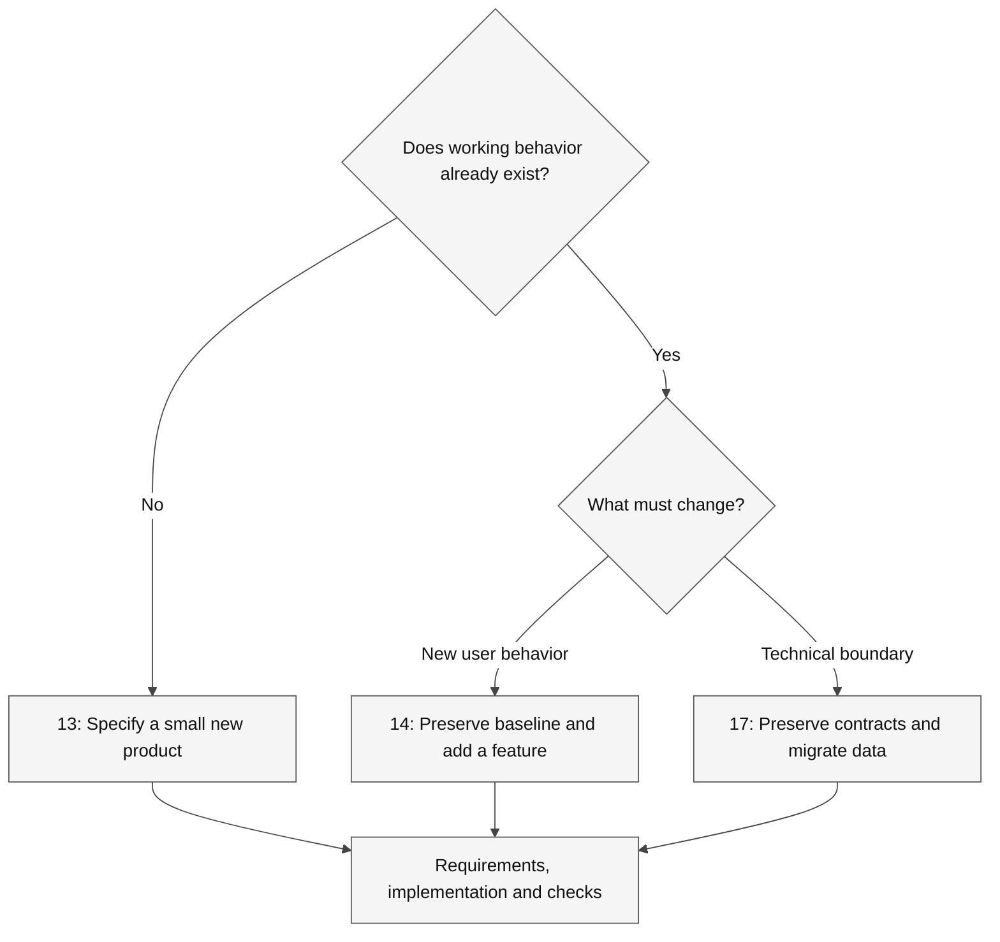

# Hands-on GitHub Copilot labs

> [!TIP]
> **Download only what you need:** the [learner-kit catalog](../docs/downloads.md)
> includes a ZIP for each of the 21 exercise variants, with instructions, images,
> tests, synthetic data, licenses and integrity checks. Preparation guides reuse
> the associated exercise kit rather than duplicating it.

Use these numbered exercises for focused professional scenarios. They share the
repository's evidence-first approach but **are not fantasy adventures**.
Durations are facilitation estimates, not measured completion guarantees.

> [!IMPORTANT]
> Work on one copied fixture at a time. Keep temporary files and caches on the
> selected work drive; do not run every build or profiler on a shared workstation.
> Start with [environment setup](Instructions/Reference/SETUP.md).

## Preparation

| Lab | Outcome |
| --- | --- |
| [C# environment](Instructions/Labs/LAB_AK_00_configure_lab_environment.md) | SDK/target agreement, one build and actual test discovery |
| [Python environment](Instructions/Labs/LAB_AK_00_configure_lab_environment_py.md) | Interpreter, import root and isolated testing |
| [Copilot access](Instructions/Labs/LAB_AK_00_enable_github_copilot_in_visual_studio_code.md) | Account, target and harmless request evidence |
| [Spec Kit setup](Instructions/Labs/LAB_AK_00_configure_github_dev_kit_lab.md) | Pinned skills integration without overwriting existing work |
| [SDK setup](Instructions/Labs/LAB_AK_00_configure_github_copilot_sdk_lab.md) | Offline logic separated from authenticated inference |

## Core workflow

Choose a language path; do not build the C# and Python copies simultaneously.

| Lab | C# | Python | Outcome |
| --- | --- | --- | --- |
| 01 | [Context and interface](Instructions/Labs/LAB_AK_01_examine_settings_interface.md) | Shared exercise | Roles, harnesses, evidence and permissions |
| 02 | [Analyze/document](Instructions/Labs/LAB_AK_02_analyze_document_code.md) | [Analyze/document](Instructions/Labs/LAB_AK_02_analyze_document_code_py.md) | Source-grounded onboarding |
| 03 | [Develop availability](Instructions/Labs/LAB_AK_03_develop_code_features.md) | [Develop availability](Instructions/Labs/LAB_AK_03_develop_code_features_py.md) | End-to-end book-copy availability |
| 04 | [xUnit tests](Instructions/Labs/LAB_AK_04_develop_unit_tests_xunit.md) | [pytest tests](Instructions/Labs/LAB_AK_04_develop_unit_tests_pytest.md) | Tests that detect wrong behavior |
| 05 | [Refactor](Instructions/Labs/LAB_AK_05_refactor_improve_existing_code.md) | [Refactor](Instructions/Labs/LAB_AK_05_refactor_improve_existing_code_py.md) | Characterization and semantic preservation |

## Engineering and collaboration

| Lab | Focus |
| --- | --- |
| [06 - Shopping prototype](Instructions/Labs/LAB_AK_06_vibe_coding_prototype_ecommerce_app.md) | Small PRD, integer-cents domain and accessible UI checks |
| [07 - Duplication](Instructions/Labs/LAB_AK_07_consolidate_duplicate_code.md) | Shared mechanics versus distinct business rules |
| [08 - Large functions](Instructions/Labs/LAB_AK_08_refactor_large_functions.md) | Error paths, inventory compensation and extraction |
| [09 - Complex conditions](Instructions/Labs/LAB_AK_09_simplify_complex_conditionals.md) | Decision tables and equality boundaries |
| [10 - Profiling](Instructions/Labs/LAB_AK_10_implement_performance_profiling.md) | Small measurements, controlled scope, no promised speedup |
| [11 - Issues](Instructions/Labs/LAB_AK_11_resolve_github_issues.md) | Local reproduction to reviewed change |
| [12 - Secret remediation](Instructions/Labs/LAB_AK_12_resolve_github_secret_scanning_alerts.md) | Revocation-first simulation without real credentials |

## Spec-driven development and agent customization

| Lab | Case and stack |
| --- | --- |
| [13 - Greenfield](Instructions/Labs/LAB_AK_13_get-started-spec-driven-development.md) | RSS subscription contract; Node/TypeScript with .NET/Python/Go adaptations |
| [14 - Brownfield feature](Instructions/Labs/LAB_AK_14_implement-spec-driven-development.md) | Existing dashboard; owner-scoped metadata and compatibility |
| [15 - Customization](Instructions/Labs/LAB_AK_15_configure_customize_github_copilot_vscode.md) | Instructions, prompts, skills and agent handoffs |
| [16 - Copilot SDK](Instructions/Labs/LAB_AK_16_develop_ai_enabled_apps_github_copilot_sdk.md) | Read-only support tool, offline contracts and optional live inference |
| [17 - Modernization](Instructions/Labs/LAB_AK_17_modernize_existing_app_spec_kit.md) | Python CSV to SQLite; reconciliation, non-overwrite and rollback |

## How to choose a Spec Kit case

**Legend.** Diamonds are scope decisions, rectangles are exercise paths, and solid
arrows show selection flow. Labels distinguish new behavior from a storage change.

**Explanation.** All three paths use Spec Kit artifacts, but their starting evidence
and failure risks differ. Modernization requires preserved output, reconciled data,
and rollback, not just a new implementation.

## References and instructor guidance

- [Copilot concepts](Instructions/Reference/COPILOT.md)
- [Spec Kit version/integration reference](Instructions/Reference/SPEC_KIT.md)
- [PRD examples](Instructions/Concepts/Sample%20PRDs.md)
- [Scope a hands-on exercise](Instructions/Concepts/How%20to%20scope%20vibe%20coding%20lab%20exercise.md)
- [Lab-by-lab audit](Instructions/Reference/AUDIT.md)
- [Repository diagram style](../docs/diagram-style.md)
- [Download fixture sources](https://github.com/workshop-gbb/awesome-copilot-adventures/tree/main/mslearn-github-copilot/LabFiles)
