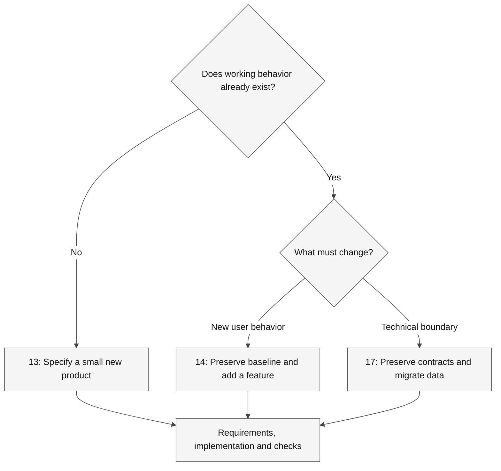

# Hands-on GitHub Copilot labs

> [!TIP]
> **Download only what you need:** the [learner-kit catalog](../docs/downloads.md)
> includes a ZIP for each of the 21 exercise variants, with instructions, images,
> tests, synthetic data, licenses and integrity checks. Preparation guides reuse
> the associated exercise kit rather than duplicating it.

Use these numbered exercises for focused professional scenarios. They share the
repository's evidence-first approach but **are not fantasy adventures**.
Durations are facilitation estimates, not measured completion guarantees.

> [!IMPORTANT]
> Work on one copied fixture at a time. Keep temporary files and caches on the
> selected work drive; do not run every build or profiler on a shared workstation.
> Start with [environment setup](Instructions/Reference/SETUP.md).

Choose a language path; do not build the C# and Python copies simultaneously.

## How to choose a Spec Kit case

**Legend.** Diamonds are scope decisions, rectangles are exercise paths, and solid
arrows show selection flow. Labels distinguish new behavior from a storage change.

**Explanation.** All three paths use Spec Kit artifacts, but their starting evidence
and failure risks differ. Modernization requires preserved output, reconciled data,
and rollback, not just a new implementation.

## References and instructor guidance

- [Copilot concepts](Instructions/Reference/COPILOT.md)
- [Spec Kit version/integration reference](Instructions/Reference/SPEC_KIT.md)
- [PRD examples](Instructions/Concepts/Sample%20PRDs.md)
- [Scope a hands-on exercise](Instructions/Concepts/How%20to%20scope%20vibe%20coding%20lab%20exercise.md)
- [Lab-by-lab audit](Instructions/Reference/AUDIT.md)
- [Repository diagram style](../docs/diagram-style.md)
- [Download fixture sources](https://github.com/workshop-gbb/awesome-copilot-adventures/tree/main/mslearn-github-copilot/LabFiles)
